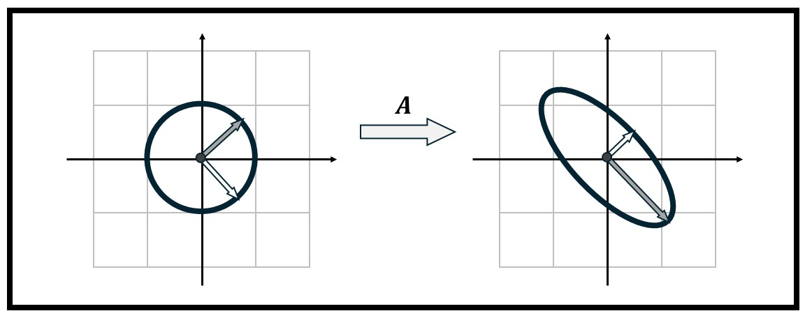

# Quiz 5: Weeks 10-11

*20 problems*

## Week Breakdown
- Week 10 (Singular Value Decomposition): 13 problems
- Week 11 (Principal Components): 7 problems

---

## Problem Q5-P01

**Week 10** | **Singular Value Decomposition**
**Concepts:** SVD from geometric picture, singular value conventions, left vs right singular vectors

The figure shows how a matrix $A \in \mathbb{R}^{2 \times 2}$ transforms the unit circle to an ellipse, with the singular vectors represented.

\begin{center}
\begin{figure}[h]
\includegraphics[width=6.5in]{2030 Q5 SVD FIG.jpg}

\end{figure}
\end{center}

Based on this figure, which of the following is the most likely SVD of $A = U\Sigma V^T$?

**Choices:**
- (A) $U = \frac{1}{\sqrt{2}}\begin{bmatrix} 1 & 1 \\ 1 & -1 \end{bmatrix}, \quad \Sigma = \begin{bmatrix} 3/2 & 0 \\ 0 & 1/2 \end{bmatrix}, \quad V = \frac{1}{\sqrt{2}}\begin{bmatrix} 1 & 1 \\ -1 & 1 \end{bmatrix}$
- (B) $U = \frac{1}{\sqrt{2}}\begin{bmatrix} 1 & 1 \\ -1 & 1 \end{bmatrix}, \quad \Sigma = \begin{bmatrix} 3/2 & 0 \\ 0 & 1/2 \end{bmatrix}, \quad V = \frac{1}{\sqrt{2}}\begin{bmatrix} 1 & 1 \\ 1 & -1 \end{bmatrix}$
- (C) $U = \frac{1}{\sqrt{2}}\begin{bmatrix} 1 & 1 \\ -1 & 1 \end{bmatrix}, \quad \Sigma = \begin{bmatrix} 1/2 & 0 \\ 0 & 3/2 \end{bmatrix}, \quad V = \frac{1}{\sqrt{2}}\begin{bmatrix} 1 & 1 \\ -1 & 1 \end{bmatrix}$
- (D) $U = \frac{1}{\sqrt{2}}\begin{bmatrix} 1 & 1 \\ 1 & -1 \end{bmatrix}, \quad \Sigma = \begin{bmatrix} 3/2 & 0 \\ 0 & -1/2 \end{bmatrix}, \quad V = \frac{1}{\sqrt{2}}\begin{bmatrix} 1 & 1 \\ 1 & -1 \end{bmatrix}$
- (E) $U = \frac{1}{\sqrt{2}}\begin{bmatrix} 1 & 1 \\ 1 & -1 \end{bmatrix}, \quad \Sigma = \begin{bmatrix} 3/2 & 0 \\ 0 & 1/2 \end{bmatrix}, \quad V = \frac{1}{\sqrt{2}}\begin{bmatrix} 1 & 1 \\ 1 & -1 \end{bmatrix}$

Show Answer

**Correct: (None)**

---

## Problem Q5-P02

**Week 10** | **Singular Value Decomposition**
**Concepts:** Geometric foundations of SVD, sphere to ellipsoid transformation, role of A^TA

A linear transformation $A \in \mathbb{R}^{3 \times 2}$ maps the unit circle in $\mathbb{R}^2$ to an ellipse in $\mathbb{R}^3$. The matrix $A^TA$ has eigenvalues $\lambda_1 = 9$ and $\lambda_2 = 4$ with corresponding orthonormal eigenvectors $\mathbf{v}_1$ and $\mathbf{v}_2$.

Which statement correctly describes the geometric action of $A$?

**Choices:**
- (A) The ellipse in $\mathbb{R}^3$ has semi-axis lengths 9 and 4, aligned with the directions $\mathbf{v}_1$ and $\mathbf{v}_2$.
- (B) The ellipse in $\mathbb{R}^3$ has semi-axis lengths 3 and 2, and the input directions $\mathbf{v}_1$ and $\mathbf{v}_2$ are mapped to these semi-axes.
- (C) The ellipse lies in a 2-dimensional subspace of $\mathbb{R}^3$, with semi-axis lengths $\sqrt{9} = 3$ and $\sqrt{4} = 2$.
- (D) The transformation stretches the direction $\mathbf{v}_1$ by factor 9 and $\mathbf{v}_2$ by factor 4, producing an ellipse with area $36\pi$.
- (E) The eigenvalues of $A$ determine the semi-axis lengths, which are 9 and 4.

Show Answer

**Correct: (None)**

---

## Problem Q5-P03

**Week 10** | **Singular Value Decomposition**
**Concepts:** Rank-Nullity Theorem

A centered data matrix $X \in \mathbb{R}^{n \times d}$ has SVD $X = U\Sigma V^T$ with singular values $\sigma_1 = 100, \sigma_2 = 50, \sigma_3 = 25, \ldots$ A researcher wants a 2-dimensional representation of the $n$ observations and considers two approaches:

\textbf{Approach 1:} Compute the $n \times 2$ matrix $U_2\Sigma_2$, where $U_2$ contains the first 2 columns of $U$ and $\Sigma_2$ is the $2 \times 2$ upper-left block of $\Sigma$.

\textbf{Approach 2:} Compute the $n \times 2$ matrix $XV_2$, where $V_2$ contains the first 2 columns of $V$ (i.e., project each observation onto the first two principal component directions).

Which statement is most TRUE?

**Choices:**
- (A) Both approaches give identical 2D representations since $U\Sigma = XV$.
- (B) Approach 1 gives the optimal rank-2 approximation to $X$ in Frobenius norm, while Approach 2 gives the 2D representation that maximizes captured variance, but these are different things.
- (C) The approaches yield different matrices: $U_2\Sigma_2 \neq XV_2$ because one uses left singular vectors and the other uses right singular vectors.
- (D) Approach 1 produces vectors in $\mathbb{R}^n$ while Approach 2 produces vectors in $\mathbb{R}^d$, so they cannot be compared.
- (E) Both approaches produce the same $n \times 2$ matrix of 2D observation coordinates, and both optimally capture the variance structure in a 2D subspace.

Show Answer

**Correct: (None)**

---

## Problem Q5-P04

**Week 10** | **Singular Value Decomposition**
**Concepts:** Singular values ordering, operations on matrices, basic SVD properties

A matrix $A \in \mathbb{R}^{m \times n}$ has singular values $\sigma_1 = 5$, $\sigma_2 = 3$, $\sigma_3 = 1$, and $\sigma_k = 0$ for $k>3$. 

Which of the following statements is most TRUE?

**Choices:**
- (A) Matrix $2A$ has singular values 10, 6, 2, with all others zero, but they should be reordered as 2, 6, 10 to maintain the SVD convention.
- (B) Matrix $A^T$ has singular values $\sigma_1=1, \sigma_2=3, \sigma_3=5$, with all others zero.
- (C) Matrix $A^TA$ has eigenvalues 25, 9, 1, with the remaining eigenvalues zero.
- (D) The largest singular value of $AA^T$ is 25.
- (E) Matrices $A^TA$ and $AA^T$ have different nonzero eigenvalues.

Show Answer

**Correct: (None)**

---

## Problem Q5-P05

**Week 10** | **Singular Value Decomposition**
**Concepts:** Pseudoinverse construction via SVD, Σ^† formula

A matrix $A \in \mathbb{R}^{4 \times 3}$ has singular value decomposition $A = U\Sigma V^T$ where $U \in \mathbb{R}^{4 \times 4}$, $V \in \mathbb{R}^{3 \times 3}$ are orthogonal, and:
$$\Sigma = \begin{bmatrix} 5 & 0 & 0 \\ 0 & 2 & 0 \\ 0 & 0 & 0 \\ 0 & 0 & 0 \end{bmatrix} \in \mathbb{R}^{4 \times 3}$$

What is the pseudoinverse $A^\dagger$ of this matrix?

**Choices:**
- (A) $A^\dagger = U\Sigma^{-1} V^T$ where $\Sigma^{-1} = \begin{bmatrix} 1/5 & 0 & 0 \\ 0 & 1/2 & 0 \\ 0 & 0 & \text{undefined} \\ 0 & 0 & \text{undefined} \end{bmatrix}$
- (B) $A^\dagger = V\Sigma^T U^T$ where $\Sigma^T = \begin{bmatrix} 5 & 0 & 0 & 0 \\ 0 & 2 & 0 & 0 \\ 0 & 0 & 0 & 0 \end{bmatrix}$
- (C) $A^\dagger = V\Sigma^\dagger U^T$ where $\Sigma^\dagger = \begin{bmatrix} 1/5 & 0 & 0 & 0 \\ 0 & 1/2 & 0 & 0 \\ 0 & 0 & 0 & 0 \end{bmatrix}$
- (D) $A^\dagger = U^T\Sigma^\dagger V$ where $\Sigma^\dagger = \begin{bmatrix} 1/5 & 0 & 0 & 0 \\ 0 & 1/2 & 0 & 0 \\ 0 & 0 & 0 & 0 \end{bmatrix}$
- (E) $A^\dagger = V\Sigma^\dagger U^T$ where $\Sigma^\dagger = \begin{bmatrix} 1/5 & 0 & 0 \\ 0 & 1/2 & 0 \\ 0 & 0 & 0 \\ 0 & 0 & 0 \end{bmatrix}$

Show Answer

**Correct: (None)**

---

## Problem Q5-P06

**Week 10** | **Singular Value Decomposition**
**Concepts:** Subspace properties

A data matrix $A \in \mathbb{R}^{100 \times 50}$ represents measurements where rows are observations and columns are features. The SVD $A = U\Sigma V^T$ reveals that only the first 10 singular values are nonzero: $\sigma_1 \geq \sigma_2 \geq \cdots \geq \sigma_{10} > 0$ and $\sigma_{11} = \cdots = \sigma_{50} = 0$.

An analyst wants to understand the fundamental subspaces. Which statement is most TRUE?

**Choices:**
- (A) The first 10 right singular vectors $\mathbf{v}_1, \ldots, \mathbf{v}_{10}$ span the column space of $A$, capturing the 10 most important patterns in the observations.
- (B) The first 10 left singular vectors $\mathbf{u}_1, \ldots, \mathbf{u}_{10}$ span a 10-dimensional subspace of feature space where all data variation occurs.
- (C) The right singular vectors $\mathbf{v}_{11}, \ldots, \mathbf{v}_{50}$ form a basis for $\ker(A)$, representing 40 redundant feature combinations.
- (D) The left singular vectors $\mathbf{u}_{11}, \ldots, \mathbf{u}_{100}$ span $\ker(A^T)$, representing observation directions that have no correlation with any features.
- (E) Both (C) and (D) are correct.

Show Answer

**Correct: (None)**

---

## Problem Q5-P07

**Week 10** | **Singular Value Decomposition**
**Concepts:** Dimension of vector spaces

A machine learning engineer wants to store a compressed representation of matrix $A \in \mathbb{R}^{500 \times 300}$ using its rank-$k$ SVD approximation $A_k = \sum_{i=1}^k \sigma_i \mathbf{u}_i\mathbf{v}_i^T$.

To store $A_k$, they need to save:
\begin{itemize}
\item $k$ singular values $\{\sigma_1, \ldots, \sigma_k\}$
\item $k$ left singular vectors $\{\mathbf{u}_1, \ldots, \mathbf{u}_k\}$
\item $k$ right singular vectors $\{\mathbf{v}_1, \ldots, \mathbf{v}_k\}$
\end{itemize}

How many total scalar values must be stored, and for which value of $k$ does the storage equal the original matrix $A$?

**Choices:**
- (A) $k(500 + 300 + 1)$ values; storage equals original when $k = 500$
- (B) $k(500 + 300 + 1)$ values; storage equals original when $k = 300$
- (C) $k(500 + 300)$ values; storage equals original when $k = 187$ (approximately)
- (D) $k(500 \cdot 300)$ values; storage never equals original since SVD is always compressed
- (E) $k(500 + 300 + 1)$ values; storage equals original when $k = 187$ (approximately)

Show Answer

**Correct: (None)**

---

## Problem Q5-P08

**Week 10** | **Singular Value Decomposition**
**Concepts:** SVD of orthogonal matrices, singular values, geometric interpretation

What can be said about the SVD of an orthogonal matrix $Q \in \mathbb{R}^{n \times n}$?.

**Choices:**
- (A) All singular values equal 1, so $Q = U\Sigma V^T$ where $\Sigma = I$, meaning $Q = UV^T$ is a product of two orthogonal matrices.
- (B) The singular values depend on the specific matrix $Q$; for example, a rotation matrix has different singular values than a reflection matrix.
- (C) All singular values equal 1, and because of this the SVD is not unique.
- (D) Orthogonal matrices do not have a uniquely defined SVD because they preserve lengths, which contradicts the stretching interpretation of singular values.
- (E) The largest singular value is 1, but the other singular values can be less than 1 depending on how much $Q$ ``compresses'' certain directions.

Show Answer

**Correct: (None)**

---

## Problem Q5-P09

**Week 11** | **Principal Components**
**Concepts:** Covariance vs Correlation PCA, preprocessing and scaling

An engineer monitors a chemical reactor with three sensors measuring temperature ($T$, in °C), pressure ($P$, in kPa), and flow rate ($F$, in mL/min). A week of measurements yields:

$$\text{Temperature: } T \in [180, 220] \text{ °C}$$
$$\text{Pressure: } P \in [2000, 2500] \text{ kPa}$$
$$\text{Flow rate: } F \in [5, 15] \text{ mL/min}$$

The engineer performs covariance PCA on the centered data and finds that the first principal component is approximately:
$$\mathbf{v}_1 \approx (0.002, 0.998, 0.005)^T$$

Which statement best explains this result?

**Choices:**
- (A) Pressure dominates the first principal component because it has the largest absolute variance, masking potentially important patterns in temperature and flow.
- (B) The principal component correctly identifies pressure as the most important variable since it has the widest measurement range.
- (C) This result suggests the three variables are uncorrelated, with pressure varying independently of temperature and flow.
- (D) The small coefficients for temperature and flow indicate these variables contribute negligible information and can be discarded.
- (E) Covariance PCA automatically accounts for different measurement scales, so this result reveals genuine physical dominance of pressure variation.

Show Answer

**Correct: (None)**

---

## Problem Q5-P10

**Week 11** | **Principal Components**
**Concepts:** Interpreting principal components, physical meaning

Four vibration sensors measure vertical displacement (in mm) on a suspension bridge at locations: North anchor, North midspan, South midspan, South anchor. After centering the data, (covariance) PCA reveals the following eigenvectors/eigenvalues of $X^TX$:

$$\mathbf{v}_1 = \frac{1}{2}\begin{pmatrix} 1 \\ 1 \\ 1 \\ 1 \end{pmatrix}, \quad \mathbf{v}_2 = \frac{1}{\sqrt{2}}\begin{pmatrix} 1 \\ 0 \\ 0 \\ -1 \end{pmatrix}, \quad \mathbf{v}_3 = \frac{1}{\sqrt{2}}\begin{pmatrix} 0 \\ 1 \\ -1 \\ 0 \end{pmatrix}$$

with eigenvalues $\lambda_1 = 36$, $\lambda_2 = 9$, $\lambda_3 = 4$, $\lambda_4 = 1$ (in mm²).

Which interpretation is most consistent with these results?

**Choices:**
- (A) $\mathbf{v}_1$ represents uniform vertical motion of the entire bridge (all sensors move together), capturing 72\
- (B) $\mathbf{v}_2$ represents torsional twisting where the North side moves opposite to the South side, while midspan points remain stationary.
- (C) $\mathbf{v}_3$ represents antisymmetric bending where the two midspan points move in opposite directions while anchors remain fixed.
- (D) All of the above (A, B, and C) are correct interpretations of the principal components.
- (E) None of the above.

Show Answer

**Correct: (None)**

---

## Problem Q5-P11

**Week 10** | **Singular Value Decomposition**
**Concepts:** Subspace properties, Isomorphisms

The SVD $A = U\Sigma V^T$ reveals that $A$ acts as an isomorphism (scaled by singular values) between certain fundamental subspaces. For matrix $A \in \mathbb{R}^{m \times n}$ with rank $r$, which statement is most TRUE?

**Choices:**
- (A) $A$ maps $\ker(A)$ isomorphically onto $\ker(A^T)$ by the relationship $A\mathbf{v}_i = \sigma_i \mathbf{u}_i$ for $i > r$.
- (B) $A$ maps $\text{im}(A^T)$ isomorphically onto $\text{im}(A)$, with the isomorphism given by scaling: $A\mathbf{v}_i = \sigma_i \mathbf{u}_i$ for $i \leq r$.
- (C) $A$ maps $\mathbb{R}^n$ isomorphically onto $\mathbb{R}^m$ whenever $m = n$, regardless of rank.
- (D) $A$ maps both $\ker(A)$ and $\text{im}(A^T)$ isomorphically onto $\text{im}(A)$, explaining why $\dim(\ker(A)) + \dim(\text{im}(A^T)) = \dim(\text{im}(A))$.
- (E) The restriction of $A$ to $\ker(A)$ is an isomorphism onto $\ker(A^T)$ because both have dimension $n - r$.

Show Answer

**Correct: (None)**

---

## Problem Q5-P12

**Week 11** | **Principal Components**
**Concepts:** Dimension of vector spaces

A data scientist analyzes measurements from six sensors monitoring a thermodynamic process. The sensors measure various properties of the system: pressure, temperature, volume, entropy, enthalpy, and work.
The figures below plot (vertically) cumulative explained variance for covariance PCA (left) and correlation PCA (right), versus (horizontally) number of singular values (from 0 to 6). Based on these plots, which interpretation is most appropriate?

\begin{center}
\begin{figure}[h]
\includegraphics[width=7in]{2030 Q5 SCREE COV-COR.jpg}

\end{figure}
\end{center}

**Choices:**
- (A) Covariance PCA reveals that the process is essentially one-dimensional: a single latent variable explains 94\
- (B) Correlation PCA suggests the process has intrinsic dimension approximately 3, with scale differences among sensors masking this structure in the covariance analysis.
- (C) Both analyses agree on low intrinsic dimensionality; correlation PCA is always preferable as it preserves the natural units of measurement.
- (D) The correlation PCA result is misleading because standardizing variables inflates the apparent contribution of low-variance sensors like volume.
- (E) A rank-2 approximation captures over 75\

Show Answer

**Correct: (None)**

---

## Problem Q5-P13

**Week 11** | **Principal Components**
**Concepts:** Choosing number of components, singular value decay patterns

Two centered data matrices are analyzed via covariance PCA:

\textbf{Dataset A:} $X_A \in \mathbb{R}^{200 \times 10}$ has all nonzero singular values:
$$\sigma_1 = 24, \quad \sigma_2 = 22, \quad \sigma_3 = 20, \quad \sigma_4 = 18, \quad \sigma_5 = 16, \ldots$$

\textbf{Dataset B:} $X_B \in \mathbb{R}^{200 \times 10}$ has all nonzero singular values:
$$\sigma_1 = 50, \quad \sigma_2 = 25, \quad \sigma_3 = 8, \quad \sigma_4 = 3, \quad \sigma_5 = 1, \ldots$$

Which statement best characterizes the difference between these datasets?

**Choices:**
- (A) Dataset A has clearer low-dimensional structure.
- (B) Dataset B has clearer low-dimensional structure.
- (C) Dataset A is better for dimensionality reduction based on better total variance.
- (D) Both datasets have similar intrinsic dimensionality since all singular values are positive.
- (E) Dataset B should have been handled via correlation PCA.

Show Answer

**Correct: (None)**

---

## Problem Q5-P14

**Week 10** | **Singular Value Decomposition**
**Concepts:** Subspace properties, Kernel (null space), Image (range)

A matrix $A \in \mathbb{R}^{7 \times 5}$ has rank 3 with SVD $A = U\Sigma V^T$.

Which approach yields a basis for the coimage $\text{coim}(A) = (\ker A)^\perp$?

**Choices:**
- (A) Right singular vectors $\{\mathbf{v}_1, \mathbf{v}_2, \mathbf{v}_3, \mathbf{v}_4, \mathbf{v}_5\}$
- (B) Left singular vectors $\{\mathbf{u}_1, \mathbf{u}_2, \mathbf{u}_3\}$
- (C) Right singular vectors $\{\mathbf{v}_1, \mathbf{v}_2, \mathbf{v}_3\}$
- (D) Left singular vectors $\{\mathbf{u}_4, \mathbf{u}_5, \mathbf{u}_6, \mathbf{u}_7\}$
- (E) Right singular vectors $\{\mathbf{v}_4, \mathbf{v}_5\}$

Show Answer

**Correct: (None)**

---

## Problem Q5-P15

**Week 10** | **Singular Value Decomposition**
**Concepts:** Eigenvalues vs singular values, symmetric matrices, general square matrices

A $3 \times 3$ matrix $A$ has eigenvalues $\lambda_1 = 5$, $\lambda_2 = -3$, $\lambda_3 = 1$.

Which statement about the singular values of $A$ is most TRUE?

**Choices:**
- (A) The singular values are $5, 3, 1$.
- (B) The singular values are $25, 9, 1$.
- (C) The singular values are $\sqrt{5}, \sqrt{3}, 1$.
- (D) The singular values cannot be determined from eigenvalues alone.
- (E) The singular values of a {\em square} matrix equal the eigenvalues for any square matrix.

Show Answer

**Correct: (None)**

---

## Problem Q5-P16

**Week 11** | **Principal Components**
**Concepts:** Effect of orthogonal transformations, invariance properties, creative application

Consider two analysts working with the same centered data matrix $X \in \mathbb{R}^{100 \times 6}$ that has singular values $\sigma_1 = 20, \sigma_2 = 15, \sigma_3 = 8, \sigma_4 = 5, \sigma_5 = 2, \sigma_6 = 1$.

\textbf{Analyst A} performs PCA directly on $X$.

\textbf{Analyst B} first applies an orthogonal transformation $Q \in \mathbb{R}^{6 \times 6}$ to get $Y = XQ$, then performs PCA on $Y$.

How do their results compare?

**Choices:**
- (A) Analyst B's principal components are related to Analyst A's by the transformation: $\mathbf{w}_k = Q^T\mathbf{v}_k$, where $\mathbf{v}_k$ are A's principal components.
- (B) Both analysts obtain identical singular values: $\{20, 15, 8, 5, 2, 1\}$, but their principal component directions differ.
- (C) Analyst A's results are superior because applying $Q$ distorts the covariance structure of the data.
- (D) The analyses are equivalent only if $Q$ is a rotation (determinant +1), but not if $Q$ includes reflections (determinant -1).
- (E) Both analyses capture the same total variance and the same variance proportions, but the ordering of principal components may differ.

Show Answer

**Correct: (None)**

---

## Problem Q5-P17

**Week 11** | **Principal Components**
**Concepts:** Correlation as cosine similarity, orthogonality, angle interpretation

Four feature vectors $(X_1, X_2, X_3, X_4)$ are extracted from centered sensor data. The covariance and correlation matrices are:

$$[\Sigma] = \begin{bmatrix}
4 & 3 & -4.2 & 6.4 \\
3 & 25 & -6 & -12 \\
-4.2 & -6 & 9 & 1.2 \\
6.4 & -12 & 1.2 & 16
\end{bmatrix}
\quad : \quad
[R] = \begin{bmatrix}
1.0 & 0.3 & -0.7 & 0.8 \\
0.3 & 1.0 & -0.4 & -0.6 \\
-0.7 & -0.4 & 1.0 & 0.1 \\
0.8 & -0.6 & 0.1 & 1.0
\end{bmatrix}$$

Which pairs of feature vectors have directions within $30^\circ$ of being orthogonal?

**Choices:**
- (A) $(X_1, X_3)$ and $(X_2, X_4)$
- (B) $(X_1, X_2)$ and $(X_3, X_4)$
- (C) $(X_2, X_3)$ only
- (D) $(X_1, X_3)$, $(X_2, X_3)$, and $(X_2, X_4)$
- (E) $(X_1, X_2)$, $(X_2, X_3)$, and $(X_3, X_4)$

Show Answer

**Correct: (None)**

---

## Problem Q5-P18

**Week 11** | **Principal Components**
**Concepts:** SVD geometry, PCA variance structure, A^T A vs covariance

A centered data matrix $X \in \mathbb{R}^{100 \times 3}$ represents 100 observations of three variables. The matrix $X^TX$ has eigenvalues:
$$\lambda_1 = 1600, \quad \lambda_2 = 400, \quad \lambda_3 = 100$$

Consider the linear transformation $T: \mathbb{R}^3 \to \mathbb{R}^{100}$ defined by $T(\mathbf{v}) = X\mathbf{v}$. This transformation maps the unit sphere in $\mathbb{R}^3$ to an ellipsoid in $\mathbb{R}^{100}$.

Which statement correctly relates the SVD geometry to the PCA variance structure?

**Choices:**
- (A) The ellipsoid has semi-axis lengths 1600, 400, and 100, which equal the variances along the three principal component directions.
- (B) The ellipsoid has semi-axis lengths 40, 20, and 10, which equal the variances along the three principal component directions.
- (C) The ellipsoid semi-axes have lengths in ratio 4:2:1, while the principal component variances have ratio 16:4:1.
- (D) The ellipsoid semi-axes have lengths in ratio 4:2:1, and the principal component variances have the same ratio 4:2:1.
- (E) The ellipsoid lies in a 3-dimensional subspace of $\mathbb{R}^{100}$, but the semi-axis lengths and PC variances are unrelated quantities.

Show Answer

**Correct: (None)**

---

## Problem Q5-P19

**Week 10** | **Singular Value Decomposition**
**Concepts:** Frobenius norm from singular values

A matrix $A \in \mathbb{R}^{4 \times 3}$ has singular values $\sigma_1 = 6$, $\sigma_2 = 3$, $\sigma_3 = 2$.

What is the Frobenius norm $\|A\|_F$?

**Choices:**
- (A) $11$
- (B) $49$
- (C) $7$
- (D) $\sqrt{11}$
- (E) Not enough information to determine $\|A\|_F$.

Show Answer

**Correct: (None)**

---

## Problem Q5-P20

**Week 10** | **Singular Value Decomposition**
**Concepts:** Subspace properties

The figure shows the full SVD $A = U\Sigma V^T$ for a matrix $A \in \mathbb{R}^{12 \times 5}$.
Filled circles represent nonzero singular values; empty circles represent zero singular values.
Vertical lines indicate columns; horizontal lines indicate rows.

\begin{center}
\begin{figure}[h]
\includegraphics[width=7in]{2030 Q5 SVD ICON.jpg}

\end{figure}
\end{center}
Which statement is most TRUE?

**Choices:**
- (A) $\dim(\ker A) = 9$.
- (B) The first three columns of $V$ form an orthonormal basis for $\mathrm{im}(A)$.
- (C) The last 9 columns of $U$ form an orthonormal basis for the codomain of $A$.
- (D) The last two columns of $V$ form an orthonormal basis for $\ker(A)$.
- (E) The rank of $A$ equals $5$.

Show Answer

**Correct: (None)**

---
