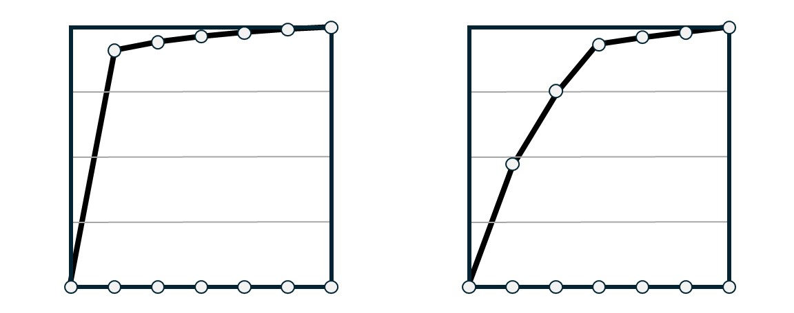

# 2025C — quiz5

*20 problems, in the order they appeared. GENERATED by scripts/compile.py.*

## ESE2030-0096
*week 10 · 2025C quiz5 #1 · active · legacy Q5-P01*  
skills: `W10.S02` Compute the SVD of a 2x2 or a simple 2x3 / 3x2 matrix  
topics: SVD from geometric picture, singular value conventions, left vs right singular vectors

The figure shows how a matrix $A \in \mathbb{R}^{2 \times 2}$ transforms the unit circle to an ellipse, with the singular vectors represented.

Based on this figure, which of the following is the most likely SVD of $A = U\Sigma V^T$?

- **(A)** $U = \frac{1}{\sqrt{2}}\begin{bmatrix} 1 & 1 \\ 1 & -1 \end{bmatrix}, \quad \Sigma = \begin{bmatrix} 3/2 & 0 \\ 0 & 1/2 \end{bmatrix}, \quad V = \frac{1}{\sqrt{2}}\begin{bmatrix} 1 & 1 \\ -1 & 1 \end{bmatrix}$
- **(B)** $U = \frac{1}{\sqrt{2}}\begin{bmatrix} 1 & 1 \\ -1 & 1 \end{bmatrix}, \quad \Sigma = \begin{bmatrix} 3/2 & 0 \\ 0 & 1/2 \end{bmatrix}, \quad V = \frac{1}{\sqrt{2}}\begin{bmatrix} 1 & 1 \\ 1 & -1 \end{bmatrix}$
- **(C)** $U = \frac{1}{\sqrt{2}}\begin{bmatrix} 1 & 1 \\ -1 & 1 \end{bmatrix}, \quad \Sigma = \begin{bmatrix} 1/2 & 0 \\ 0 & 3/2 \end{bmatrix}, \quad V = \frac{1}{\sqrt{2}}\begin{bmatrix} 1 & 1 \\ -1 & 1 \end{bmatrix}$
- **(D)** $U = \frac{1}{\sqrt{2}}\begin{bmatrix} 1 & 1 \\ 1 & -1 \end{bmatrix}, \quad \Sigma = \begin{bmatrix} 3/2 & 0 \\ 0 & -1/2 \end{bmatrix}, \quad V = \frac{1}{\sqrt{2}}\begin{bmatrix} 1 & 1 \\ 1 & -1 \end{bmatrix}$
- **(E)** $U = \frac{1}{\sqrt{2}}\begin{bmatrix} 1 & 1 \\ 1 & -1 \end{bmatrix}, \quad \Sigma = \begin{bmatrix} 3/2 & 0 \\ 0 & 1/2 \end{bmatrix}, \quad V = \frac{1}{\sqrt{2}}\begin{bmatrix} 1 & 1 \\ 1 & -1 \end{bmatrix}$

Answer

**Correct: (B)**

Reading from the figure: - The right singular vectors (columns of $V$) are in the domain at $\pm 45°$: $\mathbf{v}_1 = (1,1)^T/\sqrt{2}$ and $\mathbf{v}_2 = (1,-1)^T/\sqrt{2}$ - The semi-axis lengths give $\sigma_1 = 3/2$ (major) and $\sigma_2 = 1/2$ (minor) - The left singular vectors (columns of $U$) align with the ellipse axes in the codomain: $\mathbf{u}_1 = (1,-1)^T/\sqrt{2}$ (at $-45°$) and $\mathbf{u}_2 = (1,1)^T/\sqrt{2}$ (at $45°$)

Why the distractors tempt:
- (A) swaps $U$ and $V$; confuses which singular vectors live in domain vs codomain
- (C) places smaller singular value first; violates the convention $\sigma_1 \geq \sigma_2 \geq \cdots \geq 0$
- (D) uses negative singular value $-1/2$; singular values must be non-negative by definition
- (E) (uses $\sigma_i^2$ instead of $\sigma_i$; confuses eigenvalues of $A^TA$ with singular values) %%%%%%%%%%%%%%%%%%%%%%%%%%%%%%%%%%%%%%%%%%%%%%%%%%%%%%%%%%%%%%%% %%%%%%%%%%%%%%%%%%%%%%%%%%%%%%%%%%%%%%%%%%%%%%%%%%%%%%%%%%%%%%%%

---

## ESE2030-0097
*week 10 · 2025C quiz5 #2 · active · legacy Q5-P02*  
skills: `W10.S08` Relate singular values of A to eigenvalues of A^T A without conflating them  
topics: Geometric foundations of SVD, sphere to ellipsoid transformation, role of A^TA

A linear transformation $A \in \mathbb{R}^{3 \times 2}$ maps the unit circle in $\mathbb{R}^2$ to an ellipse in $\mathbb{R}^3$. The matrix $A^TA$ has eigenvalues $\lambda_1 = 9$ and $\lambda_2 = 4$ with corresponding orthonormal eigenvectors $\mathbf{v}_1$ and $\mathbf{v}_2$.

Which statement correctly describes the geometric action of $A$?

- **(A)** The ellipse in $\mathbb{R}^3$ has semi-axis lengths 9 and 4, aligned with the directions $\mathbf{v}_1$ and $\mathbf{v}_2$.
- **(B)** The ellipse in $\mathbb{R}^3$ has semi-axis lengths 3 and 2, and the input directions $\mathbf{v}_1$ and $\mathbf{v}_2$ are mapped to these semi-axes.
- **(C)** The ellipse lies in a 2-dimensional subspace of $\mathbb{R}^3$, with semi-axis lengths $\sqrt{9} = 3$ and $\sqrt{4} = 2$.
- **(D)** The transformation stretches the direction $\mathbf{v}_1$ by factor 9 and $\mathbf{v}_2$ by factor 4, producing an ellipse with area $36\pi$.
- **(E)** The eigenvalues of $A$ determine the semi-axis lengths, which are 9 and 4.

Answer

**Correct: (C)**  — partial credit: B

The key geometric insight is that $A$ transforms the unit circle (sphere in $\mathbb{R}^2$) into an ellipse in $\mathbb{R}^3$. Since $A \in \mathbb{R}^{3 \times 2}$, the image must lie in a 2-dimensional subspace (the column space of $A$). The eigenvalues $\lambda_i$ of $A^TA$ give $\|A\mathbf{v}_i\|^2 = \lambda_i$, so the singular values $\sigma_i = \sqrt{\lambda_i}$ are the actual stretching factors: $\sigma_1 = 3$ and $\sigma_2 = 2$. These are the semi-axis lengths of the ellipse. The eigenvectors $\mathbf{v}_1, \mathbf{v}_2$ (in the domain) are the principal input directions that get stretched to form the semi-axes.

Why the distractors tempt:
- (A) confuses eigenvalues $\lambda_i$ with singular values $\sigma_i$; the eigenvalues give squared stretching, not the lengths themselves
- (D) uses eigenvalues as stretching factors instead of their square roots
- (E) conflates eigenvalues of $A$ with eigenvalues of $A^TA$; for rectangular $A$, eigenvalues of $A$ don't exist

---

## ESE2030-0098
*week 11 · 2025C quiz5 #3 · active · legacy Q5-P03*  
skills: `W11.S08` Project data onto the top two components and interpret the resulting plot; `W11.S02` Identify principal components as eigenvectors of C or right singular vectors of X  
topics: Rank-k approximation from both perspectives, preprocessing effects

A centered data matrix $X \in \mathbb{R}^{n \times d}$ has SVD $X = U\Sigma V^T$ with singular values $\sigma_1 = 100, \sigma_2 = 50, \sigma_3 = 25, \ldots$ A researcher wants a 2-dimensional representation of the $n$ observations and considers two approaches:

\textbf{Approach 1:} Compute the $n \times 2$ matrix $U_2\Sigma_2$, where $U_2$ contains the first 2 columns of $U$ and $\Sigma_2$ is the $2 \times 2$ upper-left block of $\Sigma$.

\textbf{Approach 2:} Compute the $n \times 2$ matrix $XV_2$, where $V_2$ contains the first 2 columns of $V$ (i.e., project each observation onto the first two principal component directions).

Which statement is most TRUE?

- **(A)** Both approaches give identical 2D representations since $U\Sigma = XV$.
- **(B)** Approach 1 gives the optimal rank-2 approximation to $X$ in Frobenius norm, while Approach 2 gives the 2D representation that maximizes captured variance, but these are different things.
- **(C)** The approaches yield different matrices: $U_2\Sigma_2 \neq XV_2$ because one uses left singular vectors and the other uses right singular vectors.
- **(D)** Approach 1 produces vectors in $\mathbb{R}^n$ while Approach 2 produces vectors in $\mathbb{R}^d$, so they cannot be compared.
- **(E)** Both approaches produce the same $n \times 2$ matrix of 2D observation coordinates, and both optimally capture the variance structure in a 2D subspace.

Answer

**Correct: (E)**  — partial credit: B

This tests whether students understand the equivalence of different formulations: - $U\Sigma V^T$ is the SVD, so $X = U\Sigma V^T$ - Therefore $XV = U\Sigma V^T V = U\Sigma$ (since $V^TV = I$) - Keeping first 2 columns: $U_2\Sigma_2 = XV_2$, where subscript 2 means first 2 columns Both approaches yield the SAME $n \times 2$ matrix. This matrix: 1) Gives the best rank-2 approximation: $X_2 = U_2\Sigma_2 V_2^T$ minimizes $\|X - X_2\|_F$ (Eckart-Young from Week 10) 2) Maximizes variance captured: the columns are projections onto principal directions that explain the most variance (from Week 11) 3) Projects observations optimally onto a 2D subspace KEY SYNTHESIS: SVD's optimal low-rank approximation and PCA's variance maximization are THE SAME THING for centered data. The geometric picture (ellipsoid with largest semi-axes) corresponds to the statistical picture (directions of maximum variance).

---

## ESE2030-0099
*week 10 · 2025C quiz5 #4 · active · legacy Q5-P04*  
skills: `W10.S08` Relate singular values of A to eigenvalues of A^T A without conflating them  
topics: Singular values ordering, operations on matrices, basic SVD properties

A matrix $A \in \mathbb{R}^{m \times n}$ has singular values $\sigma_1 = 5$, $\sigma_2 = 3$, $\sigma_3 = 1$, and $\sigma_k = 0$ for $k>3$.

Which of the following statements is most TRUE?

- **(A)** Matrix $2A$ has singular values 10, 6, 2, with all others zero, but they should be reordered as 2, 6, 10 to maintain the SVD convention.
- **(B)** Matrix $A^T$ has singular values $\sigma_1=1, \sigma_2=3, \sigma_3=5$, with all others zero.
- **(C)** Matrix $A^TA$ has eigenvalues 25, 9, 1, with the remaining eigenvalues zero.
- **(D)** The largest singular value of $AA^T$ is 25.
- **(E)** Matrices $A^TA$ and $AA^T$ have different nonzero eigenvalues.

Answer

**Correct: (C)**

Singular values are ALWAYS arranged in descending order: $\sigma_1 \geq \sigma_2 \geq \cdots \geq 0$. This is a convention, not a consequence of any operation. The key relationships: (1) $A$ and $A^T$ have identical singular values (same set, same order). (2) If $A$ has singular values $\{\sigma_i\}$, then $cA$ has singular values $\{|c|\sigma_i\}$ in the same descending order. (3) The eigenvalues of $A^TA$ are $\sigma_i^2$, so $25, 9, 1, 0, 0, \ldots$ in descending order. (4) Both $A^TA$ and $AA^T$ share the same NONZERO eigenvalues (namely $\sigma_i^2$ for $i \leq r = \rank(A)$), though they may have different numbers of zero eigenvalues depending on dimensions.

Why the distractors tempt:
- (A) singular values of $2A$ are correctly computed as $10, 6, 2$, but they do NOT need reordering—they're already in descending order by construction
- (B) $A^T$ has the SAME singular values as $A$, in the same descending order; transpose doesn't reverse the ordering
- (D) $AA^T$ is an $m \times m$ matrix; its eigenvalues are $\sigma_i^2 = 25, 9, 1, 0, \ldots$, so its largest eigenvalue is 25, but this is an eigenvalue, not a singular value of $AA^T$. The singular values of $AA^T$ would be the square roots of eigenvalues of $(AA^T)^T(AA^T) = AA^TAA^T$
- (E) classic misconception: $A^TA$ and $AA^T$ always share the same nonzero eigenvalues, which are $\sigma_1^2, \ldots, \sigma_r^2$

---

## ESE2030-0100
*week 10 · 2025C quiz5 #5 · active · legacy Q5-P05*  
skills: `W10.S07` Build A^+ from a given SVD and use it to solve a least squares problem  
topics: Pseudoinverse construction via SVD, Σ^† formula

A matrix $A \in \mathbb{R}^{4 \times 3}$ has singular value decomposition $A = U\Sigma V^T$ where $U \in \mathbb{R}^{4 \times 4}$, $V \in \mathbb{R}^{3 \times 3}$ are orthogonal, and:
$$\Sigma = \begin{bmatrix} 5 & 0 & 0 \\ 0 & 2 & 0 \\ 0 & 0 & 0 \\ 0 & 0 & 0 \end{bmatrix} \in \mathbb{R}^{4 \times 3}$$

What is the pseudoinverse $A^\dagger$ of this matrix?

- **(A)** $A^\dagger = U\Sigma^{-1} V^T$ where $\Sigma^{-1} = \begin{bmatrix} 1/5 & 0 & 0 \\ 0 & 1/2 & 0 \\ 0 & 0 & \text{undefined} \\ 0 & 0 & \text{undefined} \end{bmatrix}$
- **(B)** $A^\dagger = V\Sigma^T U^T$ where $\Sigma^T = \begin{bmatrix} 5 & 0 & 0 & 0 \\ 0 & 2 & 0 & 0 \\ 0 & 0 & 0 & 0 \end{bmatrix}$
- **(C)** $A^\dagger = V\Sigma^\dagger U^T$ where $\Sigma^\dagger = \begin{bmatrix} 1/5 & 0 & 0 & 0 \\ 0 & 1/2 & 0 & 0 \\ 0 & 0 & 0 & 0 \end{bmatrix}$
- **(D)** $A^\dagger = U^T\Sigma^\dagger V$ where $\Sigma^\dagger = \begin{bmatrix} 1/5 & 0 & 0 & 0 \\ 0 & 1/2 & 0 & 0 \\ 0 & 0 & 0 & 0 \end{bmatrix}$
- **(E)** $A^\dagger = V\Sigma^\dagger U^T$ where $\Sigma^\dagger = \begin{bmatrix} 1/5 & 0 & 0 \\ 0 & 1/2 & 0 \\ 0 & 0 & 0 \\ 0 & 0 & 0 \end{bmatrix}$

Answer

**Correct: (C)**

The pseudoinverse formula is $A^\dagger = V\Sigma^\dagger U^T$. The pseudoinverse of the diagonal matrix $\Sigma$ is constructed by: (1) transposing $\Sigma$ to get a $3 \times 4$ matrix, then (2) replacing each nonzero diagonal entry $\sigma_i$ with $1/\sigma_i$, and (3) leaving zero entries as zero. Thus: $$\Sigma^\dagger = \begin{bmatrix} 1/5 & 0 & 0 & 0 \\ 0 & 1/2 & 0 & 0 \\ 0 & 0 & 0 & 0 \end{bmatrix} \in \mathbb{R}^{3 \times 4}$$ Note the dimensions: $A$ is $4 \times 3$, so $A^\dagger$ must be $3 \times 4$. We have $V$ is $3 \times 3$, $\Sigma^\dagger$ is $3 \times 4$, and $U^T$ is $4 \times 4$, giving $(3 \times 3)(3 \times 4)(4 \times 4) = 3 \times 4$. ✓ The key insight: we don't try to "invert" $\Sigma$ (which is rectangular and rank-deficient), but rather construct its pseudoinverse by transposing and inverting only the nonzero entries.

Why the distractors tempt:
- (A) trying to directly invert $\Sigma$ doesn't work because $\Sigma$ is rectangular and has zero entries; the pseudoinverse handles this by transposing first
- (B) just transposing $\Sigma$ doesn't give the pseudoinverse; you must also invert the nonzero entries
- (D) incorrect ordering; the pseudoinverse is $V\Sigma^\dagger U^T$, not $U^T\Sigma^\dagger V$, which comes from reversing $A = U\Sigma V^T$
- (E) zero singular values remain zero in $\Sigma^\dagger$; they are NOT replaced with 1 or any other value

---

## ESE2030-0101
*week 10 · 2025C quiz5 #6 · active · legacy Q5-P06*  
skills: `W10.S03` Read rank, and bases for all four fundamental subspaces, off a GIVEN SVD  
topics: Fundamental subspaces via SVD, left vs right singular vectors, geometric interpretation

A data matrix $A \in \mathbb{R}^{100 \times 50}$ represents measurements where rows are observations and columns are features. The SVD $A = U\Sigma V^T$ reveals that only the first 10 singular values are nonzero: $\sigma_1 \geq \sigma_2 \geq \cdots \geq \sigma_{10} > 0$ and $\sigma_{11} = \cdots = \sigma_{50} = 0$.

An analyst wants to understand the fundamental subspaces. Which statement is most TRUE?

- **(A)** The first 10 right singular vectors $\mathbf{v}_1, \ldots, \mathbf{v}_{10}$ span the column space of $A$, capturing the 10 most important patterns in the observations.
- **(B)** The first 10 left singular vectors $\mathbf{u}_1, \ldots, \mathbf{u}_{10}$ span a 10-dimensional subspace of feature space where all data variation occurs.
- **(C)** The right singular vectors $\mathbf{v}_{11}, \ldots, \mathbf{v}_{50}$ form a basis for $\ker(A)$, representing 40 redundant feature combinations.
- **(D)** The left singular vectors $\mathbf{u}_{11}, \ldots, \mathbf{u}_{100}$ span $\ker(A^T)$, representing observation directions that have no correlation with any features.
- **(E)** Both (C) and (D) are correct.

Answer

**Correct: (E)**  — partial credit: D

This tests understanding of which singular vectors span which fundamental subspaces. For $A \in \mathbb{R}^{100 \times 50}$ with rank 10: - Right singular vectors $\mathbf{v}_i \in \mathbb{R}^{50}$ (feature space): $\{\mathbf{v}_1, \ldots, \mathbf{v}_{10}\}$ span $\text{im}(A^T)$ (NOT $\text{im}(A)$), and $\{\mathbf{v}_{11}, \ldots, \mathbf{v}_{50}\}$ span $\ker(A)$. Statement C is correct. - Left singular vectors $\mathbf{u}_i \in \mathbb{R}^{100}$ (observation space): $\{\mathbf{u}_1, \ldots, \mathbf{u}_{10}\}$ span $\text{im}(A)$, and $\{\mathbf{u}_{11}, \ldots, \mathbf{u}_{100}\}$ span $\ker(A^T)$. Statement D is correct. The kernel $\ker(A)$ has dimension $50 - 10 = 40$, representing linear combinations of features that always give zero when $A$ acts on them (redundant feature directions). The left null space $\ker(A^T)$ has dimension $100 - 10 = 90$, representing observation directions orthogonal to the column space.

Why the distractors tempt:
- (A) confuses $\text{im}(A^T)$ with $\text{im}(A)$; right singular vectors span $\text{im}(A^T)$ in the domain, not $\text{im}(A)$ in the codomain
- (B) left singular vectors live in observation space $\mathbb{R}^{100}$, not feature space $\mathbb{R}^{50}$; they span the column space $\text{im}(A)$, which is 10-dimensional

---

## ESE2030-0102
*week 10 · 2025C quiz5 #7 · active · legacy Q5-P07*  
skills: `W10.S04` Write A as a sum of rank-one terms and identify the dominant one  
topics: Matrix dimensions in SVD, compatibility, parameter counting

A machine learning engineer wants to store a compressed representation of matrix $A \in \mathbb{R}^{500 \times 300}$ using its rank-$k$ SVD approximation $A_k = \sum_{i=1}^k \sigma_i \mathbf{u}_i\mathbf{v}_i^T$.

To store $A_k$, they need to save:
\begin{itemize}
\item $k$ singular values $\{\sigma_1, \ldots, \sigma_k\}$
\item $k$ left singular vectors $\{\mathbf{u}_1, \ldots, \mathbf{u}_k\}$
\item $k$ right singular vectors $\{\mathbf{v}_1, \ldots, \mathbf{v}_k\}$
\end{itemize}

How many total scalar values must be stored, and for which value of $k$ does the storage equal the original matrix $A$?

- **(A)** $k(500 + 300 + 1)$ values; storage equals original when $k = 500$
- **(B)** $k(500 + 300 + 1)$ values; storage equals original when $k = 300$
- **(C)** $k(500 + 300)$ values; storage equals original when $k = 187$ (approximately)
- **(D)** $k(500 \cdot 300)$ values; storage never equals original since SVD is always compressed
- **(E)** $k(500 + 300 + 1)$ values; storage equals original when $k = 187$ (approximately)

Answer

**Correct: (E)**

For rank-$k$ approximation of $A \in \mathbb{R}^{500 \times 300}$: - $k$ singular values (each is 1 scalar): $k$ values - $k$ left singular vectors $\mathbf{u}_i \in \mathbb{R}^{500}$: $500k$ values - $k$ right singular vectors $\mathbf{v}_i \in \mathbb{R}^{300}$: $300k$ values Total storage: $k + 500k + 300k = k(500 + 300 + 1) = 801k$ values. The original matrix $A$ stores $500 \times 300 = 150000$ values. Storage equals original when: $801k = 150000$, so $k = 150000/801 \approx 187.3$ This shows the crossover point: for $k < 187$, SVD compression saves storage; for $k > 187$, it uses more. The maximum useful rank is $\min(500, 300) = 300$, but full rank ($k=300$) would store $801 \times 300 = 240300$ values, which exceeds the original! This reveals why SVD compression is most valuable when the effective rank is much smaller than both dimensions.

Why the distractors tempt:
- (A) correctly counts storage but incorrectly thinks full storage occurs at $k = m = 500$; the maximum rank is $\min(m,n) = 300$
- (B) correctly counts storage but thinks full storage = max rank; actually at max rank, SVD stores MORE than original due to separate storage of vectors
- (C) forgets to count the $k$ singular values themselves; singular values are scalars that must also be stored
- (D) (incorrectly thinks each component requires full $m \times n$ storage; the outer product $\mathbf{u}_i\mathbf{v}_i^T$ need not be stored explicitly) %%%%%%%%%%%%%%%%%%%%%%%%%%%%%%%%%%%%%%%%%%%%%%%%%%%%%%%%%%%%%%%% %%%%%%%%%%%%%%%%%%%%%%%%%%%%%%%%%%%%%%%%%%%%%%%%%%%%%%%%%%%%%%%%

---

## ESE2030-0103
*week 10 · 2025C quiz5 #8 · active · legacy Q5-P08*  
skills: `W10.S08` Relate singular values of A to eigenvalues of A^T A without conflating them  
topics: SVD of orthogonal matrices, singular values, geometric interpretation

What can be said about the SVD of an orthogonal matrix $Q \in \mathbb{R}^{n \times n}$?.

- **(A)** All singular values equal 1, so $Q = U\Sigma V^T$ where $\Sigma = I$, meaning $Q = UV^T$ is a product of two orthogonal matrices.
- **(B)** The singular values depend on the specific matrix $Q$; for example, a rotation matrix has different singular values than a reflection matrix.
- **(C)** All singular values equal 1, and because of this the SVD is not unique.
- **(D)** Orthogonal matrices do not have a uniquely defined SVD because they preserve lengths, which contradicts the stretching interpretation of singular values.
- **(E)** The largest singular value is 1, but the other singular values can be less than 1 depending on how much $Q$ ``compresses'' certain directions.

Answer

**Correct: (A)**  — partial credit: C

For any orthogonal matrix $Q$, we have $Q^T Q = I$. The singular values of $Q$ are defined as $\sigma_i = \sqrt{\lambda_i}$ where $\lambda_i$ are eigenvalues of $Q^T Q = I$. Since the eigenvalues of the identity matrix are all 1, we get $\sigma_i = \sqrt{1} = 1$ for all $i$. Therefore, in the SVD $Q = U\Sigma V^T$, we have $\Sigma = I$, giving $Q = U I V^T = UV^T$. This shows that every orthogonal matrix can be written as a product of two orthogonal matrices. Geometrically, orthogonal matrices preserve lengths (no stretching or compression), which is exactly what having all singular values equal to 1 means. The SVD decomposition $Q = UV^T$ represents $Q$ as a composition of two orthogonal transformations.

Why the distractors tempt:
- (B) doesn't recognize that the defining property $Q^T Q = I$ immediately forces all singular values to be 1
- (C) (correctly identifies that all singular values are 1, but incorrectly concludes non-uniqueness
- (D) misunderstands the SVD; preserving lengths means singular values are 1, not that SVD doesn't exist
- (E) backwards reasoning: orthogonal matrices preserve ALL lengths, so no direction is compressed; all singular values must be 1

---

## ESE2030-0104
*week 11 · 2025C quiz5 #9 · active · legacy Q5-P09*  
skills: `W11.S05` Decide between covariance PCA and correlation PCA from the units and scales given; `W11.S09` Interpret loadings: which variables drive which component, and the sign ambiguity  
topics: Covariance vs Correlation PCA, preprocessing and scaling

An engineer monitors a chemical reactor with three sensors measuring temperature ($T$, in °C), pressure ($P$, in kPa), and flow rate ($F$, in mL/min). A week of measurements yields:
$$\text{Temperature: } T \in [180, 220] \text{ °C}$$
$$\text{Pressure: } P \in [2000, 2500] \text{ kPa}$$
$$\text{Flow rate: } F \in [5, 15] \text{ mL/min}$$

The engineer performs covariance PCA on the centered data and finds that the first principal component is approximately:
$$\mathbf{v}_1 \approx (0.002, 0.998, 0.005)^T$$

Which statement best explains this result?

- **(A)** Pressure dominates the first principal component because it has the largest absolute variance, masking potentially important patterns in temperature and flow.
- **(B)** The principal component correctly identifies pressure as the most important variable since it has the widest measurement range.
- **(C)** This result suggests the three variables are uncorrelated, with pressure varying independently of temperature and flow.
- **(D)** The small coefficients for temperature and flow indicate these variables contribute negligible information and can be discarded.
- **(E)** Covariance PCA automatically accounts for different measurement scales, so this result reveals genuine physical dominance of pressure variation.

Answer

**Correct: (A)**

Covariance PCA is sensitive to the scale of variables. Pressure varies on the order of hundreds of kPa, while temperature varies by tens of degrees and flow by ~10 mL/min. The sample variance of pressure will be much larger (proportional to the square of the range), causing the first PC to align almost entirely with the pressure direction. This doesn't mean pressure is genuinely "more important" - it's an artifact of the different measurement units. To reveal patterns independent of scale, the engineer should use correlation PCA (standardize variables to unit variance before PCA) or carefully rescale the variables.

Why the distractors tempt:
- (E) (contradicts the fundamental issue with covariance PCA - it does NOT automatically account for scale) %%%%%%%%%%%%%%%%%%%%%%%%%%%%%%%%%%%%%%%%%%%%%%%%%%%%%%%%%%%%%%%% %%%%%%%%%%%%%%%%%%%%%%%%%%%%%%%%%%%%%%%%%%%%%%%%%%%%%%%%%%%%%%%%

---

## ESE2030-0105
*week 11 · 2025C quiz5 #10 · active · legacy Q5-P10*  
skills: `W11.S09` Interpret loadings: which variables drive which component, and the sign ambiguity; `W11.S03` Compute variance captured and explained-variance ratios from eigenvalues or singular values  
topics: Interpreting principal components, physical meaning

Four vibration sensors measure vertical displacement (in mm) on a suspension bridge at locations: North anchor, North midspan, South midspan, South anchor. After centering the data, (covariance) PCA reveals the following eigenvectors/eigenvalues of $X^TX$:

$$\mathbf{v}_1 = \frac{1}{2}\begin{pmatrix} 1 \\ 1 \\ 1 \\ 1 \end{pmatrix}, \quad \mathbf{v}_2 = \frac{1}{\sqrt{2}}\begin{pmatrix} 1 \\ 0 \\ 0 \\ -1 \end{pmatrix}, \quad \mathbf{v}_3 = \frac{1}{\sqrt{2}}\begin{pmatrix} 0 \\ 1 \\ -1 \\ 0 \end{pmatrix}$$

with eigenvalues $\lambda_1 = 36$, $\lambda_2 = 9$, $\lambda_3 = 4$, $\lambda_4 = 1$ (in mm²).

Which interpretation is most consistent with these results?

- **(A)** $\mathbf{v}_1$ represents uniform vertical motion of the entire bridge (all sensors move together), capturing 72\% of total variance.
- **(B)** $\mathbf{v}_2$ represents torsional twisting where the North side moves opposite to the South side, while midspan points remain stationary.
- **(C)** $\mathbf{v}_3$ represents antisymmetric bending where the two midspan points move in opposite directions while anchors remain fixed.
- **(D)** All of the above (A, B, and C) are correct interpretations of the principal components.
- **(E)** None of the above.

Answer

**Correct: (D)**  — partial credit: A, B, C

Each principal component reveals a distinct vibration mode: - $\mathbf{v}_1 = (1,1,1,1)/2$: All four sensors move together with equal weight → uniform vertical displacement. Proportion: $36/50 = 72\%$. - $\mathbf{v}_2 = (1,0,0,-1)/\sqrt{2}$: North anchor and South anchor move in opposite directions (+1 vs -1), midspan sensors have zero weight → end-to-end "tilting" or rotational mode. - $\mathbf{v}_3 = (0,1,-1,0)/\sqrt{2}$: The two midspan sensors move in opposition while anchors have zero weight → midspan antisymmetric bending. These interpretations match physical vibration modes of bridges. The large $\lambda_1$ indicates most variation is uniform heaving.

---

## ESE2030-0106
*week 10 · 2025C quiz5 #11 · active · legacy Q5-P11*  
skills: `W10.S03` Read rank, and bases for all four fundamental subspaces, off a GIVEN SVD  
topics: SVD revealing Fundamental Theorem structure, isomorphism between subspaces

The SVD $A = U\Sigma V^T$ reveals that $A$ acts as an isomorphism (scaled by singular values) between certain fundamental subspaces. For matrix $A \in \mathbb{R}^{m \times n}$ with rank $r$, which statement is most TRUE?

- **(A)** $A$ maps $\ker(A)$ isomorphically onto $\ker(A^T)$ by the relationship $A\mathbf{v}_i = \sigma_i \mathbf{u}_i$ for $i > r$.
- **(B)** $A$ maps $\text{im}(A^T)$ isomorphically onto $\text{im}(A)$, with the isomorphism given by scaling: $A\mathbf{v}_i = \sigma_i \mathbf{u}_i$ for $i \leq r$.
- **(C)** $A$ maps $\mathbb{R}^n$ isomorphically onto $\mathbb{R}^m$ whenever $m = n$, regardless of rank.
- **(D)** $A$ maps both $\ker(A)$ and $\text{im}(A^T)$ isomorphically onto $\text{im}(A)$, explaining why $\dim(\ker(A)) + \dim(\text{im}(A^T)) = \dim(\text{im}(A))$.
- **(E)** The restriction of $A$ to $\ker(A)$ is an isomorphism onto $\ker(A^T)$ because both have dimension $n - r$.

Answer

**Correct: (B)**

This tests the deep geometric insight from the Fundamental Theorem via SVD. The key observation: $A$ collapses $\ker(A)$ to zero but acts as an isomorphism on $(\ker A)^\perp = \text{im}(A^T)$. Specifically: - For $i \leq r$ (nonzero singular values): $A\mathbf{v}_i = \sigma_i \mathbf{u}_i$. The vectors $\{\mathbf{v}_1, \ldots, \mathbf{v}_r\}$ form an orthonormal basis for $\text{im}(A^T)$, and $\{\mathbf{u}_1, \ldots, \mathbf{u}_r\}$ form an orthonormal basis for $\text{im}(A)$. - $A$ restricted to $\text{im}(A^T)$ gives a bijection onto $\text{im}(A)$: it's injective (kernel restricted to $\text{im}(A^T)$ is trivial) and surjective (by definition of image). The singular values $\sigma_i$ provide the scaling factors for this isomorphism. - For $i > r$ (zero singular values): $A\mathbf{v}_i = \mathbf{0}$, so $A$ collapses $\ker(A) = \text{span}\{\mathbf{v}_{r+1}, \ldots, \mathbf{v}_n\}$ to zero. This reveals the geometric content of the Fundamental Theorem: $A$ acts as $(\text{im}(A^T) \xrightarrow{\sim} \text{im}(A)) \oplus (\ker(A) \to \{\mathbf{0}\})$.

Why the distractors tempt:
- (A) $A$ maps $\ker(A)$ to zero, not to $\ker(A^T)$; these are unrelated subspaces in different vector spaces
- (C) false even when $m = n$; if rank$(A) < n$, then $A$ is not an isomorphism because it has a nontrivial kernel
- (D) completely wrong dimension formula; rank-nullity says $\dim(\ker(A)) + \dim(\text{im}(A^T)) = n$, not $\dim(\text{im}(A))$
- (E) ($A$ restricted to $\ker(A)$ gives the zero map, not an isomorphism; $A$ annihilates $\ker(A)$) %%%%%%%%%%%%%%%%%%%%%%%%%%%%%%%%%%%%%%%%%%%%%%%%%%%%%%%%%%%%%%%% %%%%%%%%%%%%%%%%%%%%%%%%%%%%%%%%%%%%%%%%%%%%%%%%%%%%%%%%%%%%%%%% %%%%%%%%%%%%%%%%%%%%%%%%%%%%%%%%%%%%%%%%%%%%%%%%%%%%%%%%%%%%%%%% %%%%%%%%%%%%%%%%%%%%%%%%%%%%%%%%%%%%%%%%%%%%%%%%%%%%%%%%%%%%%%%%

---

## ESE2030-0107
*week 11 · 2025C quiz5 #12 · active · legacy Q5-P12*  
skills: `W11.S04` Read a scree plot and defend a choice of k; `W11.S05` Decide between covariance PCA and correlation PCA from the units and scales given  
topics: Covariance vs correlation PCA, scree plots, intrinsic dimensionality, scale artifacts

A data scientist analyzes measurements from six sensors monitoring a thermodynamic process. The sensors measure various properties of the system: pressure, temperature, volume, entropy, enthalpy, and work.
The figures below plot (vertically) cumulative explained variance for covariance PCA (left) and correlation PCA (right), versus (horizontally) number of singular values (from 0 to 6). Based on these plots, which interpretation is most appropriate?

- **(A)** Covariance PCA reveals that the process is essentially one-dimensional: a single latent variable explains 94\% of all variation, making $k=1$ the optimal choice for dimensionality reduction.
- **(B)** Correlation PCA suggests the process has intrinsic dimension approximately 3, with scale differences among sensors masking this structure in the covariance analysis.
- **(C)** Both analyses agree on low intrinsic dimensionality; correlation PCA is always preferable as it preserves the natural units of measurement.
- **(D)** The correlation PCA result is misleading because standardizing variables inflates the apparent contribution of low-variance sensors like volume.
- **(E)** A rank-2 approximation captures over 75\% of variance in both analyses, so either method supports reducing to 2 dimensions.

Answer

**Correct: (B)**

The 94% variance captured by the first covariance PC is a classic symptom of scale mismatch: pressure (measured in thousands of kPa) dominates the variance simply due to units. This doesn't indicate true 1-dimensionality—it indicates that one variable has numerically larger values than the others. Correlation PCA standardizes all variables to unit variance, removing scale artifacts. The resulting plot shows a clear elbow at $k=3$: three components capture 90% of standardized variance, suggesting the underlying process has approximately 3 degrees of freedom. This is the genuine intrinsic dimensionality, revealed only after accounting for measurement scale. The covariance result would lead to discarding potentially important process information that happens to be measured in small-magnitude units (like pH ranging 6-8 or dissolved O₂ in mg/L).

Why the distractors tempt:
- (A) falls into the scale-artifact trap; high variance ≠ physical importance
- (C) covariance PCA does NOT reveal low dimensionality—it reveals scale dominance; also, "natural units" is not a valid reason when units are incommensurable
- (D) standardization doesn't "inflate" low-variance variables unfairly—it gives each variable equal opportunity to contribute, which is appropriate when scales are arbitrary
- (E) (technically true that correlation PCA hits 75% at $k=2$, but covariance PCA hits 97% at $k=2$, so "both analyses" is misleading; more importantly, this misses the key insight about WHICH analysis to trust) %%%%%%%%%%%%%%%%%%%%%%%%%%%%%%%%%%%%%%%%%%%%%%%%%%%%%%%%%%%%%%%% %%%%%%%%%%%%%%%%%%%%%%%%%%%%%%%%%%%%%%%%%%%%%%%%%%%%%%%%%%%%%%%%

---

## ESE2030-0108
*week 11 · 2025C quiz5 #13 · active · legacy Q5-P13*  
skills: `W11.S04` Read a scree plot and defend a choice of k  
topics: Choosing number of components, singular value decay patterns

Two centered data matrices are analyzed via covariance PCA:

\textbf{Dataset A:} $X_A \in \mathbb{R}^{200 \times 10}$ has all nonzero singular values:
$$\sigma_1 = 24, \quad \sigma_2 = 22, \quad \sigma_3 = 20, \quad \sigma_4 = 18, \quad \sigma_5 = 16, \ldots$$

\textbf{Dataset B:} $X_B \in \mathbb{R}^{200 \times 10}$ has all nonzero singular values:
$$\sigma_1 = 50, \quad \sigma_2 = 25, \quad \sigma_3 = 8, \quad \sigma_4 = 3, \quad \sigma_5 = 1, \ldots$$

Which statement best characterizes the difference between these datasets?

- **(A)** Dataset A has clearer low-dimensional structure.
- **(B)** Dataset B has clearer low-dimensional structure.
- **(C)** Dataset A is better for dimensionality reduction based on better total variance.
- **(D)** Both datasets have similar intrinsic dimensionality since all singular values are positive.
- **(E)** Dataset B should have been handled via correlation PCA.

Answer

**Correct: (B)**

The key insight is interpreting singular value decay. Dataset A shows gradual, nearly uniform decay (24, 22, 20, 18, ...) suggesting variation is spread across many dimensions with no clear dominant low-dimensional structure. Dataset B shows rapid decay (50, 25, 8, 3, 1, ...) with a sharp drop after the first 2-3 values, indicating the data lies approximately in a low-dimensional subspace. For PCA/dimensionality reduction, rapid decay is desirable - it means a few components capture most variation. This is the "elbow" pattern: large early values, then a sharp drop to small values. Dataset B would need fewer components to achieve any given variance threshold.

Why the distractors tempt:
- (E) rapid decay means FEWER components needed, not more

---

## ESE2030-0109
*week 10 · 2025C quiz5 #14 · active · legacy Q5-P14*  
skills: `W10.S03` Read rank, and bases for all four fundamental subspaces, off a GIVEN SVD  
topics: Four fundamental subspaces via SVD, kernel, image, orthogonal complements

A matrix $A \in \mathbb{R}^{7 \times 5}$ has rank 3 with SVD $A = U\Sigma V^T$.

Which approach yields a basis for the coimage $\text{coim}(A) = (\ker A)^\perp$?

- **(A)** Right singular vectors $\{\mathbf{v}_1, \mathbf{v}_2, \mathbf{v}_3, \mathbf{v}_4, \mathbf{v}_5\}$
- **(B)** Left singular vectors $\{\mathbf{u}_1, \mathbf{u}_2, \mathbf{u}_3\}$
- **(C)** Right singular vectors $\{\mathbf{v}_1, \mathbf{v}_2, \mathbf{v}_3\}$
- **(D)** Left singular vectors $\{\mathbf{u}_4, \mathbf{u}_5, \mathbf{u}_6, \mathbf{u}_7\}$
- **(E)** Right singular vectors $\{\mathbf{v}_4, \mathbf{v}_5\}$

Answer

**Correct: (C)**

The coimage $\text{coim}(A) = (\ker A)^\perp$ is the orthogonal complement of the kernel in the domain $\mathbb{R}^5$. By the Fundamental Theorem, $(\ker A)^\perp = \text{im}(A^T)$. The SVD reveals that $\text{im}(A^T)$ is spanned by right singular vectors corresponding to nonzero singular values. Since rank$(A) = 3$, we have exactly 3 nonzero singular values, so $\text{coim}(A) = \text{span}\{\mathbf{v}_1, \mathbf{v}_2, \mathbf{v}_3\}$.

Why the distractors tempt:
- (A) includes both $\ker(A)$ and $(\ker A)^\perp$, giving all of $\mathbb{R}^5$ rather than just the coimage
- (B) left singular vectors live in codomain $\mathbb{R}^7$, not domain $\mathbb{R}^5$
- (D) wrong space and wrong singular values
- (E) these span $\ker(A)$, not its orthogonal complement

---

## ESE2030-0110
*week 10 · 2025C quiz5 #15 · active · legacy Q5-P15*  
skills: `W10.S08` Relate singular values of A to eigenvalues of A^T A without conflating them  
topics: Eigenvalues vs singular values, symmetric matrices, general square matrices

A $3 \times 3$ matrix $A$ has eigenvalues $\lambda_1 = 5$, $\lambda_2 = -3$, $\lambda_3 = 1$.
Which statement about the singular values of $A$ is most TRUE?

- **(A)** The singular values are $5, 3, 1$.
- **(B)** The singular values are $25, 9, 1$.
- **(C)** The singular values are $\sqrt{5}, \sqrt{3}, 1$.
- **(D)** The singular values cannot be determined from eigenvalues alone.
- **(E)** The singular values of a {\em square} matrix equal the eigenvalues for any square matrix.

Answer

**Correct: (D)**  — partial credit: A

Eigenvalues and singular values measure fundamentally different things: - Eigenvalues come from $A\mathbf{v} = \lambda\mathbf{v}$ and can be negative or complex - Singular values come from $A^TA$ (or the SVD) and are always real and non-negative For SYMMETRIC matrices: $A = A^T$ implies $A^TA = A^2$, so the eigenvalues of $A^TA$ are $\lambda_i^2$, giving singular values $\sigma_i = |\lambda_i|$. Thus: $\sigma_1 = 5$, $\sigma_2 = 3$, $\sigma_3 = 1$. For NON-SYMMETRIC matrices: the eigenvalues of $A$ and $A^TA$ are unrelated in general. A non-symmetric matrix with these eigenvalues could have completely different singular values. Example: a shear matrix can have repeated eigenvalue 1 but singular values far from 1.

Why the distractors tempt:
- (B) confuses eigenvalues of $A^TA$ with singular values; singular values are $\sqrt{\lambda(A^TA)}$, not $\lambda^2$
- (C) inverts the relationship; singular values are $|\lambda_i|$ for symmetric matrices, not $\sqrt{|\lambda_i|}$
- (E) (false: eigenvalues can be negative or complex, but singular values are always $\geq 0$; immediately contradicted by $\lambda_2 = -3$) %%%%%%%%%%%%%%%%%%%%%%%%%%%%%%%%%%%%%%%%%%%%%%%%%%%%%%%%%%%%%%%% %%%%%%%%%%%%%%%%%%%%%%%%%%%%%%%%%%%%%%%%%%%%%%%%%%%%%%%%%%%%%%%%

---

## ESE2030-0111
*week 11 · 2025C quiz5 #16 · needs-review · legacy Q5-P16*  
skills: `W11.S02` Identify principal components as eigenvectors of C or right singular vectors of X  
topics: Effect of orthogonal transformations, invariance properties, creative application

Consider two analysts working with the same centered data matrix $X \in \mathbb{R}^{100 \times 6}$ that has singular values $\sigma_1 = 20, \sigma_2 = 15, \sigma_3 = 8, \sigma_4 = 5, \sigma_5 = 2, \sigma_6 = 1$.

\textbf{Analyst A} performs PCA directly on $X$.

\textbf{Analyst B} first applies an orthogonal transformation $Q \in \mathbb{R}^{6 \times 6}$ to get $Y = XQ$, then performs PCA on $Y$.

How do their results compare?

- **(A)** Analyst B's principal components are related to Analyst A's by the transformation: $\mathbf{w}_k = Q^T\mathbf{v}_k$, where $\mathbf{v}_k$ are A's principal components.
- **(B)** Both analysts obtain identical singular values: $\{20, 15, 8, 5, 2, 1\}$, but their principal component directions differ.
- **(C)** Analyst A's results are superior because applying $Q$ distorts the covariance structure of the data.
- **(D)** The analyses are equivalent only if $Q$ is a rotation (determinant +1), but not if $Q$ includes reflections (determinant -1).
- **(E)** Both analyses capture the same total variance and the same variance proportions, but the ordering of principal components may differ.

Answer

**Correct: (B)**  — partial credit: A

Key insight: Orthogonal transformations preserve singular values. If $X = U\Sigma V^T$, then $Y = XQ = U\Sigma V^TQ$. The singular values of $Y$ are found from $Y^TY = Q^TV\Sigma^2 V^TQ$. Since $Q$ is orthogonal, this is similar to $V\Sigma^2 V^T$, preserving eigenvalues. Thus singular values of $Y$ equal those of $X$. However, the principal components differ: for $Y$, the PCs are columns of $W$ where $Y = U\Sigma W^T$, giving $W = Q^TV$, so $\mathbf{w}_k = Q^T\mathbf{v}_k$. CONCEPTUAL POINT: The singular value spectrum (and thus variance captured) is invariant under orthogonal transformations of the columns. This makes sense: rotating the coordinate system doesn't change the intrinsic dimensionality or variance structure of the data - just the coordinate representation of the principal directions.

Why the distractors tempt:
- (E) the variance proportions are identical, but the ordering remains the same - both get $\sigma_1 = 20$ as largest, etc.

---

## ESE2030-0112
*week 11 · 2025C quiz5 #17 · active · legacy Q5-P17*  
topics: Correlation as cosine similarity, orthogonality, angle interpretation

Four feature vectors $(X_1, X_2, X_3, X_4)$ are extracted from centered sensor data. The covariance and correlation matrices are:

$$[\Sigma] = \begin{bmatrix}
4 & 3 & -4.2 & 6.4 \\
3 & 25 & -6 & -12 \\
-4.2 & -6 & 9 & 1.2 \\
6.4 & -12 & 1.2 & 16
\end{bmatrix}
\quad : \quad
[R] = \begin{bmatrix}
1.0 & 0.3 & -0.7 & 0.8 \\
0.3 & 1.0 & -0.4 & -0.6 \\
-0.7 & -0.4 & 1.0 & 0.1 \\
0.8 & -0.6 & 0.1 & 1.0
\end{bmatrix}$$

Which pairs of feature vectors have directions within $30^\circ$ of being orthogonal?

- **(A)** $(X_1, X_3)$ and $(X_2, X_4)$
- **(B)** $(X_1, X_2)$ and $(X_3, X_4)$
- **(C)** $(X_2, X_3)$ only
- **(D)** $(X_1, X_3)$, $(X_2, X_3)$, and $(X_2, X_4)$
- **(E)** $(X_1, X_2)$, $(X_2, X_3)$, and $(X_3, X_4)$

Answer

**Correct: (E)**

"Within 30° of orthogonal" means the angle θ satisfies $60° < \theta < 120°$, which requires: $$\cos(60°) < \cos(\theta) < \cos(120°) \quad \Rightarrow \quad -0.5 < \rho < 0.5$$ Since ρ = cos(θ) for centered vectors, we need $|\rho| < 0.5$. Checking each pair: - $(X_1, X_2)$: $\rho_{12} = 0.3$, so $|\rho| = 0.3 < 0.5$ → angle ≈ 73° ✓ - $(X_1, X_3)$: $\rho_{13} = -0.7$, so $|\rho| = 0.7 > 0.5$ → angle ≈ 134° ✗ - $(X_1, X_4)$: $\rho_{14} = 0.8$, so $|\rho| = 0.8 > 0.5$ → angle ≈ 37° ✗ - $(X_2, X_3)$: $\rho_{23} = -0.4$, so $|\rho| = 0.4 < 0.5$ → angle ≈ 114° ✓ - $(X_2, X_4)$: $\rho_{24} = -0.6$, so $|\rho| = 0.6 > 0.5$ → angle ≈ 127° ✗ - $(X_3, X_4)$: $\rho_{34} = 0.1$, so $|\rho| = 0.1 < 0.5$ → angle ≈ 84° ✓ Pairs within 30° of orthogonal: $(X_1, X_2)$, $(X_2, X_3)$, $(X_3, X_4)$. KEY DISTRACTION: Negative correlation doesn't automatically mean near-orthogonal. $(X_1, X_3)$ has $\rho = -0.7$ (angle 134°) and $(X_2, X_4)$ has $\rho = -0.6$ (angle 127°), both too far from 90°. Similarly, small covariance doesn't guarantee near-orthogonality - must check correlation.

Why the distractors tempt:
- (A) negative covariance/correlation suggests orthogonality, but $|\rho| > 0.5$ means angles are too extreme
- (B) uses covariance magnitude instead of correlation; $C_{12} = 3$ and $C_{34} = 1.2$ are small but this doesn't directly indicate angles
- (D) (assumes negative correlation means near-orthogonal, but need $|\rho| < 0.5$, not just $\rho < 0$) %%%%%%%%%%%%%%%%%%%%%%%%%%%%%%%%%%%%%%%%%%%%%%%%%%%%%%%%%%%%%%%% %%%%%%%%%%%%%%%%%%%%%%%%%%%%%%%%%%%%%%%%%%%%%%%%%%%%%%%%%%%%%%%%

---

## ESE2030-0113
*week 10 · 2025C quiz5 #18 · active · legacy Q5-P18*  
skills: `W10.S08` Relate singular values of A to eigenvalues of A^T A without conflating them  
topics: SVD geometry, PCA variance structure, A^T A vs covariance

A centered data matrix $X \in \mathbb{R}^{100 \times 3}$ represents 100 observations of three variables. The matrix $X^TX$ has eigenvalues:
$$\lambda_1 = 1600, \quad \lambda_2 = 400, \quad \lambda_3 = 100$$

Consider the linear transformation $T: \mathbb{R}^3 \to \mathbb{R}^{100}$ defined by $T(\mathbf{v}) = X\mathbf{v}$. This transformation maps the unit sphere in $\mathbb{R}^3$ to an ellipsoid in $\mathbb{R}^{100}$.

Which statement correctly relates the SVD geometry to the PCA variance structure?

- **(A)** The ellipsoid has semi-axis lengths 1600, 400, and 100, which equal the variances along the three principal component directions.
- **(B)** The ellipsoid has semi-axis lengths 40, 20, and 10, which equal the variances along the three principal component directions.
- **(C)** The ellipsoid semi-axes have lengths in ratio 4:2:1, while the principal component variances have ratio 16:4:1.
- **(D)** The ellipsoid semi-axes have lengths in ratio 4:2:1, and the principal component variances have the same ratio 4:2:1.
- **(E)** The ellipsoid lies in a 3-dimensional subspace of $\mathbb{R}^{100}$, but the semi-axis lengths and PC variances are unrelated quantities.

Answer

**Correct: (C)**  — partial credit: D

This requires connecting SVD geometry to PCA statistics: 1) SVD GEOMETRY: The eigenvalues of $X^TX$ are $\sigma_i^2$, so $\sigma_1 = 40$, $\sigma_2 = 20$, $\sigma_3 = 10$. These singular values are the semi-axis lengths of the ellipsoid. Ratio: $40 : 20 : 10 = 4 : 2 : 1$. 2) PCA VARIANCE: The covariance matrix is $C = X^TX/(n-1) = X^TX/99$, with eigenvalues $\lambda_1^{(C)} \approx 16.16$, $\lambda_2^{(C)} \approx 4.04$, $\lambda_3^{(C)} \approx 1.01$. These are the PC variances. Ratio: approximately $16 : 4 : 1$. 3) KEY INSIGHT: Semi-axis lengths scale as $\sigma_i$ (ratio 4:2:1), while variances scale as $\sigma_i^2/(n-1)$ (ratio 16:4:1). The linear vs. quadratic relationship explains the difference. Both capture the same ellipsoidal structure: singular values measure stretching factors (distances), while variances measure spread (squared distances, normalized by sample size).

Why the distractors tempt:
- (A) confuses eigenvalues of $X^TX$ with both semi-axes and variances; eigenvalues are $\sigma_i^2$, not the lengths or variances directly
- (B) correctly computes semi-axis lengths as $\sqrt{\lambda_i}$, but these are NOT the variances; variances require division by $n-1$

---

## ESE2030-0114
*week 10 · 2025C quiz5 #19 · active · legacy Q5-P19*  
skills: `W10.S05` Compute spectral and Frobenius norms from singular values  
topics: Frobenius norm from singular values

A matrix $A \in \mathbb{R}^{4 \times 3}$ has singular values $\sigma_1 = 6$, $\sigma_2 = 3$, $\sigma_3 = 2$.

What is the Frobenius norm $\|A\|_F$?

- **(A)** $11$
- **(B)** $49$
- **(C)** $7$
- **(D)** $\sqrt{11}$
- **(E)** Not enough information to determine $\|A\|_F$.

Answer

**Correct: (C)**

The Frobenius norm can be computed directly from singular values: $$\|A\|_F = \sqrt{\sigma_1^2 + \sigma_2^2 + \sigma_3^2} = \sqrt{36 + 9 + 4} = \sqrt{49} = 7$$ This is equivalent to $\sqrt{\sum_{i,j} a_{ij}^2}$ (the entry-wise definition), but the singular value formula shows that $\|A\|_F$ depends only on the singular values, not on the specific entries or the orthogonal factors $U$ and $V$.

Why the distractors tempt:
- (A) adds singular values $6 + 3 + 2 = 11$ instead of computing $\sqrt{\sum \sigma_i^2}$; confuses sum with norm
- (B) computes $\sigma_1^2 + \sigma_2^2 + \sigma_3^2 = 49$ but forgets the square root
- (D) takes square root of the sum of singular values $\sqrt{11}$; combines both errors
- (E) (believes one needs the actual matrix entries or the orthogonal factors; doesn't recognize that singular values fully determine the Frobenius norm) %%%%%%%%%%%%%%%%%%%%%%%%%%%%%%%%%%%%%%%%%%%%%%%%%%%%%%%%%%%%%%%% %%%%%%%%%%%%%%%%%%%%%%%%%%%%%%%%%%%%%%%%%%%%%%%%%%%%%%%%%%%%%%%%

---

## ESE2030-0115
*week 10 · 2025C quiz5 #20 · active · legacy Q5-P20*  
skills: `W10.S03` Read rank, and bases for all four fundamental subspaces, off a GIVEN SVD  
topics: SVD structure, fundamental subspaces, left vs right singular vectors

The figure shows the full SVD $A = U\Sigma V^T$ for a matrix $A \in \mathbb{R}^{12 \times 5}$.
Filled circles represent nonzero singular values; empty circles represent zero singular values.
Vertical lines indicate columns; horizontal lines indicate rows.

Which statement is most TRUE?

- **(A)** $\dim(\ker A) = 9$.
- **(B)** The first three columns of $V$ form an orthonormal basis for $\mathrm{im}(A)$.
- **(C)** The last 9 columns of $U$ form an orthonormal basis for the codomain of $A$.
- **(D)** The last two columns of $V$ form an orthonormal basis for $\ker(A)$.
- **(E)** The rank of $A$ equals $5$.

Answer

**Correct: (D)**

For $A \in \mathbb{R}^{12 \times 5}$ with rank $r = 3$: - Right singular vectors $\mathbf{v}_i \in \mathbb{R}^5$ (domain) - Left singular vectors $\mathbf{u}_i \in \mathbb{R}^{12}$ (codomain) - $\{\mathbf{v}_1, \mathbf{v}_2, \mathbf{v}_3\}$ spans $\mathrm{im}(A^T)$ (row space) - $\{\mathbf{v}_4, \mathbf{v}_5\}$ spans $\ker(A)$ ← this is (D), TRUE - $\{\mathbf{u}_1, \mathbf{u}_2, \mathbf{u}_3\}$ spans $\mathrm{im}(A)$ (column space) - $\{\mathbf{u}_4, \ldots, \mathbf{u}_{12}\}$ spans $\ker(A^T)$ (left nullspace)

Why the distractors tempt:
- (A) computes $12 - 3 = 9$, which is $\dim(\ker A^T)$, not $\dim(\ker A)$; confuses left nullspace with right nullspace. Correct: $\dim(\ker A) = 5 - 3 = 2$
- (B) right singular vectors span $\mathrm{im}(A^T)$, not $\mathrm{im}(A)$; the column space is spanned by LEFT singular vectors $\mathbf{u}_1, \mathbf{u}_2, \mathbf{u}_3$
- (C) the vectors $\mathbf{u}_i$ live in $\mathbb{R}^{12}$, not $\mathbb{R}^5$; confuses domain with codomain
- (E) rank = number of nonzero singular values = 3, not the size of $V$; a matrix can have full-size orthogonal factors while being rank-deficient

---
