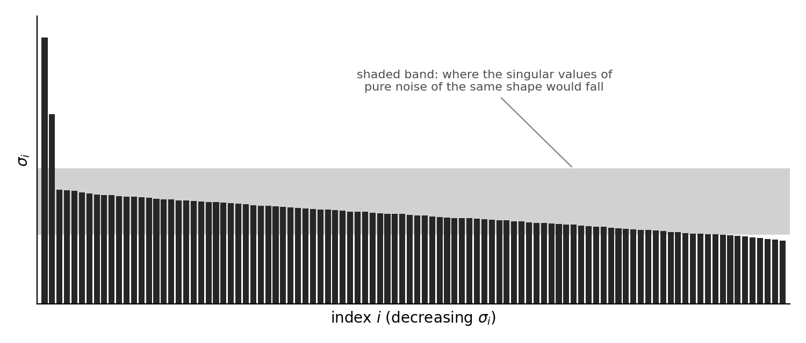

# POOL — pool

*54 problems, in the order they appeared. GENERATED by scripts/compile.py.*

## ESE2030-0293
*week 12 · POOL pool #1 · active · Core*  
skills: `W12.S01` Translate between statistical and geometric vocabulary: expectation / projection onto constants, variance / squared length, covariance / inner product, correlation / cosine, centering / projection onto 1^⊥  

Let $\rho$ be a probability density on $N$ outcomes with every $\rho_i > 0$, and let $\langle f, g\rangle_\rho = \sum_i \rho_i f_i g_i$ be the probability inner product on random variables $f, g \in \mathbb{R}^N$. Consider three claims:

I. $\mathbb{E}(f)$ is the coefficient of the orthogonal projection of $f$ onto the line spanned by $\mathbf{1}$.

II. $\sigma(f)$ is the distance from $f$ to the line spanned by $\mathbf{1}$.

III. $\operatorname{corr}(f,g)$ is the cosine of the angle between $f$ and $g$.

Which claims are correct?

- **(A)** I only
- **(B)** II and III only
- **(C)** I and II only
- **(D)** I and III only
- **(E)** All three

Answer

**Correct: (C)**

Since $\norm{\mathbf{1}}_\rho = 1$, the projection of $f$ onto $\operatorname{span}\{\mathbf{1}\}$ is $\langle f, \mathbf{1}\rangle_\rho \mathbf{1} = \mathbb{E}(f)\,\mathbf{1}$, so I holds. The residual $\hat f = f - \mathbb{E}(f)\mathbf{1}$ is orthogonal to the constants and $\sigma(f) = \norm{\hat f}_\rho$ is its length --- the distance from $f$ to the line --- so II holds. III fails as stated: correlation is the cosine of the angle between the \emph{centered} variables $\hat f$ and $\hat g$, not between $f$ and $g$ themselves. Two variables with large positive means have $\langle f, g\rangle_\rho > 0$ regardless of whether they co-vary.

Why the distractors tempt:
- (A) Distractor: has the projection reading but misses that the standard deviation is a length.
- (B) Distractor: accepts III (uncentered cosine) while rejecting the projection reading of the mean.
- (D) Trick: takes correlation as the cosine between the raw variables; centering is what makes the cosine a correlation (Ch.12.1).
- (E) Trick: same error as (D), with I and II correctly accepted.

---

## ESE2030-0294
*week 12 · POOL pool #2 · active · Core*  
skills: `W12.S01` Translate between statistical and geometric vocabulary: expectation / projection onto constants, variance / squared length, covariance / inner product, correlation / cosine, centering / projection onto 1^⊥  

In the probability inner product, a random variable decomposes as $f = \mathbb{E}(f)\,\mathbf{1} + \hat f$ with the two pieces orthogonal. Which of the following identities is the Pythagorean theorem applied to this decomposition?

- **(A)** $\mathbb{E}(f^2) = \mathbb{E}(f)^2 + \mathbb{V}(f)$
- **(B)** $\mathbb{V}(f+g) = \mathbb{V}(f) + \mathbb{V}(g) + 2\operatorname{cov}(f,g)$
- **(C)** $\mathbb{E}(f+g) = \mathbb{E}(f) + \mathbb{E}(g)$
- **(D)** $\operatorname{corr}(f,g) = \operatorname{cov}(f,g)\,/\,\sigma(f)\sigma(g)$
- **(E)** $\mathbb{P}(A \cap B) = \langle \mathbf{1}_A, \mathbf{1}_B\rangle_\rho$

Answer

**Correct: (A)**

Pythagoras for the orthogonal pieces reads $\norm{f}_\rho^2 = \norm{\mathbb{E}(f)\mathbf{1}}_\rho^2 + \norm{\hat f}_\rho^2$. The three norms are $\mathbb{E}(f^2)$, $\mathbb{E}(f)^2$ (because $\norm{\mathbf{1}}_\rho = 1$), and $\mathbb{V}(f)$. Choice (B) is the law of cosines --- Pythagoras only when the residuals are orthogonal, i.e. when the covariance term vanishes.

Why the distractors tempt:
- (B) Trick: the law of cosines for $\hat f + \hat g$; it reduces to Pythagoras only when $\operatorname{cov}(f,g) = 0$. A student who remembers 'variances add' as Pythagoras lands here.
- (C) Distractor: linearity of the inner product, not a statement about lengths.
- (D) Distractor: the definition of the cosine of an angle, not a length identity.
- (E) Distractor: probabilities as inner products of indicators --- true, but not Pythagoras.

---

## ESE2030-0295
*week 12 · POOL pool #3 · active · Core*  
skills: `W12.S02` Recognize the probability inner product ⟨f,g⟩_ρ, why the constant vector has unit length (total probability), and why linearity of expectation needs no independence  

In the probability inner product $\langle f, g\rangle_\rho = \sum_{i=1}^N \rho_i f_i g_i$, the constant random variable $\mathbf{1} = (1, \ldots, 1)^T$ satisfies $\norm{\mathbf{1}}_\rho = 1$. This fact is the same as which property of the density $\rho$?

- **(A)** $\sum_i \rho_i = 1$
- **(B)** $\rho_i > 0$ for every $i$
- **(C)** $\rho_i = 1/N$ for every $i$
- **(D)** $\mathbb{V}(\mathbf{1}) = 0$
- **(E)** $\mathbb{E}(f) \leq \max_i f_i$ for every $f$

Answer

**Correct: (A)**

$\norm{\mathbf{1}}_\rho^2 = \sum_i \rho_i \cdot 1 \cdot 1 = \sum_i \rho_i$, so unit length of the constant vector is exactly total-probability-one. Positivity of the weights (B) is a different hypothesis: it is what makes the form positive-definite, not what makes $\mathbf{1}$ a unit vector.

Why the distractors tempt:
- (B) Trick: positivity of the weights buys positive-definiteness of the inner product; it says nothing about the length of $\mathbf{1}$.
- (C) Distractor: the uniform density is one density among many with total mass one.
- (D) Distractor: true of $\mathbf{1}$ under any density, so it cannot be equivalent to a property of $\rho$.
- (E) Distractor: a consequence of nonnegativity and unit mass together, not the length statement.

---

## ESE2030-0296
*week 12 · POOL pool #4 · active · Core*  
skills: `W12.S02` Recognize the probability inner product ⟨f,g⟩_ρ, why the constant vector has unit length (total probability), and why linearity of expectation needs no independence  

Linearity of expectation, $\mathbb{E}(f+g) = \mathbb{E}(f) + \mathbb{E}(g)$, holds for every pair of random variables on the same outcomes. What is the reason?

- **(A)** $\mathbb{E}(f) = \langle f, \mathbf{1}\rangle_\rho$, and an inner product is linear in each argument
- **(B)** $f$ and $g$ are assumed independent
- **(C)** $\sum_i \rho_i = 1$
- **(D)** $\mathbb{E}(fg) = \mathbb{E}(f)\,\mathbb{E}(g)$
- **(E)** $\mathbb{V}(f+g) = \mathbb{V}(f) + \mathbb{V}(g)$

Answer

**Correct: (A)**

Expectation is the inner product with the fixed vector $\mathbf{1}$ --- equivalently the coefficient of a projection --- and inner products and projections are linear. No hypothesis on the joint behaviour of $f$ and $g$ enters. Independence (B) is the standard false belief: it is needed for $\mathbb{E}(fg) = \mathbb{E}(f)\mathbb{E}(g)$, never for additivity.

Why the distractors tempt:
- (B) Trick: the listed Week 12 trap --- believing linearity of expectation requires independence.
- (C) Distractor: unit mass makes $\mathbf{1}$ a unit vector; it does not make the pairing linear.
- (D) Distractor: multiplicativity, which DOES require independence (or at least uncorrelatedness); a different statement.
- (E) Distractor: additivity of variance, which holds only for orthogonal residuals.

---

## ESE2030-0297
*week 12 · POOL pool #5 · active · Deeper*  
skills: `W12.S02` Recognize the probability inner product ⟨f,g⟩_ρ, why the constant vector has unit length (total probability), and why linearity of expectation needs no independence  

Let $\rho$ be a density on $N = 4$ outcomes with $\rho = (0.5, 0.3, 0.2, 0)^T$: outcome 4 is impossible. Define $\langle f, g\rangle_\rho = \sum_i \rho_i f_i g_i$ as usual. Which inner-product axiom fails?

- **(A)** Positive-definiteness: some $f \neq \mathbf{0}$ has $\langle f, f\rangle_\rho = 0$
- **(B)** Symmetry: $\langle f, g\rangle_\rho \neq \langle g, f\rangle_\rho$ for some $f, g$
- **(C)** Bilinearity
- **(D)** $\norm{\mathbf{1}}_\rho = 1$ no longer holds
- **(E)** None; it is still an inner product

Answer

**Correct: (A)**

Take $f = \mathbf{e}_4$: then $\langle f, f\rangle_\rho = \rho_4 = 0$ with $f \neq \mathbf{0}$. Symmetry and bilinearity survive any choice of weights, and $\sum_i \rho_i = 1$ still, so $\mathbf{1}$ still has unit length. The form is positive \emph{semi}definite, and the text's remedy is to identify random variables that agree except on outcomes of probability zero --- a quotient construction in the spirit of Section 3.6.

Why the distractors tempt:
- (B) Distractor: symmetry holds for any weights.
- (C) Distractor: bilinearity holds for any weights.
- (D) Trick: total probability is unchanged; $\mathbf{1}$ is still a unit vector. Confuses the two hypotheses on $\rho$ (positivity vs. unit mass).
- (E) Trick: the form is only semidefinite --- the reason the text asks for $\rho_i > 0$.

---

## ESE2030-0298
*week 12 · POOL pool #6 · active · Core*  
skills: `W12.S03` Recognize conditional expectation as an orthogonal projection, and when variances add (orthogonal residuals — Pythagoras)  

Let $f, g$ be random variables with centered versions $\hat f = f - \mathbb{E}(f)\mathbf{1}$ and $\hat g = g - \mathbb{E}(g)\mathbf{1}$. Which condition is \emph{equivalent} to $\mathbb{V}(f+g) = \mathbb{V}(f) + \mathbb{V}(g)$?

- **(A)** $\langle \hat f, \hat g\rangle_\rho = 0$
- **(B)** $f$ and $g$ are independent
- **(C)** $\langle f, g\rangle_\rho = 0$
- **(D)** $\mathbb{E}(f) = \mathbb{E}(g) = 0$
- **(E)** $\norm{\hat f}_\rho = \norm{\hat g}_\rho$

Answer

**Correct: (A)**  — partial credit: C

Expanding $\norm{\hat f + \hat g}_\rho^2$ gives $\mathbb{V}(f+g) = \mathbb{V}(f) + \mathbb{V}(g) + 2\langle \hat f, \hat g\rangle_\rho$, so additivity holds exactly when the residuals are orthogonal (uncorrelated). Independence is sufficient but not necessary; orthogonality of the raw variables is the wrong pair of vectors.

Why the distractors tempt:
- (B) Trick: independence implies orthogonal residuals, but the converse fails --- the condition is sufficient, not equivalent.
- (C) Partial credit: has the insight that additivity is an orthogonality condition, but tests the raw variables instead of the residuals. Insight 1 of 2 (orthogonality); missing: centering. Prefix: yes. Guessable: no. Defensible: yes.
- (D) Distractor: with zero means (A) and (C) coincide, but zero means alone say nothing about the covariance.
- (E) Distractor: equal lengths of the residuals is unrelated to their angle.

---

## ESE2030-0299
*week 12 · POOL pool #7 · active · Deeper*  
skills: `W12.S03` Recognize conditional expectation as an orthogonal projection, and when variances add (orthogonal residuals — Pythagoras)  

For random variables $f, g$ on a finite outcome space with the probability inner product, which of the following statements can be \emph{false}?

- **(A)** If $f$ and $g$ are independent, then $\operatorname{cov}(f,g) = 0$
- **(B)** If $\operatorname{cov}(f,g) = 0$, then $f$ and $g$ are independent
- **(C)** $-1 \leq \operatorname{corr}(f,g) \leq 1$
- **(D)** If $\operatorname{cov}(f,g) = 0$, then $\mathbb{V}(f+g) = \mathbb{V}(f) + \mathbb{V}(g)$
- **(E)** $\mathbb{E}(f+g) = \mathbb{E}(f) + \mathbb{E}(g)$

Answer

**Correct: (B)**

Uncorrelated means the residuals are orthogonal; independent means much more. A standard counterexample: four equally likely outcomes with $f = (1,-1,1,-1)$ and $g = (1,1,-1,-1)$ have $\operatorname{cov}(f,g) = 0$, but $f$ and $g$ are not independent since $fg = (1,-1,-1,1)$ is not constant on the events where $f$ is fixed --- in fact $g^2 = f^2 = \mathbf{1}$ here, so $f$ and $|g|$ are trivially dependent. (A) is the true direction; (C) is Cauchy-Schwarz; (D) is the law of cosines with the cross term removed; (E) needs no hypothesis at all.

Why the distractors tempt:
- (A) Trick: the twin of the answer; this direction is the true one.
- (C) Distractor: always true --- it is Cauchy-Schwarz (Lemma 5.5) for the residuals.
- (D) Distractor: always true --- the cross term in the law of cosines is exactly the covariance.
- (E) Distractor: always true, with no independence hypothesis (linearity of the inner product).

---

## ESE2030-0300
*week 12 · POOL pool #8 · active · Core*  
skills: `W12.S03` Recognize conditional expectation as an orthogonal projection, and when variances add (orthogonal residuals — Pythagoras)  

You want the constant $c$ that minimizes $\mathbb{E}\big((f - c)^2\big)$ for a given random variable $f$. Which principle answers the question, and what is $c$?

- **(A)** Orthogonal projection of $f$ onto $\operatorname{span}\{\mathbf{1}\}$; $c = \mathbb{E}(f)$
- **(B)** Orthogonal projection of $f$ onto $\mathbf{1}^\perp$; $c = \mathbb{E}(f)$
- **(C)** Cauchy-Schwarz; $c = \sigma(f)$
- **(D)** Gram-Schmidt applied to $\{f, \mathbf{1}\}$; $c = \norm{f}_\rho$
- **(E)** Markov's inequality; $c = \mathbb{E}(f)$

Answer

**Correct: (A)**

$\mathbb{E}((f-c)^2) = \norm{f - c\mathbf{1}}_\rho^2$, the squared distance from $f$ to a point of the line spanned by $\mathbf{1}$. The best approximation in a subspace is the orthogonal projection (Lemma 6.5), which here is $\langle f, \mathbf{1}\rangle_\rho \mathbf{1} = \mathbb{E}(f)\mathbf{1}$. The minimum value is $\mathbb{V}(f)$.

Why the distractors tempt:
- (B) Trick: the right value with the wrong subspace --- projection onto $\mathbf{1}^\perp$ is centering, which produces the residual, not the constant.
- (C) Distractor: Cauchy-Schwarz bounds an inner product; it does not locate a minimizer.
- (D) Distractor: Gram-Schmidt manufactures an orthonormal basis; it is not a minimization principle, and $\norm{f}_\rho$ is not the answer.
- (E) Trick: right value, wrong principle --- Markov bounds a tail probability and says nothing about least squares.

---

## ESE2030-0301
*week 12 · POOL pool #9 · active · Core*  
skills: `W12.S04` Recognize the simplex, decide whether a point lies in it, and know what softmax does (a density on the simplex; shift-invariant; not a probability of correctness) and that stochastic matrices preserve the simplex  

Exactly one of the following vectors lies in the probability simplex $\Delta^2 \subset \mathbb{R}^3$. Which?

- **(A)** $(0.5,\ 0.5,\ 0)^T$
- **(B)** $(0.6,\ 0.6,\ -0.2)^T$
- **(C)** $(0.2,\ 0.3,\ 0.4)^T$
- **(D)** $(0.7,\ 0.4,\ 0)^T$
- **(E)** $\tfrac{1}{\sqrt{3}}(1,\ 1,\ 1)^T$

Answer

**Correct: (A)**  — partial credit: B

Membership in $\Delta^{N-1}$ needs two things: entrywise nonnegativity and $\langle \rho, \mathbf{1}\rangle = 1$. Only (A) satisfies both; it lies on the boundary (outcome 3 forbidden), which is still in the simplex. (B) sums to one but has a negative entry; (C) is nonnegative but sums to $0.9$; (D) sums to $1.1$; (E) has unit \emph{length}, not unit sum.

Why the distractors tempt:
- (B) Partial credit: checked the sum but not the sign. Insight 1 of 2 (unit mass); missing: nonnegativity. Prefix: yes. Guessable: no. Defensible: yes.
- (C) Distractor: nonnegative but the mass is $0.9$ --- the other half of the membership test.
- (D) Distractor: nonnegative but the mass is $1.1$.
- (E) Trick: confuses the unit sphere with the simplex --- unit length is $\norm{\rho} = 1$, not $\langle \rho, \mathbf{1}\rangle = 1$.

---

## ESE2030-0302
*week 12 · POOL pool #10 · active · Deeper*  
skills: `W12.S04` Recognize the simplex, decide whether a point lies in it, and know what softmax does (a density on the simplex; shift-invariant; not a probability of correctness) and that stochastic matrices preserve the simplex  

For every score vector $\mathbf{z} \in \mathbb{R}^N$ and every scalar $c$, $\operatorname{softmax}(\mathbf{z} + c\mathbf{1}) = \operatorname{softmax}(\mathbf{z})$. Consequently softmax is really a map out of a quotient of $\mathbb{R}^N$. Which quotient, and which fundamental space of the centering map $\mathbf{z} \mapsto \mathbf{z} - \big(\tfrac{1}{N}\langle \mathbf{z}, \mathbf{1}\rangle\big)\mathbf{1}$ is it?

- **(A)** $\mathbb{R}^N / \operatorname{span}\{\mathbf{1}\}$; the coimage
- **(B)** $\mathbb{R}^N / \mathbf{1}^\perp$; the cokernel
- **(C)** $\operatorname{span}\{\mathbf{1}\}$; the kernel
- **(D)** $\mathbf{1}^\perp$; the image
- **(E)** $\mathbb{R}^N / \operatorname{span}\{\mathbf{1}\}$; the kernel

Answer

**Correct: (A)**  — partial credit: E

Softmax is blind to the component of $\mathbf{z}$ along $\mathbf{1}$, so it is well defined on equivalence classes $\mathbf{z} + \operatorname{span}\{\mathbf{1}\}$, i.e. on $\mathbb{R}^N / \operatorname{span}\{\mathbf{1}\}$. The centering map has kernel $\operatorname{span}\{\mathbf{1}\}$, and $V / \ker T$ is by definition the coimage. On that quotient softmax loses nothing: the entrywise logarithm recovers $\mathbf{z}$ up to an additive constant, so softmax is a bijection from the coimage onto the relative interior of $\Delta^{N-1}$.

Why the distractors tempt:
- (B) Trick: quotients by the wrong subspace and names the codomain-side space; the cokernel lives in the codomain (listed Week 3 trap).
- (C) Distractor: the kernel is what is quotiented OUT, not the quotient; a subspace, not a space of classes.
- (D) Trick: $\mathbf{1}^\perp$ is a complement of the kernel and is isomorphic to the quotient, but it is a choice, not the quotient itself (Week 3 trap: complement vs. quotient).
- (E) Partial credit: the right quotient with the wrong name. Insight 1 of 2 (the quotient by $\operatorname{span}\{\mathbf{1}\}$); missing: $V/\ker T$ is the coimage, not the kernel. Prefix: yes. Guessable: no. Defensible: yes.

---

## ESE2030-0303
*week 12 · POOL pool #11 · active · Core*  
skills: `W12.S04` Recognize the simplex, decide whether a point lies in it, and know what softmax does (a density on the simplex; shift-invariant; not a probability of correctness) and that stochastic matrices preserve the simplex  

Let $\mathbf{z} \in \mathbb{R}^N$ have a unique largest coordinate, in position $j$, and consider $\operatorname{softmax}(t\mathbf{z})$ as the scale $t > 0$ varies. What are the limits as $t \to \infty$ and as $t \to 0^+$, respectively?

- **(A)** $\mathbf{e}_j$ and $\tfrac{1}{N}\mathbf{1}$
- **(B)** $\mathbf{e}_j$ and $\mathbf{0}$
- **(C)** $\mathbf{z}\,/\,\textstyle\sum_i z_i$ and $\tfrac{1}{N}\mathbf{1}$
- **(D)** $\tfrac{1}{N}\mathbf{1}$ and $\mathbf{e}_j$
- **(E)** $\mathbf{e}_j$, attained exactly for all $t$ large enough, and $\tfrac{1}{N}\mathbf{1}$

Answer

**Correct: (A)**  — partial credit: E

Stretching the scores drives the largest exponential to dominate, so the output approaches the vertex $\mathbf{e}_j$ --- but never reaches it, since every entry of a softmax is strictly positive. Shrinking the scores makes all exponentials tend to $1$, so the output flattens to the uniform density at the centre of the simplex. $\mathbf{0}$ is not in the simplex at all.

Why the distractors tempt:
- (B) Trick: $\mathbf{0}$ is not a density; softmax never leaves the simplex.
- (C) Trick: normalizing by the sum is not softmax and can fail (negative or zero-sum scores); softmax normalizes the EXPONENTIALS.
- (D) Distractor: the two limits reversed.
- (E) Partial credit: both limits right, but claims the vertex is attained. Insight 1 of 2 (the limits); missing: softmax lands in the relative interior --- certainty lies at infinity. Prefix: yes. Guessable: no. Defensible: yes.

---

## ESE2030-0304
*week 12 · POOL pool #12 · active · Core*  
skills: `W12.S04` Recognize the simplex, decide whether a point lies in it, and know what softmax does (a density on the simplex; shift-invariant; not a probability of correctness) and that stochastic matrices preserve the simplex  

A matrix $P \in \mathbb{R}^{N \times N}$ maps every density to a density: $P\rho \in \Delta^{N-1}$ whenever $\rho \in \Delta^{N-1}$. Which condition on $P$ is \emph{equivalent} to this?

- **(A)** $P \geq 0$ entrywise and $P^T\mathbf{1} = \mathbf{1}$
- **(B)** $P \geq 0$ entrywise and $P\mathbf{1} = \mathbf{1}$
- **(C)** $P^T\mathbf{1} = \mathbf{1}$
- **(D)** $\rho(P) = 1$
- **(E)** $P$ is orthogonal

Answer

**Correct: (A)**  — partial credit: C

The vertices $\mathbf{e}_j$ must go to densities, and $P\mathbf{e}_j$ is the $j$th column, so each column is nonnegative with unit sum: $P$ is column-stochastic. Conversely nonnegativity keeps $P\rho \geq 0$, and $P^T\mathbf{1} = \mathbf{1}$ gives $\langle P\rho, \mathbf{1}\rangle = \langle \rho, P^T\mathbf{1}\rangle = 1$ by the adjoint identity. This is Definition 9.13's column-stochastic convention: the Markov chains of Chapter 9 are dynamics confined to the simplex.

Why the distractors tempt:
- (B) Trick: row-stochastic --- the other convention; $P\mathbf{1} = \mathbf{1}$ conserves mass for ROW vectors, not for the densities $P\rho$ (Week 9 trap).
- (C) Partial credit: mass conservation without nonnegativity --- a column summing to one can still send a density to a vector with a negative entry. Insight 1 of 2 (unit column sums via the adjoint); missing: nonnegativity. Prefix: yes. Guessable: no. Defensible: yes.
- (D) Distractor: a consequence of column-stochasticity (Lemma 9.15), not equivalent to it.
- (E) Distractor: orthogonal matrices preserve length, not mass; a rotation carries a density out of the orthant.

---

## ESE2030-0305
*week 12 · POOL pool #13 · active · Core*  
skills: `W12.S05` Explain near-orthogonality in high dimension: random inner products have mean 0 and variance 1/n; lengths concentrate; exponentially many nearly-orthogonal directions  

Fix a unit vector $\mathbf{u} \in \mathbb{R}^n$ and draw a random unit vector $\mathbf{v}$ uniformly from the unit sphere. The random variable $\langle \mathbf{u}, \mathbf{v}\rangle = \cos\theta$ has mean and variance, respectively,

- **(A)** $0$ and $1/n$
- **(B)** $0$ and $1/\sqrt{n}$
- **(C)** $0$ and $1$
- **(D)** $1/n$ and $1/n$
- **(E)** $0$ and $1/3$, for every $n$

Answer

**Correct: (A)**

Reflecting a coordinate shows $\mathbb{E}(v_i) = 0$ and $\mathbb{E}(v_i v_j) = 0$ for $i \neq j$; permuting coordinates shows all $\mathbb{E}(v_i^2)$ are equal, and $\sum_i v_i^2 = 1$ forces each to be $1/n$. Then $\mathbb{V}\langle \mathbf{u}, \mathbf{v}\rangle = \sum_i u_i^2\,\mathbb{E}(v_i^2) = 1/n$. The standard deviation is $1/\sqrt{n}$: the cosine of a random angle crowds toward zero as the dimension grows.

Why the distractors tempt:
- (B) Trick: $1/\sqrt{n}$ is the standard deviation, not the variance.
- (C) Distractor: the naive prior --- unit vectors, so the cosine should be 'of size one'.
- (D) Distractor: a nonzero mean would break the reflection symmetry of the sphere.
- (E) Trick: $1/3$ is the $n = 3$ case (Archimedes' hat-box theorem); it is not dimension-free.

---

## ESE2030-0306
*week 12 · POOL pool #14 · active · Deeper*  
skills: `W12.S05` Explain near-orthogonality in high dimension: random inner products have mean 0 and variance 1/n; lengths concentrate; exponentially many nearly-orthogonal directions  

Two unit vectors are found to have cosine similarity $0.2$. In which setting is this evidence of a genuine relationship between them, as opposed to what chance alone produces?

- **(A)** In $\mathbb{R}^{1024}$ but not in $\mathbb{R}^3$
- **(B)** In $\mathbb{R}^3$ but not in $\mathbb{R}^{1024}$
- **(C)** In both
- **(D)** In neither
- **(E)** Only if the vectors were centered first

Answer

**Correct: (A)**

By Lemma 12.6, unrelated unit vectors have cosines of mean $0$ and standard deviation $1/\sqrt{n}$. In $\mathbb{R}^3$ that is about $0.58$, and a cosine of $0.2$ is unremarkable --- random pairs manage it most of the time. In $\mathbb{R}^{1024}$ the standard deviation is about $0.03$, and $0.2$ stands more than six standard deviations above chance. The question 'how large must a cosine be to mean anything' is incomplete until the dimension is named.

Why the distractors tempt:
- (B) Trick: reverses the dependence --- high dimension SHRINKS the chance band, making a fixed cosine more significant, not less.
- (C) Distractor: the naive prior that $0.2$ is small in any dimension.
- (D) Distractor: the naive prior that $0.2$ is 'weak correlation' regardless of setting.
- (E) Distractor: centering is about the probability inner product on random variables; the question is about directions in $\mathbb{R}^n$.

---

## ESE2030-0307
*week 12 · POOL pool #15 · active · Deeper*  
skills: `W12.S05` Explain near-orthogonality in high dimension: random inner products have mean 0 and variance 1/n; lengths concentrate; exponentially many nearly-orthogonal directions  

Let $\mathbf{g} \in \mathbb{R}^n$ have independent standard normal coordinates, with $n$ large. Where does a typical sample of $\mathbf{g}$ lie?

- **(A)** Near the sphere of radius $\sqrt{n}$
- **(B)** Near the origin, where the density is largest
- **(C)** Near the sphere of radius $n$
- **(D)** Spread roughly uniformly through the ball of radius $\sqrt{n}$
- **(E)** Near the sphere of radius $\sqrt{2n}$

Answer

**Correct: (A)**

$\norm{\mathbf{g}}^2 = \sum_i g_i^2$ is a sum of $n$ independent terms of mean $1$ and variance $2$, so it has mean $n$ and standard deviation $\sqrt{2n}$: the length concentrates near $\sqrt{n}$ with relative fluctuations of order $1/\sqrt{n}$. The density is maximal at the origin, but the volume of a shell at radius $r$ grows like $r^{n-1}$; the product $r^{n-1}e^{-r^2/2}$ peaks near $r = \sqrt{n}$. The origin wins the density contest and loses the volume contest.

Why the distractors tempt:
- (B) Trick: confuses the peak of the density with where the mass is; a listed idea in the text ('the pulp of the high-dimensional orange is in its peel').
- (C) Distractor: $n$ is the mean of $\norm{\mathbf{g}}^2$, not of $\norm{\mathbf{g}}$.
- (D) Distractor: the ball of radius $0.99\sqrt{n}$ holds an exponentially small fraction of the mass; nothing is uniform here.
- (E) Trick: $\sqrt{2n}$ is the typical DISTANCE BETWEEN two independent samples, not the length of one.

---

## ESE2030-0308
*week 12 · POOL pool #16 · active · Core*  
skills: `W12.S06` Know what the union bound and the probabilistic method do, and recognize an argument of the shape "one-point concentration plus a union bound over pairs"  

A random projection is applied to $m$ points. For any one fixed pair of points, the probability that its squared distance is distorted beyond tolerance is at most $p$. Which bound on the probability that \emph{some} pair is distorted beyond tolerance follows from the union bound?

- **(A)** $\binom{m}{2}\,p$
- **(B)** $m\,p$
- **(C)** $p^{\,m(m-1)/2}$
- **(D)** $1 - (1-p)^m$
- **(E)** $p$

Answer

**Correct: (A)**  — partial credit: B

The bad event is a union over pairs, of which there are $\binom{m}{2} < m^2/2$, and the union bound totals their probabilities without any independence assumption. Counting points instead of pairs (B) undercounts; a product (C) would require independence AND describes all pairs failing at once; (D) assumes independence and counts points; (E) ignores the union entirely.

Why the distractors tempt:
- (B) Partial credit: applies the union bound but counts points rather than pairs. Insight 1 of 2 (sum the per-event probabilities); missing: the events are indexed by PAIRS. Prefix: yes. Guessable: no. Defensible: yes.
- (C) Trick: a product is the probability that EVERY pair fails, and only under independence.
- (D) Distractor: assumes independent failures (the union bound needs none) and counts points.
- (E) Distractor: the per-pair bound quoted as if it were the family bound --- the listed trap.

---

## ESE2030-0309
*week 12 · POOL pool #17 · active · Core*  
skills: `W12.S07` Know that pure noise has a predictable spectrum (a bulk with an edge), so a singular value is signal only if it clears the noise floor — and that this is what makes a scree plot readable  

The figure shows the singular values of a centered data matrix $\mathcal{X} \in \mathbb{R}^{1000 \times 100}$ in decreasing order. The shaded band is the interval into which the singular values of a pure-noise matrix of the same shape and noise level would fall. How many principal components does the plot support?

- **(A)** 1
- **(B)** 2
- **(C)** 3
- **(D)** Every component whose singular value exceeds the median
- **(E)** 0 --- the band does not reach down to zero, so nothing is distinguishable from noise

Answer

**Correct: (B)**

Noise alone fills the band; a component is evidence of structure only if its singular value stands clear of the band's upper edge. Two do. The third-largest singular value sits inside the band, where a singular value is not evidence but arithmetic: it is the largest of the noise, not the smallest of the signal. That the band sits at height $\approx\sqrt{n}$ rather than at zero is the point --- the noise floor is not zero.

Why the distractors tempt:
- (A) Trick: reading the scree plot by eye for the one dramatic drop, ignoring the second value that also clears the edge.
- (C) Trick: counting the largest in-band value as signal because it is 'bigger than the rest' --- the listed trap of reading a large eigenvalue as signal without a noise floor.
- (D) Distractor: the median has no significance; the standard is the noise edge.
- (E) Trick: expects the noise floor at zero; it stands at $\approx\sqrt{n}$ and rises with $n$.

---

## ESE2030-0310
*week 12 · POOL pool #18 · active · Deeper*  
skills: `W12.S07` Know that pure noise has a predictable spectrum (a bulk with an edge), so a singular value is signal only if it clears the noise floor — and that this is what makes a scree plot readable  

A pure-noise matrix with $n$ observations of $d$ variables ($n \geq d$) has singular values that crowd into a bulk. Two changes are proposed: (i) double the number of variables $d$, holding $n$ fixed; (ii) double the number of observations $n$, holding $d$ fixed. What happens to the \emph{width of the bulk relative to its centre}?

- **(A)** (i) widens it; (ii) narrows it
- **(B)** (i) narrows it; (ii) widens it
- **(C)** Both widen it
- **(D)** Both narrow it
- **(E)** Neither changes it

Answer

**Correct: (A)**

The bulk runs from $\sqrt{n}(1-\sqrt{\gamma})$ to $\sqrt{n}(1+\sqrt{\gamma})$ with aspect ratio $\gamma = d/n$; its relative width is governed by $\sqrt{d/n}$ alone. More variables per observation fatten the bulk --- spurious apparent structure --- and more observations per variable thin it. This is Section 11.5's warning about too few observations, drawn to scale.

Why the distractors tempt:
- (B) Trick: the dependence reversed.
- (C) Distractor: conflates the centre (which rises with $n$) with the relative width.
- (D) Distractor: assumes more data of either kind always helps.
- (E) Distractor: the naive prior that noise has a fixed, shape-independent spectrum.

---

## ESE2030-0311
*week 12 · POOL pool #19 · active · Core*  
skills: `W12.S08` State what Johnson–Lindenstrauss preserves (pairwise SQUARED distances to relative error ε) and what the target dimension depends on (number of points and ε — NOT the ambient dimension); recognize the random projection's calibration  

A million points in $\mathbb{R}^{5000}$ must be reduced to a low dimension. All that is needed downstream is every pairwise distance, to within a few percent, and the reduction map must be chosen \emph{before} the data are seen. Which method, with which guarantee?

- **(A)** Random projection to $\mathbb{R}^k$, $k \propto \ln m / \epsilon^2$; every pairwise squared distance within a factor $1 \pm \epsilon$, with high probability
- **(B)** PCA to the top $k$ components, $k$ = effective rank; every pairwise distance preserved exactly
- **(C)** Random projection to $\mathbb{R}^k$, $k \propto \ln m / \epsilon^2$; every coordinate of every point within $\epsilon$
- **(D)** Random projection to $\mathbb{R}^k$, $k \propto n / \epsilon^2$; every pairwise squared distance within a factor $1 \pm \epsilon$, with high probability
- **(E)** PCA to the top $k$ components, $k$ = effective rank; the rank-$k$ reconstruction error minimized

Answer

**Correct: (A)**  — partial credit: D

Johnson-Lindenstrauss: a random projection to $k \geq 36\ln m/\epsilon^2$ dimensions preserves every pairwise squared distance to relative error $\epsilon$ with probability at least $1 - 1/m$, for ANY cloud, and the matrix is drawn without a glance at the data. The target dimension depends on the number of points and the tolerance, never on the ambient dimension $5000$. PCA is the adaptive tool: it must look first, and it optimizes reconstruction, not pairwise distances.

Why the distractors tempt:
- (B) Trick: PCA preserves distances only along the retained subspace; for a structureless cloud it guarantees nothing about pairwise distances, and it must see the data.
- (C) Trick: random projection preserves distances, not coordinates --- the coordinates of $\Phi\mathbf{x}$ mean nothing one at a time (listed trap).
- (D) Partial credit: right tool and right guarantee, but makes $k$ depend on the ambient dimension. Insight 1 of 2 (JL preserves pairwise squared distances obliviously); missing: $k$ depends on $m$ and $\epsilon$ only (listed trap). Prefix: yes. Guessable: no. Defensible: yes.
- (E) Distractor: a true statement about PCA (Eckart-Young) that answers a different goal, and requires seeing the data.

---

## ESE2030-0313
*week 13 · POOL pool #21 · active · Core*  
skills: `W13.S04` Recognize the feedforward architecture as alternating affine maps and elementwise nonlinearities with a linear last layer; identify the shapes of W_l, b_l, h_l and count parameters  

The figure shows a feedforward network: every unit of one layer is connected to every unit of the next, the hidden layers carry an elementwise activation $\varsigma$, the read-out is linear, and every unit past the input carries a bias. How many parameters (weights and biases together) does $\Psi$ contain?

- **(A)** 24
- **(B)** 30
- **(C)** 32
- **(D)** 35
- **(E)** 11

Answer

**Correct: (C)**

Read the widths off the figure: $3 \to 4 \to 2 \to 2$, so $\Lambda = 3$ layers. $W_1 \in \mathbb{R}^{4\times 3}$ carries $12$ weights and $\mathbf{b}_1 \in \mathbb{R}^4$ four biases; $W_2 \in \mathbb{R}^{2\times 4}$ and $\mathbf{b}_2$ give $8 + 2$; the linear read-out $W_3 \in \mathbb{R}^{2\times 2}$ and $\mathbf{b}_3$ give $4 + 2$. Total $16 + 10 + 6 = 32$. Nearly all of it sits in the matrices: $24$ of the $32$.

Why the distractors tempt:
- (A) Distractor: weights only ($12 + 8 + 4$); the biases are parameters too.
- (B) Trick: drops $\mathbf{b}_3$ on the grounds that the read-out is 'linear'. The read-out has no activation; it still has a bias (the last line of (13.2)).
- (D) Distractor: adds a bias to each of the three input units. The input is data, not a layer of units with parameters.
- (E) Distractor: counts units ($3 + 4 + 2 + 2$) rather than parameters.

---

## ESE2030-0314
*week 13 · POOL pool #22 · active · Core*  
skills: `W13.S04` Recognize the feedforward architecture as alternating affine maps and elementwise nonlinearities with a linear last layer; identify the shapes of W_l, b_l, h_l and count parameters  

A feedforward network of the text's form is to take $\mathbf{x} \in \mathbb{R}^3$ to $\hat{\mathbf{y}} \in \mathbb{R}^2$ through one hidden layer of width $5$, with elementwise activation $\varsigma$. Which expression is such a network?

- **(A)** $\hat{\mathbf{y}} = \varsigma\big(W_2\,\varsigma(W_1\mathbf{x} + \mathbf{b}_1) + \mathbf{b}_2\big)$, with $W_1 \in \mathbb{R}^{5\times 3}$, $W_2 \in \mathbb{R}^{2\times 5}$
- **(B)** $\hat{\mathbf{y}} = W_2\,\varsigma(W_1\mathbf{x} + \mathbf{b}_1) + \mathbf{b}_2$, with $W_1 \in \mathbb{R}^{5\times 3}$, $W_2 \in \mathbb{R}^{2\times 5}$
- **(C)** $\hat{\mathbf{y}} = W_2\,\varsigma(W_1\mathbf{x} + \mathbf{b}_1) + \mathbf{b}_2$, with $W_1 \in \mathbb{R}^{3\times 5}$, $W_2 \in \mathbb{R}^{5\times 2}$
- **(D)** $\hat{\mathbf{y}} = W_2 W_1 \mathbf{x} + \mathbf{b}$, with $W_1 \in \mathbb{R}^{5\times 3}$, $W_2 \in \mathbb{R}^{2\times 5}$
- **(E)** $\hat{\mathbf{y}} = W_2\,\varsigma(\mathbf{x}) + \mathbf{b}_2$, with $W_2 \in \mathbb{R}^{2\times 3}$

Answer

**Correct: (B)**

The architecture alternates affine maps with an elementwise activation, and the final line of (13.2) is purely linear: $\hat{\mathbf{y}} = W_\Lambda \mathbf{h}_{\Lambda-1} + \mathbf{b}_\Lambda$ with no $\varsigma$. A hidden layer of width $5$ fed by $\mathbb{R}^3$ needs $W_1$ with $5$ rows and $3$ columns; the read-out to $\mathbb{R}^2$ needs $W_2 \in \mathbb{R}^{2\times 5}$. Option B is the only expression with the right alternation, the right shapes, and a linear read-out.

Why the distractors tempt:
- (A) Trick: activation applied to the read-out. In the text's architecture the last layer is linear, so that whatever the network computed is linearly readable from the final hidden vector.
- (C) Distractor: shapes transposed. $W_1\mathbf{x}$ with $W_1 \in \mathbb{R}^{3\times 5}$ and $\mathbf{x} \in \mathbb{R}^3$ is not even defined; the width of a layer is the number of rows of its matrix.
- (D) Trick: no activation at all, so the 'two layers' collapse to the single affine map $\mathbf{x} \mapsto (W_2 W_1)\mathbf{x} + \mathbf{b}$ (the Section 13.1 point).
- (E) Distractor: activation applied to the raw input before any affine map, with no hidden layer at all.

---

## ESE2030-0315
*week 13 · POOL pool #23 · active · Core*  
skills: `W13.S07` Recognize the output-layer error signal as the negated least squares residual  

A network with a linear read-out predicts $\hat{\mathbf{y}}$ for a training example with target $\mathbf{y}$, under the squared loss $\mathcal{L} = \tfrac{1}{2}\|\mathbf{y} - \hat{\mathbf{y}}\|^2$. Which of the following is the error signal $[\delta_\Lambda]$ at the read-out?

- **(A)** $(\mathbf{y} - \hat{\mathbf{y}})^T$
- **(B)** $(\hat{\mathbf{y}} - \mathbf{y})^T W_\Lambda$
- **(C)** $(\hat{\mathbf{y}} - \mathbf{y})^T \operatorname{diag}\big(\varsigma'(\mathbf{z}_\Lambda)\big)$
- **(D)** $(\hat{\mathbf{y}} - \mathbf{y})^T$
- **(E)** $\tfrac{1}{2}\|\mathbf{y} - \hat{\mathbf{y}}\|^2$

Answer

**Correct: (D)**  — partial credit: A

The read-out carries no activation, so $\hat{\mathbf{y}} = \mathbf{z}_\Lambda$ and $[\delta_\Lambda]$ is the derivative of the loss with respect to the output itself. Perturbing $\hat{\mathbf{y}}$ by $\mathbf{v}$ changes $\tfrac12\|\mathbf{y}-\hat{\mathbf{y}}\|^2$ by $\langle \hat{\mathbf{y}} - \mathbf{y}, \mathbf{v}\rangle$ to first order, so $[\delta_\Lambda] = (\hat{\mathbf{y}} - \mathbf{y})^T$: prediction minus truth, transposed into a row. It is the least squares residual of Chapter 6 with its sign reversed, and this is the one place in the backward sweep where $\delta$ is a difference of anything.

Why the distractors tempt:
- (A) Partial credit: the residual without the sign flip (listed trap). Insight 1 of 2: $[\delta_\Lambda]$ is the residual, not a product and not the loss. Missing: the derivative of $\tfrac12\|\mathbf{y}-\hat{\mathbf{y}}\|^2$ with respect to $\hat{\mathbf{y}}$ is $\hat{\mathbf{y}} - \mathbf{y}$, not $\mathbf{y} - \hat{\mathbf{y}}$. Prefix: yes. Guessable: no. Defensible: yes.
- (B) Distractor: one step too far. $[\delta_\Lambda] W_\Lambda$ is the derivative with respect to $\mathbf{h}_{\Lambda-1}$, the start of the recursion of Lemma 13.5, not the error signal at the read-out.
- (C) Trick: multiplies by an activation slope that the read-out does not have. The final layer is linear; $\operatorname{diag}(\varsigma')$ enters only at hidden layers.
- (E) Distractor: the loss itself, a scalar. The error signal is a derivative of the loss, a row of sensitivities.

---

## ESE2030-0316
*week 13 · POOL pool #24 · active · Synthesis*  
skills: `W13.S07` Recognize the output-layer error signal as the negated least squares residual  

Take the degenerate case of a network with no hidden layer, $\hat{y} = \mathbf{w}^T\mathbf{x} + b$, trained by gradient descent on the squared loss over a dataset. Let $A$ be the matrix whose rows are the input examples (each augmented by a $1$ for the bias), and let $\mathbf{r}$ be the vector of residuals, prediction minus target, stacked over the data. Gradient descent has reached a fixed point exactly when $\mathbf{r}$ lies in which space?

- **(A)** $(\operatorname{im} A)^\perp$
- **(B)** $\operatorname{im} A$
- **(C)** $\ker A$
- **(D)** $(\ker A)^\perp$
- **(E)** $\{\mathbf{0}\}$ only

Answer

**Correct: (A)**

With no hidden layer the loss is $\tfrac12\|A\boldsymbol{\psi} - \mathbf{y}\|^2$ in the parameters $\boldsymbol{\psi} = (\mathbf{w}, b)$: ordinary least squares. The output error signal is the residual $\mathbf{r} = A\boldsymbol{\psi} - \mathbf{y}$ (transposed into a row), and the gradient with respect to the parameters is $A^T\mathbf{r}$. Descent stops exactly when $A^T\mathbf{r} = \mathbf{0}$, i.e. $\mathbf{r} \in \ker(A^T) = (\operatorname{im} A)^\perp$: the residual is orthogonal to the image, which is the normal equations of Chapter 6 and the cokernel of the Fundamental Theorem. Training the last layer of any network is this same problem in the features $\mathbf{h}_{\Lambda-1}$.

Why the distractors tempt:
- (B) Trick: the residual lies in the image only when it can still be reduced. At the optimum the residual is what the image cannot reach --- it is orthogonal to the image, not inside it.
- (C) Distractor: kernel of $A$ lives on the domain (parameter) side; $\mathbf{r}$ is a vector of outputs, one per example. The right kernel is $\ker(A^T)$.
- (D) Distractor: the coimage, again a domain-side space. Confuses the residual with the parameters.
- (E) Trick: descent stops when the gradient vanishes, not when the fit is perfect. A perfect fit is one fixed point; any residual orthogonal to the image is another, and it is the generic one.

---

## ESE2030-0317
*week 13 · POOL pool #25 · active · Core*  
skills: `W13.S08` Know why backpropagation is cheap (a constant multiple of one forward pass) versus finite differences (one pass per parameter)  

A network has $P$ parameters, and one forward pass (input to loss) costs $C$ arithmetic operations. Two ways to obtain the full gradient of the loss with respect to all $P$ parameters are backpropagation, and finite differences (perturb one parameter, rerun the forward pass, repeat). Which pair gives the orders of cost, backpropagation first?

- **(A)** $O(PC)$ and $O(PC)$
- **(B)** $O(C)$ and $O(C)$
- **(C)** $O(P)$ and $O(C)$
- **(D)** $O(PC)$ and $O(P^2 C)$
- **(E)** $O(C)$ and $O(PC)$

Answer

**Correct: (E)**

Finite differences need one forward pass per parameter: $P$ passes, $O(PC)$. Backpropagation is one forward sweep plus one backward sweep of the same order (Theorem 13.6): the entire gradient, one number per parameter, for a fixed constant multiple of $C$. The derivative of the network costs no more than the network. With $P$ in the millions or billions, this constant factor versus factor of $P$ is the whole reason training is possible.

Why the distractors tempt:
- (A) Trick: assumes every parameter must be visited separately in both methods. Backpropagation delivers all $P$ derivatives from one backward sweep.
- (B) Distractor: finite differences cannot be done in one pass; each perturbed parameter needs its own forward evaluation.
- (C) Distractor: swaps the roles, and counts backpropagation as if it touched each parameter once at unit cost with no forward pass.
- (D) Distractor: one power too many on both sides; backpropagation does not scale with $P$ at all beyond writing the answer down.

---

## ESE2030-0318
*week 13 · POOL pool #26 · active · Deeper*  
skills: `W13.S08` Know why backpropagation is cheap (a constant multiple of one forward pass) versus finite differences (one pass per parameter)  

The derivative of the loss is the matrix product $[D\mathcal{L}] = [Dg]\,[Df_\Lambda]\cdots[Df_1]$, one factor per layer. Backpropagation evaluates this product for a constant multiple of the cost of a forward pass, while a network of width $n$ has factors that are $n \times n$ matrices. What makes it that cheap?

- **(A)** The weight matrices of a trained network are sparse, so each factor costs far less than $n^2$ to apply
- **(B)** The loss is a scalar, so sweeping from the left keeps every intermediate product a row times a matrix
- **(C)** The gradient with respect to each weight matrix is rank one, so it has only $O(n)$ independent entries
- **(D)** Each factor $[Df_\ell]$ is a diagonal matrix, so the product costs $O(n)$ per layer
- **(E)** The forward pass stores every activation, so the backward pass performs no multiplications of its own

Answer

**Correct: (B)**

Associativity fixes the value of the product but not its cost. Starting from the loss end, $[Dg]$ is a $1 \times n$ row because the loss is a scalar; a row times an $n\times n$ matrix costs $O(n^2)$ and is again a row, so every one of the $\Lambda$ steps costs $O(n^2)$, the same order as a forward layer. Starting from the input end multiplies full matrices, $O(n^3)$ per step. Backpropagation is the associativity of matrix multiplication, exploited: reverse mode is left-association.

Why the distractors tempt:
- (A) Distractor: nothing about training makes $W_\ell$ sparse; the factors are dense, and the saving comes from their order of multiplication, not their entries.
- (C) Distractor: true --- $G_\ell = [\delta_\ell]^T \mathbf{h}_{\ell-1}^T$ is an outer product --- but it answers a question about storage, not about the cost of the sweep. The rank-one shape is a consequence of the row sweeping through, not the cause of its cheapness.
- (D) Trick: only $\operatorname{diag}(\varsigma'(\mathbf{z}_\ell))$ is diagonal; the factor $[Df_\ell] = \operatorname{diag}(\varsigma'(\mathbf{z}_\ell))\,W_\ell$ carries the full matrix $W_\ell$.
- (E) Distractor: storing activations lets the backward pass evaluate each factor where the forward pass visited, but the backward pass still multiplies by every $W_\ell$; its cost is $O(\Lambda n^2)$, not zero.

---

## ESE2030-0319
*week 13 · POOL pool #27 · active · Core*  
skills: `W13.S09` Recognize SGD as estimating an expectation by a sample: unbiased mini-batch gradients, variance falling with batch size  

Stochastic gradient descent replaces the full gradient, an average over all $n$ training examples, by the average over a mini-batch of $b$ examples drawn uniformly at random. The batch size is raised from $b$ to $4b$. What happens to the bias of the mini-batch gradient as an estimate of the full gradient, and to the bound on its variance?

- **(A)** Bias falls by a factor of $4$; variance bound falls by a factor of $4$
- **(B)** Bias stays zero; variance bound falls by a factor of $2$
- **(C)** Bias stays zero; variance bound falls by a factor of $4$
- **(D)** Bias stays zero; variance bound is unchanged
- **(E)** Bias falls by a factor of $4$; variance bound is unchanged

Answer

**Correct: (C)**  — partial credit: B

Each index is drawn uniformly, so by linearity of expectation the mini-batch gradient has expectation equal to the full gradient at every batch size: it is unbiased, and no batch size changes that (Lemma 13.8). Its variance is that of a mean of $b$ draws, at most $\nu^2/b$, so quadrupling $b$ divides the bound by $4$. Batch size trades arithmetic for variance and never buys correctness; this is Week 12's expectation estimated by a sample.

Why the distractors tempt:
- (A) Trick: the listed trap of believing mini-batch gradients are biased and that larger batches are 'more correct'. Only the variance changes.
- (B) Partial credit: standard deviation confused with variance. Insight 1 of 2: unbiased at every batch size. Missing: the bound is $\nu^2/b$ on the variance, so a factor of $4$ in $b$ is a factor of $4$ in variance (a factor of $2$ in standard deviation). Prefix: yes. Guessable: no. Defensible: yes.
- (D) Distractor: treats batch size as irrelevant to the quality of the estimate.
- (E) Trick: both parts wrong in the same misconception --- bias where there is none, and no benefit from averaging more samples.

---

## ESE2030-0320
*week 13 · POOL pool #28 · active · Core*  
skills: `W13.S09` Recognize SGD as estimating an expectation by a sample: unbiased mini-batch gradients, variance falling with batch size  

The full-batch gradient averages the per-example gradients over all $n$ training examples; the mini-batch gradient averages them over $b$ examples chosen uniformly at random, and so is itself a random quantity. In the vocabulary of Chapter 12, the full-batch gradient is which object of the mini-batch gradient?

- **(A)** Its expectation
- **(B)** Its variance
- **(C)** Its conditional expectation given the chosen batch
- **(D)** A sample drawn from it
- **(E)** Its projection onto the mini-batch

Answer

**Correct: (A)**

An average over $n$ items is an expectation under the uniform density on those items, and the mini-batch average is a sample mean of $b$ draws from that density. The sample mean's expectation is the population mean: the full gradient is the expectation of the mini-batch gradient, which is exactly the unbiasedness of Lemma 13.8. SGD is the Chapter 12 move --- an average too long to compute is an expectation, and an expectation can be estimated by a sample --- applied to the gradient.

Why the distractors tempt:
- (B) Distractor: the variance measures how far the estimate scatters about the full gradient; it is a number, not a gradient.
- (C) Trick: once the batch is fixed there is no randomness left, so the conditional expectation given the batch is the mini-batch gradient itself, not the full one.
- (D) Trick: the roles reversed. The mini-batch gradient is the sample; the full gradient is what it estimates.
- (E) Distractor: vocabulary from the wrong sentence; a mini-batch is a set of indices, not a subspace one projects onto.

---

## ESE2030-0321
*week 13 · POOL pool #29 · active · Core*  
skills: `W13.S10` Recognize attention as a LEARNED inner product (query/key bilinear form), softmax to a column-stochastic S, outputs in the convex hull of the values; know permutation equivariance and the quadratic cost  

An attention head acts on three tokens whose value vectors $\mathbf{v}_1, \mathbf{v}_2, \mathbf{v}_3 \in \mathbb{R}^2$ are drawn as points in the figure, along with five marked points. Which marked point could be the output $\mathbf{y}_i$ of the head for some token $i$?

- **(A)** P
- **(B)** Q
- **(C)** R
- **(D)** S
- **(E)** T

Answer

**Correct: (A)**

The output for token $i$ is $\mathbf{y}_i = \sum_j s_{ji}\mathbf{v}_j$ with the $i$th column of $S$ a softmax output: entrywise positive weights summing to one. So $\mathbf{y}_i$ is a convex combination of the values with every weight strictly positive, and lies strictly inside the triangle whose vertices are $\mathbf{v}_1, \mathbf{v}_2, \mathbf{v}_3$. Only P does. Attention decides the mixture; it cannot leave the convex hull of its own values.

Why the distractors tempt:
- (B) Trick: Q lies in the span of the values (all of $\mathbb{R}^2$ here) but outside their convex hull; reaching it needs a negative weight, and softmax weights are positive.
- (C) Trick: R sits on the edge joining $\mathbf{v}_1$ to $\mathbf{v}_3$, a mixture with zero weight on $\mathbf{v}_2$. Softmax never assigns weight exactly zero, so the output stays in the interior. (Hard attention that ignores a token is not what the mechanism computes.)
- (D) Distractor: S is the plain sum $\mathbf{v}_1 + \mathbf{v}_2 + \mathbf{v}_3$, weights not normalized to one; the mixture is a density, not a count.
- (E) Distractor: T is a difference of two values, a linear combination with a negative coefficient --- outside the hull and not a mixture at all.

---

## ESE2030-0322
*week 13 · POOL pool #30 · active · Core*  
skills: `W13.S10` Recognize attention as a LEARNED inner product (query/key bilinear form), softmax to a column-stochastic S, outputs in the convex hull of the values; know permutation equivariance and the quadratic cost  

A prompt of $n$ tokens is the matrix $X \in \mathbb{R}^{d \times n}$, one column per token, and an attention head returns $Y = VS \in \mathbb{R}^{d_v \times n}$ with $S = \operatorname{softmax}(K^TQ/\sqrt{d_k})$ column by column. The tokens are reordered by an $n \times n$ permutation matrix $P$, replacing $X$ by $XP$. What does the head now return?

- **(A)** $Y$
- **(B)** $VPS$
- **(C)** $YP^T$
- **(D)** $YP$
- **(E)** $P^TYP$

Answer

**Correct: (D)**

Every projection acts column by column, so $Q, K, V$ become $QP, KP, VP$. The scores become $(KP)^T(QP) = P^T(K^TQ)P$, which permutes rows and columns alike; column-wise softmax commutes with that, giving $P^TSP$; and $(VP)(P^TSP) = VSP = YP$ since $PP^T = I$. Attention is permutation equivariant (Theorem 13.13): shuffle the tokens and the outputs shuffle along, none the wiser. That blindness to order is why positional information must be added to the embeddings as data.

Why the distractors tempt:
- (A) Trick: invariance rather than equivariance. The outputs are the same vectors, but attached to the tokens in their new positions; $Y$ itself is a different matrix.
- (B) Distractor: moves the values but leaves the attention matrix fixed. $S$ is manufactured from the tokens and reorders with them, to $P^TSP$.
- (C) Distractor: the permutation applied backwards. $Y \mapsto YP$, matching $X \mapsto XP$; $P^T = P^{-1}$ undoes the reordering instead.
- (E) Distractor: conjugation is what happens to the square $n\times n$ matrix $S$, not to $Y$; $Y$ has $d_v$ rows, so $P^TY$ is not even defined in general.

---

## ESE2030-0323
*week 13 · POOL pool #31 · active · Deeper*  
skills: `W13.S10` Recognize attention as a LEARNED inner product (query/key bilinear form), softmax to a column-stochastic S, outputs in the convex hull of the values; know permutation equivariance and the quadratic cost  

The attention scores between tokens are the pairwise values of the pairing $(\mathbf{u}, \mathbf{v}) \mapsto \mathbf{u}^T M \mathbf{v}$ on embedding space, with $M = W_K^T W_Q \in \mathbb{R}^{d\times d}$ assembled from the learned key and query matrices. Measured against the requirements for an inner product on $\mathbb{R}^d$, which of them can this pairing fail?

- **(A)** Symmetry only
- **(B)** Positive definiteness only
- **(C)** Bilinearity only
- **(D)** None; it is an inner product for every choice of $W_Q$ and $W_K$
- **(E)** Symmetry and positive definiteness, but not bilinearity

Answer

**Correct: (E)**  — partial credit: A

The pairing $\mathbf{u}^T M \mathbf{v}$ is bilinear for any matrix $M$. Symmetry requires $M = M^T$, and $W_K^T W_Q$ is generically not symmetric because the two factors are different learned matrices; this is the point, since a symmetric form would force every pair of tokens to heed one another equally, and language is a web of directed dependencies. Positive definiteness fails as well: $M$ is not of the form $W^TW$, nothing forbids $\mathbf{x}^T M \mathbf{x} < 0$, and with $d_k < d$ the form is rank-deficient, so definiteness was never available. Attention learns a bilinear form, not an inner product.

Why the distractors tempt:
- (A) Partial credit: sees the asymmetry but takes $W_K^T W_Q$ for a Gram matrix. Insight 1 of 2: $M \neq M^T$ because keys and queries play different roles. Missing: a product of two different matrices is not $W^TW$, so definiteness fails too (and rank at most $d_k$ rules it out regardless). Prefix: yes. Guessable: no. Defensible: yes.
- (B) Distractor: assumes the scores are symmetric --- the listed trap of treating attention weights as symmetric. $\langle\mathbf{q}_i,\mathbf{k}_j\rangle$ and $\langle\mathbf{q}_j,\mathbf{k}_i\rangle$ are different numbers.
- (C) Distractor: bilinearity is the one axiom that survives; $\mathbf{u}^T M \mathbf{v}$ is linear in each argument for any $M$ whatever.
- (D) Trick: the notation $\langle\cdot,\cdot\rangle_M$ flatters. The Chapter 5 axioms demand symmetry and positive definiteness, and a learned $M$ delivers neither.

---

## ESE2030-0324
*week 13 · POOL pool #32 · active · Deeper*  
skills: `W13.S11` Identify kernel and image of a linearized autoencoder round trip D∘E (discarded variation; the learned model of the data), and why the encoder alone reveals little  

An autoencoder compresses data through an encoder $E:\mathbb{R}^n \to \mathbb{R}^k$ and a decoder $D:\mathbb{R}^k \to \mathbb{R}^n$ with $k \ll n$, trained so that $D(E(\mathbf{x})) \approx \mathbf{x}$ across the data. Take $E$ and $D$ linear. Why does the text study the fundamental spaces of the round trip $D \circ E$ rather than those of the encoder $E$ alone?

- **(A)** The encoder discards nothing; all of the forgetting happens in the decoder
- **(B)** A trained encoder is generically injective, so its kernel is trivial and reveals nothing
- **(C)** A trained encoder is generically surjective, so its image is all of $\mathbb{R}^k$ and its cokernel is trivial
- **(D)** The image of the encoder is the learned model of where the data lives, but it cannot be computed without the decoder
- **(E)** The encoder alone has no kernel or image, since only the round trip maps a space to itself

Answer

**Correct: (C)**

A trained encoder $E \in \mathbb{R}^{k\times n}$ with $k \ll n$ is generically of full rank $k$, hence onto: $\operatorname{im} E = \mathbb{R}^k$ and $\operatorname{coker} E = 0$. Its kernel has dimension $n - k$, but the bottleneck space $\mathbb{R}^k$ carries no geometry of its own, so the encoder by itself has little to confess. The round trip $D\circ E:\mathbb{R}^n\to\mathbb{R}^n$ lives in the data's own space, and there the four subspaces mean something: $\ker(D\circ E)$ is the variation discarded and $\operatorname{im}(D\circ E)$ is the learned model of where the data lives.

Why the distractors tempt:
- (A) Trick: backwards. The dimension drops at the encoder ($n \to k$), so that is where variation is discarded; the decoder $D$ is generically injective and discards nothing.
- (B) Distractor: a map from $\mathbb{R}^n$ to $\mathbb{R}^k$ with $k < n$ cannot be injective; its kernel has dimension at least $n-k$.
- (D) Trick: the listed trap of reading the encoder's spaces for meaning. The learned model of the data is $\operatorname{im}(D\circ E) \subset \mathbb{R}^n$; the encoder's image is just $\mathbb{R}^k$.
- (E) Distractor: every linear map has a kernel and an image, whatever its domain and codomain. The issue is that the encoder's are uninformative, not that they do not exist.

---

## ESE2030-0325
*week 13 · POOL pool #33 · active · Core*  
skills: `W13.S11` Identify kernel and image of a linearized autoencoder round trip D∘E (discarded variation; the learned model of the data), and why the encoder alone reveals little  

A linear autoencoder has round trip $T = D \circ E : \mathbb{R}^n \to \mathbb{R}^n$ with bottleneck $k \ll n$, trained to minimize the squared reconstruction error $\|\mathbf{x} - T\mathbf{x}\|^2$ over centered data. For a data point $\mathbf{x}$ write $\mathbf{r} = \mathbf{x} - T\mathbf{x}$ for its reconstruction residual. At the optimum, which relation is forced?

- **(A)** $\langle \mathbf{r}, \mathbf{x}\rangle = 0$
- **(B)** $\langle \mathbf{r}, T\mathbf{x}\rangle = 0$
- **(C)** $\mathbf{r} \in \operatorname{im} T$
- **(D)** $\|\mathbf{r}\| = \|T\mathbf{x}\|$
- **(E)** $\mathbf{r} = \mathbf{0}$

Answer

**Correct: (B)**

At the optimum the round trip is the orthogonal projection onto the span of the top $k$ principal components, so $T\mathbf{x}$ is the nearest point of $\operatorname{im} T$ to $\mathbf{x}$ and the residual is orthogonal to the image: $\mathbf{r} \in (\operatorname{im} T)^\perp$, the cokernel of $T$, and in particular $\langle\mathbf{r}, T\mathbf{x}\rangle = 0$. This is the least squares geometry of Chapter 6 with the image learned rather than given, and Pythagoras follows: $\|\mathbf{x}\|^2 = \|T\mathbf{x}\|^2 + \|\mathbf{r}\|^2$.

Why the distractors tempt:
- (A) Trick: the residual is orthogonal to the reconstruction, not to the data. $\langle\mathbf{r},\mathbf{x}\rangle = \langle\mathbf{r}, T\mathbf{x} + \mathbf{r}\rangle = \|\mathbf{r}\|^2$, which vanishes only when the point is reconstructed exactly.
- (C) Distractor: if the residual lay in the image the reconstruction could be moved along the image to shrink it, so the optimum would not be an optimum. The residual lies in the orthogonal complement of the image.
- (D) Distractor: nothing forces the kept and discarded parts to have equal length; Pythagoras relates their squares to $\|\mathbf{x}\|^2$ and says nothing about their ratio.
- (E) Trick: perfect reconstruction of every point would need the data to lie in a $k$-dimensional subspace. The bottleneck is a chosen forgetting; the residual is what it forgets.

---

## ESE2030-0326
*week 12 · POOL pool #34 · active · Core*  
skills: `W12.S09` Describe the randomized SVD in order (probe, sketch, orthonormalize, project, factor) and say why it is cheap and approximate  

Let $A \in \mathbb{R}^{m\times n}$ have singular value decomposition $A = U\Sigma V^T$ with singular vectors $\mathbf{u}_i$, $\mathbf{v}_i$ and singular values $\sigma_1 \geq \sigma_2 \geq \cdots$. The first step of the randomized SVD applies $A$ to a single Gaussian probe $\boldsymbol{\omega} \in \mathbb{R}^n$ with independent standard normal entries. What is $A\boldsymbol{\omega}$?

- **(A)** $\sigma_1 \mathbf{u}_1$, up to a random scalar
- **(B)** $\displaystyle\sum_i \sigma_i\,(\mathbf{u}_i^T\boldsymbol{\omega})\,\mathbf{v}_i$
- **(C)** $\displaystyle\sum_i (\mathbf{v}_i^T\boldsymbol{\omega})\,\mathbf{u}_i$
- **(D)** $\displaystyle\sum_i \sigma_i\,(\mathbf{v}_i^T\boldsymbol{\omega})\,\mathbf{u}_i$
- **(E)** A Gaussian vector in $\mathbb{R}^m$ whose distribution does not depend on $A$

Answer

**Correct: (D)**  — partial credit: C

Expand $A = \sum_i \sigma_i \mathbf{u}_i \mathbf{v}_i^T$ and apply it: $A\boldsymbol{\omega} = \sum_i \sigma_i (\mathbf{v}_i^T\boldsymbol{\omega})\,\mathbf{u}_i$. The coefficients $\mathbf{v}_i^T\boldsymbol{\omega}$ are independent standard normals (an orthonormal change of basis preserves the Gaussian), so one probe returns a random mixture of the left singular vectors in which each $\mathbf{u}_i$ speaks at its native volume $\sigma_i$. Directions with large singular values dominate the sketch; that is why stacking a few such probes and orthonormalizing them captures the dominant range.

Why the distractors tempt:
- (A) Trick: one probe does not isolate the top direction; it returns all of them at once, weighted by $\sigma_i$. Isolating $\mathbf{u}_1$ would take repeated application (a power iteration), which the randomized SVD does not perform.
- (B) Distractor: right and left singular vectors swapped. $A$ carries $\mathbb{R}^n$ to $\mathbb{R}^m$, so the output is built from the $\mathbf{u}_i$, and the coefficients come from pairing $\boldsymbol{\omega}$ with the $\mathbf{v}_i$.
- (C) Partial credit: the right vectors with the singular values dropped. Insight 1 of 2: the probe returns a mixture of left singular vectors with Gaussian coefficients. Missing: each is scaled by $\sigma_i$, which is the whole reason the sketch favors the dominant range. Prefix: yes. Guessable: no. Defensible: yes.
- (E) Distractor: the output is Gaussian, but its covariance is $AA^T$; everything about $A$'s range and singular values is in it.

---

## ESE2030-0327
*week 1 · POOL pool #35 · active · Core*  
skills: `W01.S09` Recognize when permutation or block structure decouples a system  

In each pattern below, $\ast$ marks an entry that may be nonzero and $0$ an entry that is zero. For which coefficient matrix can $A\mathbf{x} = \mathbf{b}$ be solved as two independent $2\times 2$ systems, possibly after reordering the unknowns and the equations?

- **(A)** $\begin{bmatrix} \ast & 0 & \ast & 0 \\ 0 & \ast & 0 & \ast \\ \ast & 0 & \ast & 0 \\ 0 & \ast & 0 & \ast \end{bmatrix}$
- **(B)** $\begin{bmatrix} \ast & \ast & 0 & 0 \\ 0 & \ast & \ast & 0 \\ 0 & 0 & \ast & \ast \\ \ast & 0 & 0 & \ast \end{bmatrix}$
- **(C)** $\begin{bmatrix} \ast & \ast & \ast & \ast \\ 0 & \ast & \ast & \ast \\ 0 & 0 & \ast & \ast \\ 0 & 0 & 0 & \ast \end{bmatrix}$
- **(D)** $\begin{bmatrix} \ast & \ast & 0 & 0 \\ \ast & \ast & 0 & 0 \\ 0 & 0 & \ast & \ast \\ \ast & 0 & \ast & \ast \end{bmatrix}$
- **(E)** $\begin{bmatrix} \ast & \ast & \ast & \ast \\ \ast & \ast & \ast & \ast \\ 0 & 0 & \ast & \ast \\ 0 & 0 & \ast & \ast \end{bmatrix}$

Answer

**Correct: (A)**

Equations 1 and 3 involve only $x_1$ and $x_3$; equations 2 and 4 involve only $x_2$ and $x_4$. Reordering the unknowns as $(x_1, x_3, x_2, x_4)$ and the equations likewise makes the matrix block diagonal with two $2\times 2$ blocks, and the system decomposes into two independent subsystems. Block structure need not be visible in the given ordering; permutations of rows and columns reveal it.

Why the distractors tempt:
- (B) Distractor: a cycle of couplings ($x_1$ to $x_2$ to $x_3$ to $x_4$ back to $x_1$); no reordering separates the unknowns into two groups that never meet.
- (C) Distractor: upper triangular. Back substitution solves it one unknown at a time, but each equation depends on the ones below it; nothing is independent.
- (D) Trick: nearly block diagonal, but the single entry coupling $x_1$ into the last equation ties the two halves together. One nonzero is enough to destroy decoupling.
- (E) Trick: block upper triangular. The lower block can be solved on its own, but the upper block then needs its answer; the two systems are sequential, not independent.

---

## ESE2030-0328
*week 1 · POOL pool #36 · active · Core*  
skills: `W01.S09` Recognize when permutation or block structure decouples a system  

Elimination on a dense $n\times n$ system costs about $c\,n^3$ operations for a constant $c$. The unknowns and equations of a particular system can be reordered so that its matrix is block diagonal with two $\tfrac{n}{2}\times\tfrac{n}{2}$ blocks. By roughly what factor does the elimination cost fall?

- **(A)** 2
- **(B)** 8
- **(C)** 4
- **(D)** $n/2$
- **(E)** It does not fall; reordering costs as much as it saves

Answer

**Correct: (C)**  — partial credit: B

Each block is a system of half the size, costing $c(n/2)^3 = c\,n^3/8$; there are two of them, for $c\,n^3/4$ in all. The cubic scaling is what makes decoupling pay: halving the size divides the work by eight, and doing it twice still leaves a factor of four. A permutation costs nothing to apply.

Why the distractors tempt:
- (A) Distractor: treats the cost as linear in the size, so two half-size problems cost the same as one full one.
- (B) Partial credit: has the cubic scaling ($1/8$ per block) but forgets that there are two blocks to solve. Insight 1 of 2: cost scales as the cube of the size. Missing: two subsystems, so $2/8 = 1/4$. Prefix: yes. Guessable: no. Defensible: yes.
- (D) Distractor: a size, not a factor; confuses the block dimension with the saving.
- (E) Distractor: a permutation of rows and columns is bookkeeping, not arithmetic; it costs nothing on the scale of $n^3$.

---

## ESE2030-0329
*week 1 · POOL pool #37 · active · Core*  
skills: `W01.S10` Say what conditioning warns about and what it does not — and that a small determinant is not the diagnostic  

A student claims that a matrix with a very small determinant must be ill-conditioned, so that solving $A\mathbf{x} = \mathbf{b}$ with it is numerically unreliable. Which matrix is a counterexample to the claim?

- **(A)** $\begin{bmatrix} 1 & 1 \\ 1 & 1.001 \end{bmatrix}$
- **(B)** $\begin{bmatrix} 0.001 & 0 \\ 0 & 0.001 \end{bmatrix}$
- **(C)** $\begin{bmatrix} 1 & 0 \\ 0 & 0.001 \end{bmatrix}$
- **(D)** $\begin{bmatrix} 1000 & 0 \\ 0 & 0.001 \end{bmatrix}$
- **(E)** $\begin{bmatrix} 1 & 1 \\ 1 & -1 \end{bmatrix}$

Answer

**Correct: (B)**

Conditioning measures how unequally a matrix stretches different directions: the ratio of the largest stretch to the smallest. The matrix $0.001\,I$ has determinant $10^{-6}$ but stretches every direction by the same factor, so a relative error in $\mathbf{b}$ becomes the same relative error in $\mathbf{x}$; it is as well-conditioned as the identity. The determinant is a product of stretches and says nothing about their ratio. (Chapter 10 makes this precise with singular values; here it is the qualitative warning of Section 1.8.)

Why the distractors tempt:
- (A) Distractor: this one has a small determinant and IS ill-conditioned (nearly parallel rows), so it supports the claim rather than refuting it.
- (C) Distractor: small determinant and ill-conditioned (stretches one direction $1000$ times more than the other); consistent with the claim.
- (D) Trick: determinant exactly $1$ yet badly conditioned. It refutes the converse claim (that a determinant near $1$ means well-conditioned), not the claim that was made.
- (E) Distractor: well-conditioned, but its determinant is $-2$, not small, so it does not test the claim at all.

---

## ESE2030-0330
*week 1 · POOL pool #38 · active · Core*  
skills: `W01.S10` Say what conditioning warns about and what it does not — and that a small determinant is not the diagnostic  

The matrix $A$ of a system $A\mathbf{x} = \mathbf{b}$ is nonsingular but ill-conditioned. What does the ill-conditioning warn you about?

- **(A)** $\det A$ is close to zero
- **(B)** The system may have no solution
- **(C)** The solution is not unique
- **(D)** A small change in $\mathbf{b}$ can move the solution $\mathbf{x}$ a long way
- **(E)** Elimination will meet a zero pivot and must exchange rows to proceed

Answer

**Correct: (D)**

Ill-conditioning is about sensitivity, not existence or uniqueness. A nonsingular matrix has exactly one solution for every $\mathbf{b}$; conditioning asks how far that solution moves when $\mathbf{b}$ is perturbed by measurement error, roundoff, or truncation. A matrix that stretches some direction a thousand times more than another can amplify a small error in $\mathbf{b}$ by that same factor in $\mathbf{x}$, so the computed answer deserves skepticism even though it exists and is unique.

Why the distractors tempt:
- (A) Trick: the listed trap in reverse. A small determinant is neither necessary nor sufficient for ill-conditioning; the diagnostic is the ratio of stretches, not their product.
- (B) Distractor: existence is settled by nonsingularity. Ill-conditioning never removes a solution; it makes the one that exists unreliable to compute.
- (C) Distractor: uniqueness is likewise settled by nonsingularity.
- (E) Distractor: a zero pivot is an exact event handled by pivoting; ill-conditioning is a matter of degree and persists under any pivoting strategy.

---

## ESE2030-0331
*week 2 · POOL pool #39 · active · Core*  
skills: `W02.S09` Recognize an infinite-dimensional space and say why it is one  

Which of the following vector spaces is infinite-dimensional?

- **(A)** $\mathcal{P}_{100}$, the polynomials of degree at most $100$
- **(B)** The solutions of $y'' + y = 0$ on $\mathbb{R}$
- **(C)** $\mathbb{R}^{10\times 10}$, the $10\times 10$ real matrices
- **(D)** The symmetric $4\times 4$ real matrices
- **(E)** $\mathcal{P}$, the polynomials of every degree

Answer

**Correct: (E)**

A space is infinite-dimensional when it has no finite spanning set. In $\mathcal{P}$ the monomials $1, x, x^2, \ldots, x^n$ are independent for every $n$; were some $k$ polynomials to span $\mathcal{P}$, the Exchange Bound would cap every independent set at $k$ members, and the monomials do not respect the cap. The other four spaces have finite bases: $101$, $2$, $100$, and $10$ elements respectively. A large dimension is still a dimension.

Why the distractors tempt:
- (A) Distractor: $\dim \mathcal{P}_{100} = 101$; large, but the monomials $1, \ldots, x^{100}$ are a finite spanning set.
- (B) Trick: a space of functions, but a two-dimensional one, spanned by $\cos t$ and $\sin t$. Being made of functions does not make a space infinite-dimensional.
- (C) Distractor: dimension $100$, one for each entry.
- (D) Distractor: dimension $10$, one for each entry on or above the diagonal.

---

## ESE2030-0332
*week 3 · POOL pool #40 · active · Core*  
skills: `W03.S07` Distinguish the quotient V/U from a complement of U, and know how a direct-sum decomposition V = U ⊕ U′ makes U′ a model for V/U  

Let $V = \mathbb{R}^3$ and let $U$ be the $z$-axis. Which statement about the quotient $V/U$ is forced?

- **(A)** The $xy$-plane is the unique complement of $U$
- **(B)** $V/U$ is the $xy$-plane
- **(C)** $\dim V/U = 2$
- **(D)** $V/U = U^\perp$
- **(E)** $V/U$ is a subspace of $V$

Answer

**Correct: (C)**

$\dim V/U = \dim V - \dim U = 3 - 1 = 2$, and that is the only statement here that depends on nothing but $V$ and $U$. The quotient is the space of cosets $\mathbf{v} + U$, the lines parallel to the $z$-axis; it is not a subspace of $V$. Any plane through the origin that does not contain the $z$-axis is a complement of $U$, and each such plane is isomorphic to $V/U$; but the plane is a choice, and the quotient is not.

Why the distractors tempt:
- (A) Trick: the listed trap. The $xy$-plane is one complement among infinitely many; the plane $z = x$ is another. A complement is a choice.
- (B) Trick: the $xy$-plane is a model for $V/U$ (a complement), not $V/U$ itself. The elements of $V/U$ are cosets, vertical lines, not vectors.
- (D) Distractor: $U^\perp$ needs an inner product, which the quotient construction never uses; and even with one, $U^\perp$ is a complement (a subspace of $V$), not the quotient.
- (E) Distractor: the quotient is built from $V$ but does not live inside it; its elements are equivalence classes of vectors.

---

## ESE2030-0333
*week 3 · POOL pool #41 · active · Core*  
skills: `W03.S07` Distinguish the quotient V/U from a complement of U, and know how a direct-sum decomposition V = U ⊕ U′ makes U′ a model for V/U  

Let $U = \operatorname{span}\{(1, 1, 0)\}$ in $\mathbb{R}^3$. Which of the following planes through the origin is NOT a complement of $U$?

- **(A)** The plane $x = 0$
- **(B)** The plane $y = 0$
- **(C)** The plane $x + y + z = 0$
- **(D)** The plane $x = y$
- **(E)** The plane $z = x$

Answer

**Correct: (D)**

A subspace $W$ is a complement of $U$ when $U \cap W = \{\mathbf{0}\}$ and $U + W = \mathbb{R}^3$; for a plane, the dimension count $1 + 2 = 3$ makes trivial intersection the whole condition. The vector $(1,1,0)$ satisfies $x = y$, so that plane contains $U$ and the intersection is all of $U$. The other four planes miss $(1,1,0)$ and are all complements, none canonical: a direct-sum decomposition $\mathbb{R}^3 = U \oplus W$ makes each of them a model for $\mathbb{R}^3/U$.

Why the distractors tempt:
- (A) Distractor: $(1,1,0)$ has $x = 1 \neq 0$, so the plane misses $U$; it is a complement.
- (B) Distractor: $(1,1,0)$ has $y = 1 \neq 0$; a complement.
- (C) Trick: a student who thinks a complement must be perpendicular to $U$ may reject this plane because its normal $(1,1,1)$ is not parallel to $(1,1,0)$. But $1 + 1 + 0 = 2 \neq 0$, the plane misses $U$, and no inner product is needed for complements at all.
- (E) Distractor: $(1,1,0)$ has $z = 0 \neq 1 = x$; a complement.

---

## ESE2030-0334
*week 3 · POOL pool #42 · active · Core*  
skills: `W03.S10` Recognize that rank(A) = rank(Aᵀ) is a theorem (the FTLA), not a definition  

A matrix $A \in \mathbb{R}^{7\times 4}$ has rank $3$. What is $\dim \ker(A^T)$?

- **(A)** 4
- **(B)** 1
- **(C)** 3
- **(D)** 7
- **(E)** It cannot be determined from the rank of $A$ alone

Answer

**Correct: (A)**

$A^T$ is $4\times 7$, a map out of $\mathbb{R}^7$, so Rank--Nullity for $A^T$ reads $\operatorname{rank}(A^T) + \dim\ker(A^T) = 7$. The step that needs a theorem is $\operatorname{rank}(A^T) = \operatorname{rank}(A) = 3$: the Fundamental Theorem identifies the coimage of $A$ with its image, and the coimage has the dimension of the row space, which is the image of $A^T$. Hence $\dim\ker(A^T) = 7 - 3 = 4$. This is the cokernel of $A$, and its dimension is the number of independent constraints a right-hand side must satisfy to be reachable.

Why the distractors tempt:
- (B) Distractor: $4 - 3 = 1$ is the nullity of $A$, computed with the domain of $A$; the question asks about $A^T$, whose domain is $\mathbb{R}^7$.
- (C) Distractor: the rank itself, which is the dimension of the image of $A^T$, not of its kernel.
- (D) Distractor: the number of rows; forgets to subtract the rank.
- (E) Trick: the listed trap taken the other way. That $\operatorname{rank}(A^T) = \operatorname{rank}(A)$ is not obvious, but it is a theorem, and once it is in hand the count is determined.

---

## ESE2030-0335
*week 4 · POOL pool #43 · active · Core*  
skills: `W04.S07` Extend an independent set to a basis and trim a spanning set to one; use dimension counting as a proof technique  

The set $\{1 + x,\; x^2\}$ is linearly independent in $\mathcal{P}_3$. Which pair of polynomials extends it to a basis of $\mathcal{P}_3$?

- **(A)** $\{1,\; x\}$
- **(B)** $\{x,\; x^3\}$
- **(C)** $\{1 + x + x^2,\; x^3\}$
- **(D)** $\{2 + 2x,\; x^3\}$
- **(E)** $\{x^2,\; x^3\}$

Answer

**Correct: (B)**

$\dim \mathcal{P}_3 = 4$, so exactly two more polynomials are needed, and they must keep the set independent. $\{1 + x, x^2, x, x^3\}$ is independent: from $x$ and $1 + x$ one recovers $1$, so the four span $\{1, x, x^2, x^3\}$ and hence all of $\mathcal{P}_3$. Basis Extension guarantees some pair works; it does not say every pair does, and the four rejected pairs each introduce a dependence on what is already present.

Why the distractors tempt:
- (A) Trick: adds two polynomials, but $1 + x$, $1$, and $x$ are dependent ($1 + x = 1 + x$), so the set of four has rank $3$ and spans only a hyperplane of $\mathcal{P}_3$.
- (C) Distractor: $1 + x + x^2 = (1 + x) + x^2$ is already in the span of the given set.
- (D) Distractor: $2 + 2x = 2(1 + x)$ is a multiple of a vector already present.
- (E) Distractor: $x^2$ is already in the set; adding it again adds nothing, and the four-element list is dependent.

---

## ESE2030-0336
*week 4 · POOL pool #44 · active · Core*  
skills: `W04.S07` Extend an independent set to a basis and trim a spanning set to one; use dimension counting as a proof technique  

Five vectors $\mathbf{v}_1, \ldots, \mathbf{v}_5$ span $\mathbb{R}^3$. Which statement is forced?

- **(A)** Any three of them form a basis
- **(B)** Exactly two of them are redundant, and which two is determined by the set
- **(C)** All five are dependent, so none of them can belong to a basis
- **(D)** Five vectors cannot span $\mathbb{R}^3$; three is the most a spanning set can have
- **(E)** Some three of them form a basis

Answer

**Correct: (E)**

A spanning set can always be trimmed to a basis: discard any vector that is a combination of the others and the span is unchanged; repeat until the survivors are independent. Since $\dim \mathbb{R}^3 = 3$ the survivors number exactly three. Which three survive depends on the order of discarding, so the trimmed basis is not unique, and the three chosen must actually be independent, so not every triple qualifies.

Why the distractors tempt:
- (A) Trick: the listed trap. Three vectors in a three-dimensional space are a basis only if independent; if $\mathbf{v}_1, \mathbf{v}_2, \mathbf{v}_3$ all lie in one plane they span only that plane.
- (B) Distractor: two must go, but which two is a choice. If $\mathbf{v}_1 = \mathbf{v}_2$, either may be discarded.
- (C) Trick: dependence of the whole list does not taint its members; a dependent spanning list always contains an independent spanning sublist.
- (D) Distractor: spanning sets can be as large as one likes; it is independent sets that are capped at the dimension (the Exchange Bound).

---

## ESE2030-0337
*week 4 · POOL pool #45 · active · Deeper*  
skills: `W04.S08` Recognize which questions require a basis and which do not (dimension and quotient do not; coordinates and matrices do)  

Let $T : V \to V$ be a linear operator on a finite-dimensional space and $\mathbf{v} \in V$. Consider the following quantities:

I. $\dim \ker T$

II. The coordinate vector $[\mathbf{v}]_B$

III. The trace of the matrix representing $T$

Which of them require a choice of basis before they can be computed?

- **(A)** I only
- **(B)** II only
- **(C)** III only
- **(D)** II and III only
- **(E)** I and III only

Answer

**Correct: (B)**

Coordinates exist only relative to a basis: the same vector has different coordinate vectors in different bases, so II requires the choice. The kernel of $T$ is defined by the map alone, with no basis in sight, so its dimension is coordinate-free. The trace is subtler: one computes it from a matrix, which needs a basis, but similar matrices have equal traces, so the number obtained does not depend on which basis was used. It is a property of the operator that happens to be computed through coordinates.

Why the distractors tempt:
- (A) Distractor: the kernel is $\{\mathbf{v} : T\mathbf{v} = \mathbf{0}\}$, a set defined by $T$ alone; no basis enters.
- (C) Distractor: the trace is basis-independent (a similarity invariant), and coordinates are the one thing here that is not.
- (D) Trick: the trace is computed via a matrix, but every basis gives the same answer, so nothing is being chosen. A quantity that needs a basis to compute but not to define is coordinate-free.
- (E) Distractor: both of these are properties of $T$ itself; neither depends on a basis.

---

## ESE2030-0338
*week 5 · POOL pool #46 · active · Core*  
skills: `W05.S09` Recognize the Gram matrix AᵀA: symmetric, positive semidefinite, ker(AᵀA) = ker A, and invertible exactly when the columns of A are independent  

A matrix $A \in \mathbb{R}^{5\times 3}$ has linearly independent columns. Which statement about $A^TA$ and $AA^T$ is forced?

- **(A)** Both $A^TA$ and $AA^T$ are invertible
- **(B)** $A^TA$ is $3\times 3$ and singular; $AA^T$ is $5\times 5$ and invertible
- **(C)** $A^TA = I$
- **(D)** $A^TA$ is $3\times 3$ and invertible; $AA^T$ is $5\times 5$ and singular
- **(E)** $A^TA$ is invertible only if $A$ is square

Answer

**Correct: (D)**

$A^TA$ is the Gram matrix of the columns of $A$: $3\times 3$, symmetric, and with $\ker(A^TA) = \ker A = \{\mathbf{0}\}$ because the columns are independent, hence invertible. $AA^T$ is $5\times 5$ but has rank at most $\operatorname{rank} A = 3 < 5$, so it is singular. Independence of the columns is exactly the condition for the Gram matrix to be invertible, and it says nothing about the larger product.

Why the distractors tempt:
- (A) Distractor: $AA^T$ has rank at most $3$ in a $5\times 5$ frame; it cannot be invertible.
- (B) Distractor: the two conclusions swapped. The small Gram matrix is the invertible one when the columns are independent.
- (C) Trick: $A^TA = I$ says the columns are orthonormal, far more than independent. Independence gives invertibility, not the identity.
- (E) Distractor: $A^TA$ is square whatever the shape of $A$; its invertibility is decided by the columns of $A$, not by $A$ being square.

---

## ESE2030-0339
*week 5 · POOL pool #47 · active · Core*  
skills: `W05.S09` Recognize the Gram matrix AᵀA: symmetric, positive semidefinite, ker(AᵀA) = ker A, and invertible exactly when the columns of A are independent  

For $A \in \mathbb{R}^{m\times n}$ and $\mathbf{x} \in \mathbb{R}^n$, the number $\mathbf{x}^T(A^TA)\mathbf{x}$ equals which of the following?

- **(A)** $\|\mathbf{x}\|^2$
- **(B)** $\langle A\mathbf{x}, \mathbf{x}\rangle$
- **(C)** $\|A^T\mathbf{x}\|^2$
- **(D)** $\|A\|_F^2\,\|\mathbf{x}\|^2$
- **(E)** $\|A\mathbf{x}\|^2$

Answer

**Correct: (E)**

Regroup: $\mathbf{x}^TA^TA\mathbf{x} = (A\mathbf{x})^T(A\mathbf{x}) = \|A\mathbf{x}\|^2$. This one line is the whole theory of the Gram matrix: the quadratic form is a squared length, so it is never negative ($A^TA$ is positive semidefinite), and it vanishes exactly when $A\mathbf{x} = \mathbf{0}$, so $\ker(A^TA) = \ker A$ and $A^TA$ is positive definite precisely when the columns of $A$ are independent.

Why the distractors tempt:
- (A) Distractor: true only when $A$ has orthonormal columns ($A^TA = I$); in general $A$ changes lengths.
- (B) Distractor: $A\mathbf{x}$ lives in $\mathbb{R}^m$ and $\mathbf{x}$ in $\mathbb{R}^n$, so the pairing is not even defined unless $m = n$, and then it is $\mathbf{x}^TA\mathbf{x}$, a different quadratic form.
- (C) Distractor: $A^T\mathbf{x}$ is undefined for $\mathbf{x} \in \mathbb{R}^n$ unless $m = n$; the transpose belongs on the outside of the product, not on the vector.
- (D) Distractor: an upper bound (Cauchy--Schwarz in the Frobenius pairing), not an equality.

---

## ESE2030-0340
*week 6 · POOL pool #48 · active · Core*  
skills: `W06.S10` Know what ridge regularization does (shrinks the solution, not the residual; unique for every λ > 0; tends to A⁺b as λ → 0)  

Ridge regression minimizes $\|A\mathbf{x} - \mathbf{b}\|^2 + \lambda\|\mathbf{x}\|^2$ with solution $\mathbf{x}_\lambda$. The parameter $\lambda > 0$ is increased. What happens to the size of the solution $\|\mathbf{x}_\lambda\|$ and to the residual $\|A\mathbf{x}_\lambda - \mathbf{b}\|$?

- **(A)** $\|\mathbf{x}_\lambda\|$ decreases; the residual does not decrease
- **(B)** Both $\|\mathbf{x}_\lambda\|$ and the residual decrease
- **(C)** $\|\mathbf{x}_\lambda\|$ increases; the residual decreases
- **(D)** $\|\mathbf{x}_\lambda\|$ decreases; the residual is unchanged
- **(E)** Both $\|\mathbf{x}_\lambda\|$ and the residual increase

Answer

**Correct: (A)**  — partial credit: D

The penalty $\lambda\|\mathbf{x}\|^2$ charges for the size of the solution, and a larger $\lambda$ charges more, so the minimizer shrinks. The unpenalized least squares solution already makes the residual as small as it can be; any other $\mathbf{x}$, the shrunken one included, has a residual at least as large. Regularization trades fit for a smaller, better-behaved solution: it shrinks $\mathbf{x}$, not the residual. (Chapter 10 will show it as damping of the small singular values.)

Why the distractors tempt:
- (B) Trick: the listed trap. Ridge cannot lower the residual below the least squares minimum; it moves away from that minimum on purpose.
- (C) Distractor: backwards on both counts; the penalty pushes $\mathbf{x}$ toward zero, not away.
- (D) Partial credit: sees that the penalty shrinks the solution. Insight 1 of 2: $\|\mathbf{x}_\lambda\|$ decreases with $\lambda$. Missing: leaving the least squares minimizer costs fit, so the residual grows. Prefix: yes. Guessable: no. Defensible: yes.
- (E) Distractor: the residual does grow, but the solution shrinks; the penalty is on $\|\mathbf{x}\|$.

---

## ESE2030-0341
*week 6 · POOL pool #49 · active · Deeper*  
skills: `W06.S10` Know what ridge regularization does (shrinks the solution, not the residual; unique for every λ > 0; tends to A⁺b as λ → 0)  

The columns of $A$ are linearly dependent, so the least squares problem $\min \|A\mathbf{x} - \mathbf{b}\|^2$ has infinitely many solutions. For $\lambda > 0$ the ridge problem $\min \|A\mathbf{x} - \mathbf{b}\|^2 + \lambda\|\mathbf{x}\|^2$ has a unique solution $\mathbf{x}_\lambda$. As $\lambda \to 0^+$, what does $\mathbf{x}_\lambda$ tend to?

- **(A)** $(A^TA)^{-1}A^T\mathbf{b}$
- **(B)** It diverges, since $A^TA$ is singular
- **(C)** $A^+\mathbf{b}$, the least squares solution of minimum norm
- **(D)** A least squares solution, but not a determined one
- **(E)** $\mathbf{0}$

Answer

**Correct: (C)**  — partial credit: D

For every $\lambda > 0$ the modified normal equations $(A^TA + \lambda I)\mathbf{x} = A^T\mathbf{b}$ have a unique solution, rank-deficient $A$ or not. As the penalty is switched off the solution approaches the least squares set, and among the infinitely many least squares solutions the penalty on $\|\mathbf{x}\|$ has been selecting for smallness all along: the limit is the one of minimum norm, $A^+\mathbf{b}$. Ridge regularization is a continuous path that lands on the pseudoinverse solution.

Why the distractors tempt:
- (A) Trick: the formula for independent columns. Here $A^TA$ is singular and the inverse does not exist; this is the listed Week 6 trap.
- (B) Distractor: the singular limit of the matrix does not make the solutions blow up; the penalty keeps $\|\mathbf{x}_\lambda\|$ bounded by the norm of any least squares solution.
- (D) Partial credit: has that the limit solves the least squares problem. Insight 1 of 2: the limit is a least squares solution. Missing: the penalty singles out the minimum-norm one, so the limit is determined. Prefix: yes. Guessable: no. Defensible: yes.
- (E) Distractor: the $\lambda \to \infty$ limit, where the penalty dominates and everything is shrunk to nothing.

---

## ESE2030-0342
*week 8 · POOL pool #50 · active · Core*  
skills: `W08.S04` Know what a generalized eigenvector is ((A − λI)w = v) and what it buys — the t e^{λt} terms — without constructing chains by hand  

$\lambda$ is an eigenvalue of $A$ with eigenvector $\mathbf{v}$, and $\mathbf{w}$ is a vector with $(A - \lambda I)\mathbf{w} = \mathbf{v}$. Which of the following is a solution of $\dot{\mathbf{x}} = A\mathbf{x}$ that the vector $\mathbf{w}$ makes available?

- **(A)** $e^{\lambda t}(\mathbf{v} + t\,\mathbf{w})$
- **(B)** $t\,e^{\lambda t}\,\mathbf{w}$
- **(C)** $e^{\lambda t}\,\mathbf{w}$
- **(D)** $t\,e^{\lambda t}\,\mathbf{v}$
- **(E)** $e^{\lambda t}(\mathbf{w} + t\,\mathbf{v})$

Answer

**Correct: (E)**  — partial credit: A

Differentiate $\mathbf{x} = e^{\lambda t}(\mathbf{w} + t\mathbf{v})$: $\dot{\mathbf{x}} = e^{\lambda t}(\lambda\mathbf{w} + \lambda t\mathbf{v} + \mathbf{v})$. Apply $A$: $A\mathbf{x} = e^{\lambda t}(A\mathbf{w} + tA\mathbf{v}) = e^{\lambda t}(\lambda\mathbf{w} + \mathbf{v} + \lambda t\mathbf{v})$, using $A\mathbf{w} = \lambda\mathbf{w} + \mathbf{v}$. The two agree. The generalized eigenvector buys the $t e^{\lambda t}$ term that a defective eigenvalue needs and an eigenvector alone cannot supply; the $t$ multiplies the eigenvector, and the generalized eigenvector rides along without it.

Why the distractors tempt:
- (A) Partial credit: the right two ingredients with the roles swapped. Insight 1 of 2: the solution combines $\mathbf{v}$ and $\mathbf{w}$ with a factor $t e^{\lambda t}$. Missing: differentiating shows the $t$ must sit on the eigenvector; $e^{\lambda t}(\mathbf{v} + t\mathbf{w})$ fails since $A\mathbf{w} \neq \lambda\mathbf{w}$. Prefix: yes. Guessable: no. Defensible: yes.
- (B) Distractor: $\frac{d}{dt}(te^{\lambda t}\mathbf{w}) = e^{\lambda t}\mathbf{w} + \lambda t e^{\lambda t}\mathbf{w}$, while $A(te^{\lambda t}\mathbf{w}) = te^{\lambda t}(\lambda\mathbf{w} + \mathbf{v})$; the terms without $t$ do not match.
- (C) Trick: treats $\mathbf{w}$ as an eigenvector. $A\mathbf{w} = \lambda\mathbf{w} + \mathbf{v} \neq \lambda\mathbf{w}$, so $e^{\lambda t}\mathbf{w}$ is not a solution.
- (D) Distractor: the listed trap in a new coat: the $te^{\lambda t}$ term never appears alone; differentiating it produces an $e^{\lambda t}\mathbf{v}$ that must be absorbed by the $\mathbf{w}$ term.

---

## ESE2030-0343
*week 8 · POOL pool #51 · active · Core*  
skills: `W08.S08` Distinguish the QR ALGORITHM (eigenvalues, Week 8) from the QR DECOMPOSITION (factorization, Week 5), and know that Jordan form is a theorem, not what software computes  

You need all the eigenvalues of a $200\times 200$ nonsymmetric matrix $A$, numerically. Which procedure does the job?

- **(A)** Factor $A = QR$ once and read the eigenvalues off the diagonal of $R$
- **(B)** Compute the Jordan canonical form of $A$ and read its diagonal
- **(C)** Expand $\det(A - \lambda I)$ and find the roots of the resulting polynomial of degree $200$
- **(D)** Iterate $A_k = Q_kR_k$, $A_{k+1} = R_kQ_k$, and read the diagonal of the limit
- **(E)** Apply Gram--Schmidt to the columns of $A$ and read the lengths of the resulting vectors

Answer

**Correct: (D)**

This is the QR algorithm. Each step replaces $A_k$ by $R_kQ_k = Q_k^TA_kQ_k$, a similar matrix with the same spectrum, and the iterates converge to a triangular matrix (block triangular, with $2\times 2$ blocks, for complex conjugate pairs) whose diagonal carries the eigenvalues. It is what software actually runs. The QR decomposition of Week 5 is one ingredient of one step; by itself it computes nothing about eigenvalues.

Why the distractors tempt:
- (A) Trick: the listed confusion of the QR decomposition (Week 5) with the QR algorithm (Week 8). The diagonal of $R$ records lengths in Gram--Schmidt, not eigenvalues; one factorization is one step of the algorithm, and the step has not been taken.
- (B) Trick: the listed trap. Jordan form is a theorem about similarity, numerically unstable to compute and not what any software produces.
- (C) Distractor: correct in principle, hopeless in practice. Root-finding on a degree-$200$ polynomial is catastrophically ill-conditioned, and the determinant is never expanded in numerical work.
- (E) Distractor: Gram--Schmidt produces the $Q$ and $R$ of a single factorization; the lengths are the diagonal of $R$, and again these are not eigenvalues.

---

## ESE2030-0344
*week 9 · POOL pool #52 · active · Core*  
skills: `W09.S08` Know what the Rayleigh quotient measures and that its extremes are λ_max and λ_min at the eigenvectors  

A symmetric $3\times 3$ matrix $A$ has eigenvalues $1$, $4$, and $9$. As $\mathbf{x}$ ranges over all nonzero vectors in $\mathbb{R}^3$, what is the set of values taken by $\dfrac{\mathbf{x}^TA\mathbf{x}}{\mathbf{x}^T\mathbf{x}}$?

- **(A)** $\{1, 4, 9\}$
- **(B)** $[1, 9]$
- **(C)** $[0, 9]$
- **(D)** $[4, 9]$
- **(E)** $(-\infty, \infty)$

Answer

**Correct: (B)**

This is the Rayleigh quotient. For symmetric $A$ its maximum is $\lambda_{\max} = 9$, attained at the corresponding eigenvector, and its minimum is $\lambda_{\min} = 1$; between them every value is attained, since the quotient is continuous on the connected unit sphere. In the eigenbasis the quotient is a weighted average $(c_1^2 + 4c_2^2 + 9c_3^2)/(c_1^2 + c_2^2 + c_3^2)$ of the eigenvalues, and a weighted average sweeps out exactly the interval between the extremes.

Why the distractors tempt:
- (A) Trick: the eigenvalues are the values at the eigenvectors, but every other direction gives a mixture. The quotient is not confined to the spectrum; it fills the gaps.
- (C) Distractor: the lower end is $\lambda_{\min} = 1$, not $0$; since every eigenvalue is positive, $\mathbf{x}^TA\mathbf{x} > 0$ for all $\mathbf{x} \neq \mathbf{0}$.
- (D) Distractor: drops the smallest eigenvalue; the eigenvector for $\lambda = 1$ gives the quotient the value $1$.
- (E) Distractor: the denominator normalizes away the length of $\mathbf{x}$, and the numerator is then bounded by the extreme eigenvalues. Unboundedness would need a nonsymmetric matrix and a different story.

---

## ESE2030-0345
*week 9 · POOL pool #53 · active · Synthesis*  
skills: `W09.S08` Know what the Rayleigh quotient measures and that its extremes are λ_max and λ_min at the eigenvectors  

Let $[C]$ be the covariance matrix of a centered data set and let $\mathbf{w}$ be a unit vector. What does $\mathbf{w}^T[C]\mathbf{w}$ measure, and over all unit vectors where is it largest?

- **(A)** The correlation between $\mathbf{w}$ and the data; largest value $1$
- **(B)** The mean of the data projected onto $\mathbf{w}$; largest along the direction of the mean
- **(C)** The variance of the data projected onto $\mathbf{w}$; largest at the first principal component, with value $\lambda_{\max}$
- **(D)** The variance of the data projected onto $\mathbf{w}$; largest at the last principal component, with value $\lambda_{\min}$
- **(E)** The total variance of the data; the same for every unit $\mathbf{w}$

Answer

**Correct: (C)**

Projecting each centered data point onto $\mathbf{w}$ gives the scalars $\mathbf{x}_i^T\mathbf{w}$, whose variance is $\frac{1}{n}\sum_i(\mathbf{x}_i^T\mathbf{w})^2 = \mathbf{w}^T[C]\mathbf{w}$. That is the Rayleigh quotient of the symmetric matrix $[C]$ on the unit sphere, so its maximum is $\lambda_{\max}$, attained at the top eigenvector, which is by definition the first principal component. PCA is the Rayleigh quotient at work: the direction of greatest variance is the direction the quotient singles out.

Why the distractors tempt:
- (A) Distractor: correlation is a cosine between two centered variables; $\mathbf{w}$ is a direction, not a variable, and the quadratic form has the units of variance.
- (B) Trick: the data are centered, so the projected mean is zero along every direction; and the mean would be linear in $\mathbf{w}$, not quadratic.
- (D) Distractor: the minimum of the Rayleigh quotient is at $\lambda_{\min}$; the question asks for the maximum.
- (E) Distractor: the total variance is the trace of $[C]$, the sum over an orthonormal basis of directions; a single direction captures only its share.

---

## ESE2030-0346
*week 11 · POOL pool #54 · active · Core*  
skills: `W11.S10` Know what the nuclear norm is and why it stands in for rank; recognize the low-rank- plus-sparse decomposition and what "sparse" means there  

Let $A$ have singular values $\sigma_1 \geq \sigma_2 \geq \cdots$ and eigenvalues $\lambda_i$ (if square). The nuclear norm $\|A\|_*$ equals which of the following?

- **(A)** $\displaystyle\sum_i \sigma_i$
- **(B)** $\sigma_1$
- **(C)** $\displaystyle\sqrt{\sum_i \sigma_i^2}$
- **(D)** The number of nonzero $\sigma_i$
- **(E)** $\displaystyle\sum_i \lambda_i$

Answer

**Correct: (A)**

The nuclear norm is the sum of the singular values. It stands in for rank because rank is the number of nonzero singular values, a count that jumps and cannot be minimized by any smooth or convex method, whereas the sum is a norm, convex, and minimizing it favors matrices with many singular values exactly zero. Eckart--Young--Mirsky's optimality extends to it, and matrix completion and robust PCA are built on it.

Why the distractors tempt:
- (B) Distractor: the spectral (operator) norm, the largest singular value alone.
- (C) Distractor: the Frobenius norm, the root of the sum of squares.
- (D) Trick: that is the rank itself, the quantity the nuclear norm replaces because it is a count and not a norm.
- (E) Distractor: the trace. It agrees with the nuclear norm only for symmetric positive semidefinite matrices, where singular values and eigenvalues coincide.

---

## ESE2030-0347
*week 11 · POOL pool #55 · active · Core*  
skills: `W11.S10` Know what the nuclear norm is and why it stands in for rank; recognize the low-rank- plus-sparse decomposition and what "sparse" means there  

Robust principal component analysis writes an observed matrix as $M = L + S$ with $L$ of low rank and $S$ ``sparse.'' Which description of $S$ is what sparse means here?

- **(A)** Every entry of $S$ is small compared with the entries of $L$
- **(B)** $S$ has low rank, but lower than $L$
- **(C)** $S$ is the noise: small random entries in every position
- **(D)** $S$ has few nonzero entries, which may be arbitrarily large
- **(E)** $S$ has small nuclear norm

Answer

**Correct: (D)**

Sparse means few nonzero entries, with no restriction on their size: gross, structured corruption that touches a small fraction of the matrix and leaves the rest reliable. That is why the sparse part is measured by the entrywise $\ell_1$ norm, which plays for sparsity the role the nuclear norm plays for low rank. Small noise everywhere is a different kind of damage, the kind truncated SVD tolerates on its own; it is the $N$ in $M = L + S + N$, not the $S$.

Why the distractors tempt:
- (A) Trick: the listed trap. Sparsity is about how many entries are nonzero, not how big they are; a single corrupted pixel of enormous value is sparse.
- (B) Distractor: low rank is the property of $L$; if $S$ were also low rank the two could not be told apart.
- (C) Trick: dense small noise is $N$, handled by truncation; the sparse term exists precisely for the errors truncation cannot absorb.
- (E) Distractor: the nuclear norm is the surrogate for rank, applied to $L$; the surrogate for sparsity is the entrywise $\ell_1$ norm.

---
