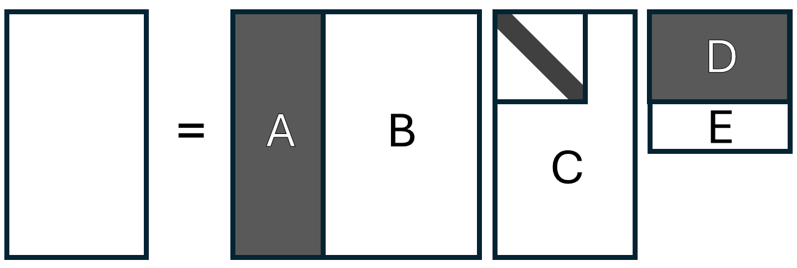

# Week 10: Singular Value Decomposition

*32 problems. GENERATED by scripts/compile.py — edit problems/*.yaml, not this file.*

## ESE2030-0096
*week 10 · 2025C quiz5 #1 · active · legacy Q5-P01*  
skills: `W10.S05` Recognize the sphere-to-ellipsoid geometry: semi-axes are singular values, directions are left singular vectors, and what rank deficiency does to the picture; `W10.S03` Read the defining relations Av_i = σ_i u_i and Aᵀu_i = σ_i v_i, and place the v's in the domain and the u's in the codomain  
topics: SVD from geometric picture, singular value conventions, left vs right singular vectors

The figure shows how a matrix $A \in \mathbb{R}^{2 \times 2}$ transforms the unit circle to an ellipse, with the singular vectors represented.

Based on this figure, which of the following is the most likely SVD of $A = U\Sigma V^T$?

- **(A)** $U = \frac{1}{\sqrt{2}}\begin{bmatrix} 1 & 1 \\ 1 & -1 \end{bmatrix}, \quad \Sigma = \begin{bmatrix} 3/2 & 0 \\ 0 & 1/2 \end{bmatrix}, \quad V = \frac{1}{\sqrt{2}}\begin{bmatrix} 1 & 1 \\ -1 & 1 \end{bmatrix}$
- **(B)** $U = \frac{1}{\sqrt{2}}\begin{bmatrix} 1 & 1 \\ -1 & 1 \end{bmatrix}, \quad \Sigma = \begin{bmatrix} 3/2 & 0 \\ 0 & 1/2 \end{bmatrix}, \quad V = \frac{1}{\sqrt{2}}\begin{bmatrix} 1 & 1 \\ 1 & -1 \end{bmatrix}$
- **(C)** $U = \frac{1}{\sqrt{2}}\begin{bmatrix} 1 & 1 \\ -1 & 1 \end{bmatrix}, \quad \Sigma = \begin{bmatrix} 1/2 & 0 \\ 0 & 3/2 \end{bmatrix}, \quad V = \frac{1}{\sqrt{2}}\begin{bmatrix} 1 & 1 \\ -1 & 1 \end{bmatrix}$
- **(D)** $U = \frac{1}{\sqrt{2}}\begin{bmatrix} 1 & 1 \\ 1 & -1 \end{bmatrix}, \quad \Sigma = \begin{bmatrix} 3/2 & 0 \\ 0 & -1/2 \end{bmatrix}, \quad V = \frac{1}{\sqrt{2}}\begin{bmatrix} 1 & 1 \\ 1 & -1 \end{bmatrix}$
- **(E)** $U = \frac{1}{\sqrt{2}}\begin{bmatrix} 1 & 1 \\ 1 & -1 \end{bmatrix}, \quad \Sigma = \begin{bmatrix} 3/2 & 0 \\ 0 & 1/2 \end{bmatrix}, \quad V = \frac{1}{\sqrt{2}}\begin{bmatrix} 1 & 1 \\ 1 & -1 \end{bmatrix}$

Answer

**Correct: (B)**

Reading from the figure: - The right singular vectors (columns of $V$) are in the domain at $\pm 45°$: $\mathbf{v}_1 = (1,1)^T/\sqrt{2}$ and $\mathbf{v}_2 = (1,-1)^T/\sqrt{2}$ - The semi-axis lengths give $\sigma_1 = 3/2$ (major) and $\sigma_2 = 1/2$ (minor) - The left singular vectors (columns of $U$) align with the ellipse axes in the codomain: $\mathbf{u}_1 = (1,-1)^T/\sqrt{2}$ (at $-45°$) and $\mathbf{u}_2 = (1,1)^T/\sqrt{2}$ (at $45°$)

Why the distractors tempt:
- (A) swaps $U$ and $V$; confuses which singular vectors live in domain vs codomain
- (C) places smaller singular value first; violates the convention $\sigma_1 \geq \sigma_2 \geq \cdots \geq 0$
- (D) uses negative singular value $-1/2$; singular values must be non-negative by definition
- (E) (uses $\sigma_i^2$ instead of $\sigma_i$; confuses eigenvalues of $A^TA$ with singular values) %%%%%%%%%%%%%%%%%%%%%%%%%%%%%%%%%%%%%%%%%%%%%%%%%%%%%%%%%%%%%%%% %%%%%%%%%%%%%%%%%%%%%%%%%%%%%%%%%%%%%%%%%%%%%%%%%%%%%%%%%%%%%%%%

---

## ESE2030-0097
*week 10 · 2025C quiz5 #2 · active · legacy Q5-P02*  
skills: `W10.S05` Recognize the sphere-to-ellipsoid geometry: semi-axes are singular values, directions are left singular vectors, and what rank deficiency does to the picture; `W10.S06` Relate singular values of A to eigenvalues of AᵀA and AAᵀ (σ_i² = λ_i, shared nonzero eigenvalues) without conflating them; know σ_i ≥ 0 while eigenvalues need not be, and when σ_i = |λ_i|  
topics: Geometric foundations of SVD, sphere to ellipsoid transformation, role of A^TA

A linear transformation $A \in \mathbb{R}^{3 \times 2}$ maps the unit circle in $\mathbb{R}^2$ to an ellipse in $\mathbb{R}^3$. The matrix $A^TA$ has eigenvalues $\lambda_1 = 9$ and $\lambda_2 = 4$ with corresponding orthonormal eigenvectors $\mathbf{v}_1$ and $\mathbf{v}_2$.

Which statement correctly describes the geometric action of $A$?

- **(A)** The ellipse in $\mathbb{R}^3$ has semi-axis lengths 9 and 4, aligned with the directions $\mathbf{v}_1$ and $\mathbf{v}_2$.
- **(B)** The ellipse in $\mathbb{R}^3$ has semi-axis lengths 3 and 2, and the input directions $\mathbf{v}_1$ and $\mathbf{v}_2$ are mapped to these semi-axes.
- **(C)** The ellipse lies in a 2-dimensional subspace of $\mathbb{R}^3$, with semi-axis lengths $\sqrt{9} = 3$ and $\sqrt{4} = 2$.
- **(D)** The transformation stretches the direction $\mathbf{v}_1$ by factor 9 and $\mathbf{v}_2$ by factor 4, producing an ellipse with area $36\pi$.
- **(E)** The eigenvalues of $A$ determine the semi-axis lengths, which are 9 and 4.

Answer

**Correct: (C)**  — partial credit: B

The key geometric insight is that $A$ transforms the unit circle (sphere in $\mathbb{R}^2$) into an ellipse in $\mathbb{R}^3$. Since $A \in \mathbb{R}^{3 \times 2}$, the image must lie in a 2-dimensional subspace (the column space of $A$). The eigenvalues $\lambda_i$ of $A^TA$ give $\|A\mathbf{v}_i\|^2 = \lambda_i$, so the singular values $\sigma_i = \sqrt{\lambda_i}$ are the actual stretching factors: $\sigma_1 = 3$ and $\sigma_2 = 2$. These are the semi-axis lengths of the ellipse. The eigenvectors $\mathbf{v}_1, \mathbf{v}_2$ (in the domain) are the principal input directions that get stretched to form the semi-axes.

Why the distractors tempt:
- (A) confuses eigenvalues $\lambda_i$ with singular values $\sigma_i$; the eigenvalues give squared stretching, not the lengths themselves
- (D) uses eigenvalues as stretching factors instead of their square roots
- (E) conflates eigenvalues of $A$ with eigenvalues of $A^TA$; for rectangular $A$, eigenvalues of $A$ don't exist

---

## ESE2030-0099
*week 10 · 2025C quiz5 #4 · active · legacy Q5-P04*  
skills: `W10.S06` Relate singular values of A to eigenvalues of AᵀA and AAᵀ (σ_i² = λ_i, shared nonzero eigenvalues) without conflating them; know σ_i ≥ 0 while eigenvalues need not be, and when σ_i = |λ_i|  
topics: Singular values ordering, operations on matrices, basic SVD properties

A matrix $A \in \mathbb{R}^{m \times n}$ has singular values $\sigma_1 = 5$, $\sigma_2 = 3$, $\sigma_3 = 1$, and $\sigma_k = 0$ for $k>3$.

Which of the following statements is most TRUE?

- **(A)** Matrix $2A$ has singular values 10, 6, 2, with all others zero, but they should be reordered as 2, 6, 10 to maintain the SVD convention.
- **(B)** Matrix $A^T$ has singular values $\sigma_1=1, \sigma_2=3, \sigma_3=5$, with all others zero.
- **(C)** Matrix $A^TA$ has eigenvalues 25, 9, 1, with the remaining eigenvalues zero.
- **(D)** The largest singular value of $AA^T$ is 25.
- **(E)** Matrices $A^TA$ and $AA^T$ have different nonzero eigenvalues.

Answer

**Correct: (C)**

Singular values are ALWAYS arranged in descending order: $\sigma_1 \geq \sigma_2 \geq \cdots \geq 0$. This is a convention, not a consequence of any operation. The key relationships: (1) $A$ and $A^T$ have identical singular values (same set, same order). (2) If $A$ has singular values $\{\sigma_i\}$, then $cA$ has singular values $\{|c|\sigma_i\}$ in the same descending order. (3) The eigenvalues of $A^TA$ are $\sigma_i^2$, so $25, 9, 1, 0, 0, \ldots$ in descending order. (4) Both $A^TA$ and $AA^T$ share the same NONZERO eigenvalues (namely $\sigma_i^2$ for $i \leq r = \rank(A)$), though they may have different numbers of zero eigenvalues depending on dimensions.

Why the distractors tempt:
- (A) singular values of $2A$ are correctly computed as $10, 6, 2$, but they do NOT need reordering—they're already in descending order by construction
- (B) $A^T$ has the SAME singular values as $A$, in the same descending order; transpose doesn't reverse the ordering
- (D) $AA^T$ is an $m \times m$ matrix; its eigenvalues are $\sigma_i^2 = 25, 9, 1, 0, \ldots$, so its largest eigenvalue is 25, but this is an eigenvalue, not a singular value of $AA^T$. The singular values of $AA^T$ would be the square roots of eigenvalues of $(AA^T)^T(AA^T) = AA^TAA^T$
- (E) classic misconception: $A^TA$ and $AA^T$ always share the same nonzero eigenvalues, which are $\sigma_1^2, \ldots, \sigma_r^2$

---

## ESE2030-0100
*week 10 · 2025C quiz5 #5 · active · legacy Q5-P05*  
skills: `W10.S09` Recognize A⁺ = VΣ⁺Uᵀ from a given SVD, with Σ⁺ inverting nonzero singular values AND transposing, and never inverting a zero  
topics: Pseudoinverse construction via SVD, Σ^† formula

A matrix $A \in \mathbb{R}^{4 \times 3}$ has singular value decomposition $A = U\Sigma V^T$ where $U \in \mathbb{R}^{4 \times 4}$, $V \in \mathbb{R}^{3 \times 3}$ are orthogonal, and:
$$\Sigma = \begin{bmatrix} 5 & 0 & 0 \\ 0 & 2 & 0 \\ 0 & 0 & 0 \\ 0 & 0 & 0 \end{bmatrix} \in \mathbb{R}^{4 \times 3}$$

What is the pseudoinverse $A^\dagger$ of this matrix?

- **(A)** $A^\dagger = U\Sigma^{-1} V^T$ where $\Sigma^{-1} = \begin{bmatrix} 1/5 & 0 & 0 \\ 0 & 1/2 & 0 \\ 0 & 0 & \text{undefined} \\ 0 & 0 & \text{undefined} \end{bmatrix}$
- **(B)** $A^\dagger = V\Sigma^T U^T$ where $\Sigma^T = \begin{bmatrix} 5 & 0 & 0 & 0 \\ 0 & 2 & 0 & 0 \\ 0 & 0 & 0 & 0 \end{bmatrix}$
- **(C)** $A^\dagger = V\Sigma^\dagger U^T$ where $\Sigma^\dagger = \begin{bmatrix} 1/5 & 0 & 0 & 0 \\ 0 & 1/2 & 0 & 0 \\ 0 & 0 & 0 & 0 \end{bmatrix}$
- **(D)** $A^\dagger = U^T\Sigma^\dagger V$ where $\Sigma^\dagger = \begin{bmatrix} 1/5 & 0 & 0 & 0 \\ 0 & 1/2 & 0 & 0 \\ 0 & 0 & 0 & 0 \end{bmatrix}$
- **(E)** $A^\dagger = V\Sigma^\dagger U^T$ where $\Sigma^\dagger = \begin{bmatrix} 1/5 & 0 & 0 \\ 0 & 1/2 & 0 \\ 0 & 0 & 0 \\ 0 & 0 & 0 \end{bmatrix}$

Answer

**Correct: (C)**

The pseudoinverse formula is $A^\dagger = V\Sigma^\dagger U^T$. The pseudoinverse of the diagonal matrix $\Sigma$ is constructed by: (1) transposing $\Sigma$ to get a $3 \times 4$ matrix, then (2) replacing each nonzero diagonal entry $\sigma_i$ with $1/\sigma_i$, and (3) leaving zero entries as zero. Thus: $$\Sigma^\dagger = \begin{bmatrix} 1/5 & 0 & 0 & 0 \\ 0 & 1/2 & 0 & 0 \\ 0 & 0 & 0 & 0 \end{bmatrix} \in \mathbb{R}^{3 \times 4}$$ Note the dimensions: $A$ is $4 \times 3$, so $A^\dagger$ must be $3 \times 4$. We have $V$ is $3 \times 3$, $\Sigma^\dagger$ is $3 \times 4$, and $U^T$ is $4 \times 4$, giving $(3 \times 3)(3 \times 4)(4 \times 4) = 3 \times 4$. ✓ The key insight: we don't try to "invert" $\Sigma$ (which is rectangular and rank-deficient), but rather construct its pseudoinverse by transposing and inverting only the nonzero entries.

Why the distractors tempt:
- (A) trying to directly invert $\Sigma$ doesn't work because $\Sigma$ is rectangular and has zero entries; the pseudoinverse handles this by transposing first
- (B) just transposing $\Sigma$ doesn't give the pseudoinverse; you must also invert the nonzero entries
- (D) incorrect ordering; the pseudoinverse is $V\Sigma^\dagger U^T$, not $U^T\Sigma^\dagger V$, which comes from reversing $A = U\Sigma V^T$
- (E) zero singular values remain zero in $\Sigma^\dagger$; they are NOT replaced with 1 or any other value

---

## ESE2030-0101
*week 10 · 2025C quiz5 #6 · active · legacy Q5-P06*  
skills: `W10.S04` Read rank and bases for all four fundamental subspaces off a GIVEN SVD (v's beyond r span the kernel; u's beyond r span the cokernel)  
topics: Fundamental subspaces via SVD, left vs right singular vectors, geometric interpretation

A data matrix $A \in \mathbb{R}^{100 \times 50}$ represents measurements where rows are observations and columns are features. The SVD $A = U\Sigma V^T$ reveals that only the first 10 singular values are nonzero: $\sigma_1 \geq \sigma_2 \geq \cdots \geq \sigma_{10} > 0$ and $\sigma_{11} = \cdots = \sigma_{50} = 0$.

An analyst wants to understand the fundamental subspaces. Which statement is most TRUE?

- **(A)** The first 10 right singular vectors $\mathbf{v}_1, \ldots, \mathbf{v}_{10}$ span the column space of $A$, capturing the 10 most important patterns in the observations.
- **(B)** The first 10 left singular vectors $\mathbf{u}_1, \ldots, \mathbf{u}_{10}$ span a 10-dimensional subspace of feature space where all data variation occurs.
- **(C)** The right singular vectors $\mathbf{v}_{11}, \ldots, \mathbf{v}_{50}$ form a basis for $\ker(A)$, representing 40 redundant feature combinations.
- **(D)** The left singular vectors $\mathbf{u}_{11}, \ldots, \mathbf{u}_{100}$ span $\ker(A^T)$, representing observation directions that have no correlation with any features.
- **(E)** Both (C) and (D) are correct.

Answer

**Correct: (E)**  — partial credit: D

This tests understanding of which singular vectors span which fundamental subspaces. For $A \in \mathbb{R}^{100 \times 50}$ with rank 10: - Right singular vectors $\mathbf{v}_i \in \mathbb{R}^{50}$ (feature space): $\{\mathbf{v}_1, \ldots, \mathbf{v}_{10}\}$ span $\text{im}(A^T)$ (NOT $\text{im}(A)$), and $\{\mathbf{v}_{11}, \ldots, \mathbf{v}_{50}\}$ span $\ker(A)$. Statement C is correct. - Left singular vectors $\mathbf{u}_i \in \mathbb{R}^{100}$ (observation space): $\{\mathbf{u}_1, \ldots, \mathbf{u}_{10}\}$ span $\text{im}(A)$, and $\{\mathbf{u}_{11}, \ldots, \mathbf{u}_{100}\}$ span $\ker(A^T)$. Statement D is correct. The kernel $\ker(A)$ has dimension $50 - 10 = 40$, representing linear combinations of features that always give zero when $A$ acts on them (redundant feature directions). The left null space $\ker(A^T)$ has dimension $100 - 10 = 90$, representing observation directions orthogonal to the column space.

Why the distractors tempt:
- (A) confuses $\text{im}(A^T)$ with $\text{im}(A)$; right singular vectors span $\text{im}(A^T)$ in the domain, not $\text{im}(A)$ in the codomain
- (B) left singular vectors live in observation space $\mathbb{R}^{100}$, not feature space $\mathbb{R}^{50}$; they span the column space $\text{im}(A)$, which is 10-dimensional

---

## ESE2030-0102
*week 10 · 2025C quiz5 #7 · active · legacy Q5-P07*  
skills: `W10.S07` Recognize A = Σσ_i u_i v_iᵀ as a sum of rank-one pieces in decreasing importance, and identify the dominant one; `W10.S03` Read the defining relations Av_i = σ_i u_i and Aᵀu_i = σ_i v_i, and place the v's in the domain and the u's in the codomain  
topics: Matrix dimensions in SVD, compatibility, parameter counting

A machine learning engineer wants to store a compressed representation of matrix $A \in \mathbb{R}^{500 \times 300}$ using its rank-$k$ SVD approximation $A_k = \sum_{i=1}^k \sigma_i \mathbf{u}_i\mathbf{v}_i^T$.

To store $A_k$, they need to save:
\begin{itemize}
\item $k$ singular values $\{\sigma_1, \ldots, \sigma_k\}$
\item $k$ left singular vectors $\{\mathbf{u}_1, \ldots, \mathbf{u}_k\}$
\item $k$ right singular vectors $\{\mathbf{v}_1, \ldots, \mathbf{v}_k\}$
\end{itemize}

How many total scalar values must be stored, and for which value of $k$ does the storage equal the original matrix $A$?

- **(A)** $k(500 + 300 + 1)$ values; storage equals original when $k = 500$
- **(B)** $k(500 + 300 + 1)$ values; storage equals original when $k = 300$
- **(C)** $k(500 + 300)$ values; storage equals original when $k = 187$ (approximately)
- **(D)** $k(500 \cdot 300)$ values; storage never equals original since SVD is always compressed
- **(E)** $k(500 + 300 + 1)$ values; storage equals original when $k = 187$ (approximately)

Answer

**Correct: (E)**

For rank-$k$ approximation of $A \in \mathbb{R}^{500 \times 300}$: - $k$ singular values (each is 1 scalar): $k$ values - $k$ left singular vectors $\mathbf{u}_i \in \mathbb{R}^{500}$: $500k$ values - $k$ right singular vectors $\mathbf{v}_i \in \mathbb{R}^{300}$: $300k$ values Total storage: $k + 500k + 300k = k(500 + 300 + 1) = 801k$ values. The original matrix $A$ stores $500 \times 300 = 150000$ values. Storage equals original when: $801k = 150000$, so $k = 150000/801 \approx 187.3$ This shows the crossover point: for $k < 187$, SVD compression saves storage; for $k > 187$, it uses more. The maximum useful rank is $\min(500, 300) = 300$, but full rank ($k=300$) would store $801 \times 300 = 240300$ values, which exceeds the original! This reveals why SVD compression is most valuable when the effective rank is much smaller than both dimensions.

Why the distractors tempt:
- (A) correctly counts storage but incorrectly thinks full storage occurs at $k = m = 500$; the maximum rank is $\min(m,n) = 300$
- (B) correctly counts storage but thinks full storage = max rank; actually at max rank, SVD stores MORE than original due to separate storage of vectors
- (C) forgets to count the $k$ singular values themselves; singular values are scalars that must also be stored
- (D) (incorrectly thinks each component requires full $m \times n$ storage; the outer product $\mathbf{u}_i\mathbf{v}_i^T$ need not be stored explicitly) %%%%%%%%%%%%%%%%%%%%%%%%%%%%%%%%%%%%%%%%%%%%%%%%%%%%%%%%%%%%%%%% %%%%%%%%%%%%%%%%%%%%%%%%%%%%%%%%%%%%%%%%%%%%%%%%%%%%%%%%%%%%%%%%

---

## ESE2030-0103
*week 10 · 2025C quiz5 #8 · active · legacy Q5-P08*  
skills: `W10.S06` Relate singular values of A to eigenvalues of AᵀA and AAᵀ (σ_i² = λ_i, shared nonzero eigenvalues) without conflating them; know σ_i ≥ 0 while eigenvalues need not be, and when σ_i = |λ_i|  
topics: SVD of orthogonal matrices, singular values, geometric interpretation

What can be said about the SVD of an orthogonal matrix $Q \in \mathbb{R}^{n \times n}$?.

- **(A)** All singular values equal 1, so $Q = U\Sigma V^T$ where $\Sigma = I$, meaning $Q = UV^T$ is a product of two orthogonal matrices.
- **(B)** The singular values depend on the specific matrix $Q$; for example, a rotation matrix has different singular values than a reflection matrix.
- **(C)** All singular values equal 1, and because of this the SVD is not unique.
- **(D)** Orthogonal matrices do not have a uniquely defined SVD because they preserve lengths, which contradicts the stretching interpretation of singular values.
- **(E)** The largest singular value is 1, but the other singular values can be less than 1 depending on how much $Q$ ``compresses'' certain directions.

Answer

**Correct: (A)**  — partial credit: C

For any orthogonal matrix $Q$, we have $Q^T Q = I$. The singular values of $Q$ are defined as $\sigma_i = \sqrt{\lambda_i}$ where $\lambda_i$ are eigenvalues of $Q^T Q = I$. Since the eigenvalues of the identity matrix are all 1, we get $\sigma_i = \sqrt{1} = 1$ for all $i$. Therefore, in the SVD $Q = U\Sigma V^T$, we have $\Sigma = I$, giving $Q = U I V^T = UV^T$. This shows that every orthogonal matrix can be written as a product of two orthogonal matrices. Geometrically, orthogonal matrices preserve lengths (no stretching or compression), which is exactly what having all singular values equal to 1 means. The SVD decomposition $Q = UV^T$ represents $Q$ as a composition of two orthogonal transformations.

Why the distractors tempt:
- (B) doesn't recognize that the defining property $Q^T Q = I$ immediately forces all singular values to be 1
- (C) (correctly identifies that all singular values are 1, but incorrectly concludes non-uniqueness
- (D) misunderstands the SVD; preserving lengths means singular values are 1, not that SVD doesn't exist
- (E) backwards reasoning: orthogonal matrices preserve ALL lengths, so no direction is compressed; all singular values must be 1

---

## ESE2030-0106
*week 10 · 2025C quiz5 #11 · active · legacy Q5-P11*  
skills: `W10.S03` Read the defining relations Av_i = σ_i u_i and Aᵀu_i = σ_i v_i, and place the v's in the domain and the u's in the codomain; `W10.S04` Read rank and bases for all four fundamental subspaces off a GIVEN SVD (v's beyond r span the kernel; u's beyond r span the cokernel)  
topics: SVD revealing Fundamental Theorem structure, isomorphism between subspaces

The SVD $A = U\Sigma V^T$ reveals that $A$ acts as an isomorphism (scaled by singular values) between certain fundamental subspaces. For matrix $A \in \mathbb{R}^{m \times n}$ with rank $r$, which statement is most TRUE?

- **(A)** $A$ maps $\ker(A)$ isomorphically onto $\ker(A^T)$ by the relationship $A\mathbf{v}_i = \sigma_i \mathbf{u}_i$ for $i > r$.
- **(B)** $A$ maps $\text{im}(A^T)$ isomorphically onto $\text{im}(A)$, with the isomorphism given by scaling: $A\mathbf{v}_i = \sigma_i \mathbf{u}_i$ for $i \leq r$.
- **(C)** $A$ maps $\mathbb{R}^n$ isomorphically onto $\mathbb{R}^m$ whenever $m = n$, regardless of rank.
- **(D)** $A$ maps both $\ker(A)$ and $\text{im}(A^T)$ isomorphically onto $\text{im}(A)$, explaining why $\dim(\ker(A)) + \dim(\text{im}(A^T)) = \dim(\text{im}(A))$.
- **(E)** The restriction of $A$ to $\ker(A)$ is an isomorphism onto $\ker(A^T)$ because both have dimension $n - r$.

Answer

**Correct: (B)**

This tests the deep geometric insight from the Fundamental Theorem via SVD. The key observation: $A$ collapses $\ker(A)$ to zero but acts as an isomorphism on $(\ker A)^\perp = \text{im}(A^T)$. Specifically: - For $i \leq r$ (nonzero singular values): $A\mathbf{v}_i = \sigma_i \mathbf{u}_i$. The vectors $\{\mathbf{v}_1, \ldots, \mathbf{v}_r\}$ form an orthonormal basis for $\text{im}(A^T)$, and $\{\mathbf{u}_1, \ldots, \mathbf{u}_r\}$ form an orthonormal basis for $\text{im}(A)$. - $A$ restricted to $\text{im}(A^T)$ gives a bijection onto $\text{im}(A)$: it's injective (kernel restricted to $\text{im}(A^T)$ is trivial) and surjective (by definition of image). The singular values $\sigma_i$ provide the scaling factors for this isomorphism. - For $i > r$ (zero singular values): $A\mathbf{v}_i = \mathbf{0}$, so $A$ collapses $\ker(A) = \text{span}\{\mathbf{v}_{r+1}, \ldots, \mathbf{v}_n\}$ to zero. This reveals the geometric content of the Fundamental Theorem: $A$ acts as $(\text{im}(A^T) \xrightarrow{\sim} \text{im}(A)) \oplus (\ker(A) \to \{\mathbf{0}\})$.

Why the distractors tempt:
- (A) $A$ maps $\ker(A)$ to zero, not to $\ker(A^T)$; these are unrelated subspaces in different vector spaces
- (C) false even when $m = n$; if rank$(A) < n$, then $A$ is not an isomorphism because it has a nontrivial kernel
- (D) completely wrong dimension formula; rank-nullity says $\dim(\ker(A)) + \dim(\text{im}(A^T)) = n$, not $\dim(\text{im}(A))$
- (E) ($A$ restricted to $\ker(A)$ gives the zero map, not an isomorphism; $A$ annihilates $\ker(A)$) %%%%%%%%%%%%%%%%%%%%%%%%%%%%%%%%%%%%%%%%%%%%%%%%%%%%%%%%%%%%%%%% %%%%%%%%%%%%%%%%%%%%%%%%%%%%%%%%%%%%%%%%%%%%%%%%%%%%%%%%%%%%%%%% %%%%%%%%%%%%%%%%%%%%%%%%%%%%%%%%%%%%%%%%%%%%%%%%%%%%%%%%%%%%%%%% %%%%%%%%%%%%%%%%%%%%%%%%%%%%%%%%%%%%%%%%%%%%%%%%%%%%%%%%%%%%%%%%

---

## ESE2030-0109
*week 10 · 2025C quiz5 #14 · active · legacy Q5-P14*  
skills: `W10.S04` Read rank and bases for all four fundamental subspaces off a GIVEN SVD (v's beyond r span the kernel; u's beyond r span the cokernel)  
topics: Four fundamental subspaces via SVD, kernel, image, orthogonal complements

A matrix $A \in \mathbb{R}^{7 \times 5}$ has rank 3 with SVD $A = U\Sigma V^T$.

Which approach yields a basis for the coimage $\text{coim}(A) = (\ker A)^\perp$?

- **(A)** Right singular vectors $\{\mathbf{v}_1, \mathbf{v}_2, \mathbf{v}_3, \mathbf{v}_4, \mathbf{v}_5\}$
- **(B)** Left singular vectors $\{\mathbf{u}_1, \mathbf{u}_2, \mathbf{u}_3\}$
- **(C)** Right singular vectors $\{\mathbf{v}_1, \mathbf{v}_2, \mathbf{v}_3\}$
- **(D)** Left singular vectors $\{\mathbf{u}_4, \mathbf{u}_5, \mathbf{u}_6, \mathbf{u}_7\}$
- **(E)** Right singular vectors $\{\mathbf{v}_4, \mathbf{v}_5\}$

Answer

**Correct: (C)**

The coimage $\text{coim}(A) = (\ker A)^\perp$ is the orthogonal complement of the kernel in the domain $\mathbb{R}^5$. By the Fundamental Theorem, $(\ker A)^\perp = \text{im}(A^T)$. The SVD reveals that $\text{im}(A^T)$ is spanned by right singular vectors corresponding to nonzero singular values. Since rank$(A) = 3$, we have exactly 3 nonzero singular values, so $\text{coim}(A) = \text{span}\{\mathbf{v}_1, \mathbf{v}_2, \mathbf{v}_3\}$.

Why the distractors tempt:
- (A) includes both $\ker(A)$ and $(\ker A)^\perp$, giving all of $\mathbb{R}^5$ rather than just the coimage
- (B) left singular vectors live in codomain $\mathbb{R}^7$, not domain $\mathbb{R}^5$
- (D) wrong space and wrong singular values
- (E) these span $\ker(A)$, not its orthogonal complement

---

## ESE2030-0110
*week 10 · 2025C quiz5 #15 · active · legacy Q5-P15*  
skills: `W10.S06` Relate singular values of A to eigenvalues of AᵀA and AAᵀ (σ_i² = λ_i, shared nonzero eigenvalues) without conflating them; know σ_i ≥ 0 while eigenvalues need not be, and when σ_i = |λ_i|  
topics: Eigenvalues vs singular values, symmetric matrices, general square matrices

A $3 \times 3$ matrix $A$ has eigenvalues $\lambda_1 = 5$, $\lambda_2 = -3$, $\lambda_3 = 1$.
Which statement about the singular values of $A$ is most TRUE?

- **(A)** The singular values are $5, 3, 1$.
- **(B)** The singular values are $25, 9, 1$.
- **(C)** The singular values are $\sqrt{5}, \sqrt{3}, 1$.
- **(D)** The singular values cannot be determined from eigenvalues alone.
- **(E)** The singular values of a {\em square} matrix equal the eigenvalues for any square matrix.

Answer

**Correct: (D)**  — partial credit: A

Eigenvalues and singular values measure fundamentally different things: - Eigenvalues come from $A\mathbf{v} = \lambda\mathbf{v}$ and can be negative or complex - Singular values come from $A^TA$ (or the SVD) and are always real and non-negative For SYMMETRIC matrices: $A = A^T$ implies $A^TA = A^2$, so the eigenvalues of $A^TA$ are $\lambda_i^2$, giving singular values $\sigma_i = |\lambda_i|$. Thus: $\sigma_1 = 5$, $\sigma_2 = 3$, $\sigma_3 = 1$. For NON-SYMMETRIC matrices: the eigenvalues of $A$ and $A^TA$ are unrelated in general. A non-symmetric matrix with these eigenvalues could have completely different singular values. Example: a shear matrix can have repeated eigenvalue 1 but singular values far from 1.

Why the distractors tempt:
- (B) confuses eigenvalues of $A^TA$ with singular values; singular values are $\sqrt{\lambda(A^TA)}$, not $\lambda^2$
- (C) inverts the relationship; singular values are $|\lambda_i|$ for symmetric matrices, not $\sqrt{|\lambda_i|}$
- (E) (false: eigenvalues can be negative or complex, but singular values are always $\geq 0$; immediately contradicted by $\lambda_2 = -3$) %%%%%%%%%%%%%%%%%%%%%%%%%%%%%%%%%%%%%%%%%%%%%%%%%%%%%%%%%%%%%%%% %%%%%%%%%%%%%%%%%%%%%%%%%%%%%%%%%%%%%%%%%%%%%%%%%%%%%%%%%%%%%%%%

---

## ESE2030-0111
*week 10 · 2025C quiz5 #16 · needs-review · legacy Q5-P16*  
skills: `W10.S10` Know that singular values are invariant under orthogonal transformations on either side (A → Q₁AQ₂ᵀ) but NOT under similarity  
topics: Effect of orthogonal transformations, invariance properties, creative application

Consider two analysts working with the same centered data matrix $X \in \mathbb{R}^{100 \times 6}$ that has singular values $\sigma_1 = 20, \sigma_2 = 15, \sigma_3 = 8, \sigma_4 = 5, \sigma_5 = 2, \sigma_6 = 1$.

\textbf{Analyst A} performs PCA directly on $X$.

\textbf{Analyst B} first applies an orthogonal transformation $Q \in \mathbb{R}^{6 \times 6}$ to get $Y = XQ$, then performs PCA on $Y$.

How do their results compare?

- **(A)** Analyst B's principal components are related to Analyst A's by the transformation: $\mathbf{w}_k = Q^T\mathbf{v}_k$, where $\mathbf{v}_k$ are A's principal components.
- **(B)** Both analysts obtain identical singular values: $\{20, 15, 8, 5, 2, 1\}$, but their principal component directions differ.
- **(C)** Analyst A's results are superior because applying $Q$ distorts the covariance structure of the data.
- **(D)** The analyses are equivalent only if $Q$ is a rotation (determinant +1), but not if $Q$ includes reflections (determinant -1).
- **(E)** Both analyses capture the same total variance and the same variance proportions, but the ordering of principal components may differ.

Answer

**Correct: (B)**  — partial credit: A

Key insight: Orthogonal transformations preserve singular values. If $X = U\Sigma V^T$, then $Y = XQ = U\Sigma V^TQ$. The singular values of $Y$ are found from $Y^TY = Q^TV\Sigma^2 V^TQ$. Since $Q$ is orthogonal, this is similar to $V\Sigma^2 V^T$, preserving eigenvalues. Thus singular values of $Y$ equal those of $X$. However, the principal components differ: for $Y$, the PCs are columns of $W$ where $Y = U\Sigma W^T$, giving $W = Q^TV$, so $\mathbf{w}_k = Q^T\mathbf{v}_k$. CONCEPTUAL POINT: The singular value spectrum (and thus variance captured) is invariant under orthogonal transformations of the columns. This makes sense: rotating the coordinate system doesn't change the intrinsic dimensionality or variance structure of the data - just the coordinate representation of the principal directions.

Why the distractors tempt:
- (E) the variance proportions are identical, but the ordering remains the same - both get $\sigma_1 = 20$ as largest, etc.

---

## ESE2030-0113
*week 10 · 2025C quiz5 #18 · active · legacy Q5-P18*  
skills: `W10.S06` Relate singular values of A to eigenvalues of AᵀA and AAᵀ (σ_i² = λ_i, shared nonzero eigenvalues) without conflating them; know σ_i ≥ 0 while eigenvalues need not be, and when σ_i = |λ_i|; `W10.S05` Recognize the sphere-to-ellipsoid geometry: semi-axes are singular values, directions are left singular vectors, and what rank deficiency does to the picture  
topics: SVD geometry, PCA variance structure, A^T A vs covariance

A centered data matrix $X \in \mathbb{R}^{100 \times 3}$ represents 100 observations of three variables. The matrix $X^TX$ has eigenvalues:
$$\lambda_1 = 1600, \quad \lambda_2 = 400, \quad \lambda_3 = 100$$

Consider the linear transformation $T: \mathbb{R}^3 \to \mathbb{R}^{100}$ defined by $T(\mathbf{v}) = X\mathbf{v}$. This transformation maps the unit sphere in $\mathbb{R}^3$ to an ellipsoid in $\mathbb{R}^{100}$.

Which statement correctly relates the SVD geometry to the PCA variance structure?

- **(A)** The ellipsoid has semi-axis lengths 1600, 400, and 100, which equal the variances along the three principal component directions.
- **(B)** The ellipsoid has semi-axis lengths 40, 20, and 10, which equal the variances along the three principal component directions.
- **(C)** The ellipsoid semi-axes have lengths in ratio 4:2:1, while the principal component variances have ratio 16:4:1.
- **(D)** The ellipsoid semi-axes have lengths in ratio 4:2:1, and the principal component variances have the same ratio 4:2:1.
- **(E)** The ellipsoid lies in a 3-dimensional subspace of $\mathbb{R}^{100}$, but the semi-axis lengths and PC variances are unrelated quantities.

Answer

**Correct: (C)**  — partial credit: D

This requires connecting SVD geometry to PCA statistics: 1) SVD GEOMETRY: The eigenvalues of $X^TX$ are $\sigma_i^2$, so $\sigma_1 = 40$, $\sigma_2 = 20$, $\sigma_3 = 10$. These singular values are the semi-axis lengths of the ellipsoid. Ratio: $40 : 20 : 10 = 4 : 2 : 1$. 2) PCA VARIANCE: The covariance matrix is $C = X^TX/(n-1) = X^TX/99$, with eigenvalues $\lambda_1^{(C)} \approx 16.16$, $\lambda_2^{(C)} \approx 4.04$, $\lambda_3^{(C)} \approx 1.01$. These are the PC variances. Ratio: approximately $16 : 4 : 1$. 3) KEY INSIGHT: Semi-axis lengths scale as $\sigma_i$ (ratio 4:2:1), while variances scale as $\sigma_i^2/(n-1)$ (ratio 16:4:1). The linear vs. quadratic relationship explains the difference. Both capture the same ellipsoidal structure: singular values measure stretching factors (distances), while variances measure spread (squared distances, normalized by sample size).

Why the distractors tempt:
- (A) confuses eigenvalues of $X^TX$ with both semi-axes and variances; eigenvalues are $\sigma_i^2$, not the lengths or variances directly
- (B) correctly computes semi-axis lengths as $\sqrt{\lambda_i}$, but these are NOT the variances; variances require division by $n-1$

---

## ESE2030-0114
*week 10 · 2025C quiz5 #19 · active · legacy Q5-P19*  
skills: `W10.S08` Recognize the spectral norm (σ₁) and the Frobenius norm (√Σσ_i²), and the condition number σ₁/σ_r as Week 1's warning made exact — small σ_min, not small determinant  
topics: Frobenius norm from singular values

A matrix $A \in \mathbb{R}^{4 \times 3}$ has singular values $\sigma_1 = 6$, $\sigma_2 = 3$, $\sigma_3 = 2$.

What is the Frobenius norm $\|A\|_F$?

- **(A)** $11$
- **(B)** $49$
- **(C)** $7$
- **(D)** $\sqrt{11}$
- **(E)** Not enough information to determine $\|A\|_F$.

Answer

**Correct: (C)**

The Frobenius norm can be computed directly from singular values: $$\|A\|_F = \sqrt{\sigma_1^2 + \sigma_2^2 + \sigma_3^2} = \sqrt{36 + 9 + 4} = \sqrt{49} = 7$$ This is equivalent to $\sqrt{\sum_{i,j} a_{ij}^2}$ (the entry-wise definition), but the singular value formula shows that $\|A\|_F$ depends only on the singular values, not on the specific entries or the orthogonal factors $U$ and $V$.

Why the distractors tempt:
- (A) adds singular values $6 + 3 + 2 = 11$ instead of computing $\sqrt{\sum \sigma_i^2}$; confuses sum with norm
- (B) computes $\sigma_1^2 + \sigma_2^2 + \sigma_3^2 = 49$ but forgets the square root
- (D) takes square root of the sum of singular values $\sqrt{11}$; combines both errors
- (E) (believes one needs the actual matrix entries or the orthogonal factors; doesn't recognize that singular values fully determine the Frobenius norm) %%%%%%%%%%%%%%%%%%%%%%%%%%%%%%%%%%%%%%%%%%%%%%%%%%%%%%%%%%%%%%%% %%%%%%%%%%%%%%%%%%%%%%%%%%%%%%%%%%%%%%%%%%%%%%%%%%%%%%%%%%%%%%%%

---

## ESE2030-0115
*week 10 · 2025C quiz5 #20 · active · legacy Q5-P20*  
skills: `W10.S04` Read rank and bases for all four fundamental subspaces off a GIVEN SVD (v's beyond r span the kernel; u's beyond r span the cokernel)  
topics: SVD structure, fundamental subspaces, left vs right singular vectors

The figure shows the full SVD $A = U\Sigma V^T$ for a matrix $A \in \mathbb{R}^{12 \times 5}$.
Filled circles represent nonzero singular values; empty circles represent zero singular values.
Vertical lines indicate columns; horizontal lines indicate rows.

Which statement is most TRUE?

- **(A)** $\dim(\ker A) = 9$.
- **(B)** The first three columns of $V$ form an orthonormal basis for $\mathrm{im}(A)$.
- **(C)** The last 9 columns of $U$ form an orthonormal basis for the codomain of $A$.
- **(D)** The last two columns of $V$ form an orthonormal basis for $\ker(A)$.
- **(E)** The rank of $A$ equals $5$.

Answer

**Correct: (D)**

For $A \in \mathbb{R}^{12 \times 5}$ with rank $r = 3$: - Right singular vectors $\mathbf{v}_i \in \mathbb{R}^5$ (domain) - Left singular vectors $\mathbf{u}_i \in \mathbb{R}^{12}$ (codomain) - $\{\mathbf{v}_1, \mathbf{v}_2, \mathbf{v}_3\}$ spans $\mathrm{im}(A^T)$ (row space) - $\{\mathbf{v}_4, \mathbf{v}_5\}$ spans $\ker(A)$ ← this is (D), TRUE - $\{\mathbf{u}_1, \mathbf{u}_2, \mathbf{u}_3\}$ spans $\mathrm{im}(A)$ (column space) - $\{\mathbf{u}_4, \ldots, \mathbf{u}_{12}\}$ spans $\ker(A^T)$ (left nullspace)

Why the distractors tempt:
- (A) computes $12 - 3 = 9$, which is $\dim(\ker A^T)$, not $\dim(\ker A)$; confuses left nullspace with right nullspace. Correct: $\dim(\ker A) = 5 - 3 = 2$
- (B) right singular vectors span $\mathrm{im}(A^T)$, not $\mathrm{im}(A)$; the column space is spanned by LEFT singular vectors $\mathbf{u}_1, \mathbf{u}_2, \mathbf{u}_3$
- (C) the vectors $\mathbf{u}_i$ live in $\mathbb{R}^{12}$, not $\mathbb{R}^5$; confuses domain with codomain
- (E) rank = number of nonzero singular values = 3, not the size of $V$; a matrix can have full-size orthogonal factors while being rank-deficient

---

## ESE2030-0119
*week 10 · 2025C final #4 · active*  
skills: `W10.S09` Recognize A⁺ = VΣ⁺Uᵀ from a given SVD, with Σ⁺ inverting nonzero singular values AND transposing, and never inverting a zero  

A matrix $A \in \mathbb{R}^{5 \times 3}$ has singular values $\sigma_1 = 6$, $\sigma_2 = 3$, $\sigma_3 = 2$.

Which statement about the pseudoinverse $A^\dagger$ is TRUE?

- **(A)** $A^\dagger \in \mathbb{R}^{3 \times 5}$ with singular values $6$, $3$, $2$.
- **(B)** $A^\dagger \in \mathbb{R}^{3 \times 5}$ with singular values $1/4$, $1/9$, $1/36$.
- **(C)** $A^\dagger \in \mathbb{R}^{3 \times 5}$ with singular values $1/2$, $1/3$, $1/6$.
- **(D)** The singular values of $A^\dagger$ equal those of $(A^TA)^{-1}$.
- **(E)** The pseudoinverse $A^\dagger$ is undefined because $A$ is not square.

Answer

**Correct: (C)**

Two key facts: 1) DIMENSIONS: If $A \in \mathbb{R}^{m \times n}$, then $A^\dagger \in \mathbb{R}^{n \times m}$. Here $A$ is $5 \times 3$, so $A^\dagger$ is $3 \times 5$. 2) SINGULAR VALUES: The nonzero singular values of $A^\dagger$ are the reciprocals of those of $A$. Since $A = U\Sigma V^T$, we have $A^\dagger = V\Sigma^\dagger U^T$. The singular values of $A^\dagger$ are $1/\sigma_3, 1/\sigma_2, 1/\sigma_1 = 1/2, 1/3, 1/6$ (listed in decreasing order, as convention requires).

Why the distractors tempt:
- (A) correct dimensions but confuses with transpose; $A^T$ has the same singular values as $A$, but $A^\dagger$ does not
- (B) confuses with $(A^TA)^{-1}$, which has eigenvalues $1/\sigma_i^2$; since $(A^TA)^{-1}$ is symmetric positive definite, its singular values equal its eigenvalues. Students who recall $A^\dagger = (A^TA)^{-1}A^T$ may conflate the singular values of $A^\dagger$ with those of $(A^TA)^{-1}$.
- (D) tests the same misconception as B from a different angle; $(A^TA)^{-1}$ has singular values $1/4, 1/9, 1/36$, not $1/2, 1/3, 1/6$

---

## ESE2030-0123
*week 10 · 2025C final #8 · active*  
skills: `W10.S03` Read the defining relations Av_i = σ_i u_i and Aᵀu_i = σ_i v_i, and place the v's in the domain and the u's in the codomain  

Let $A \in \mathbb{R}^{m \times n}$ have SVD $A = U\Sigma V^T$ with singular values $\sigma_1 > \sigma_2 > 0$ and $\sigma_k = 0$ for $k > 2$.

Which statement best describes the geometric relationship between the singular vectors?

- **(A)** $A\mathbf{u}_1 = \sigma_1 \mathbf{v}_1$: the matrix $A$ maps left singular vectors to right singular vectors, scaled by singular values.
- **(B)** $A^T\mathbf{v}_1 = \sigma_1 \mathbf{u}_1$: the matrix $A^T$ maps right singular vectors to left singular vectors, scaled by singular values.
- **(C)** $A\mathbf{v}_1 = \sigma_1 \mathbf{u}_1$: the matrix $A$ maps the first right singular vector to the first left singular vector, scaled by $\sigma_1$.
- **(D)** The columns of $U$ and $V$ are both eigenvectors of $A$, with eigenvalues $\pm\sigma_i$.
- **(E)** $\mathbf{u}_1$ and $\mathbf{v}_1$ point in the same direction, since both correspond to the largest singular value.

Answer

**Correct: (C)**

The defining relationship of the SVD is $A\mathbf{v}_i = \sigma_i \mathbf{u}_i$ for $i \leq r$ (where $r$ is the rank). This says: the matrix $A$ takes each right singular vector $\mathbf{v}_i$ (in the domain $\mathbb{R}^n$) and maps it to a scalar multiple of the corresponding left singular vector $\mathbf{u}_i$ (in the codomain $\mathbb{R}^m$). Geometrically: the right singular vectors are the principal input directions; the left singular vectors are the principal output directions; and $\sigma_i$ is the stretching factor along the $i$-th principal axis.

Why the distractors tempt:
- (A) reverses the roles: $A$ maps from domain to codomain, so it takes $\mathbf{v}_i \in \mathbb{R}^n$ to $\mathbf{u}_i \in \mathbb{R}^m$, not the other way
- (B) reverses the relationship: $A^T \mathbf{u}_i = \sigma_i \mathbf{v}_i$, not $A^T \mathbf{v}_i = \sigma_i \mathbf{u}_i$

---

## ESE2030-0140
*week 10 · 2025C final #25 · needs-review*  
skills: `W10.S10` Know that singular values are invariant under orthogonal transformations on either side (A → Q₁AQ₂ᵀ) but NOT under similarity  

Let $A \in \mathbb{R}^{m \times n}$ have singular values $\sigma_1, \ldots, \sigma_r > 0$. Let $Q \in \mathbb{R}^{m \times m}$ and $P \in \mathbb{R}^{n \times n}$ be orthogonal matrices.

Which statement is TRUE?

- **(A)** $QA$ has singular values $\sigma_1, \ldots, \sigma_r$, but $AP$ generally does not.
- **(B)** $AP$ has singular values $\sigma_1, \ldots, \sigma_r$, but $QA$ generally does not.
- **(C)** Both $QA$ and $AP$ have singular values $\sigma_1, \ldots, \sigma_r$.
- **(D)** $QAP$ has singular values $\sigma_1^2, \ldots, \sigma_r^2$ because two orthogonal transformations are applied.
- **(E)** The singular values of $QA$ depend on which orthogonal matrix $Q$ is chosen.

Answer

**Correct: (C)**

Singular values are invariant under orthogonal transformations on either side. If $A = U\Sigma V^T$, then: - $QA = (QU)\Sigma V^T$ is an SVD of $QA$ since $QU$ is orthogonal - $AP = U\Sigma (P^TV)^T$ is an SVD of $AP$ since $P^TV$ is orthogonal Geometrically: orthogonal transformations are rotations/reflections that preserve lengths and angles. The singular values measure how much $A$ stretches along principal directions. Pre- or post-composing with a rotation doesn't change the stretching — it just rotates the input or output space. This is why singular values capture "intrinsic" properties of a linear map, independent of the choice of orthonormal bases.

Why the distractors tempt:
- (A) incorrectly thinks left and right multiplication behave differently; both preserve singular values
- (B) same error as A, with sides swapped

---

## ESE2030-0147
*week 10 · 2025C final #32 · active*  
skills: `W10.S01` State the Spectral Theorem for symmetric matrices (A = QDQᵀ, real eigenvalues, orthonormal eigenbasis) and recognize which of its guarantees fail for non-symmetric matrices  

Let $A$ be a real symmetric $4 \times 4$ matrix with eigenvalues $\lambda_1 = 5$, $\lambda_2 = 5$, $\lambda_3 = -1$, and $\lambda_4 = -1$.
Let $\mathbf{v}_1, \mathbf{v}_2$ be eigenvectors for $\lambda = 5$ and $\mathbf{v}_3, \mathbf{v}_4$ be eigenvectors for $\lambda = -1$.

Which statement is guaranteed by the Spectral Theorem?

- **(A)** $\mathbf{v}_1 \perp \mathbf{v}_2$ and $\mathbf{v}_3 \perp \mathbf{v}_4$
- **(B)** $\mathbf{v}_1 \perp \mathbf{v}_3$ and $\mathbf{v}_2 \perp \mathbf{v}_4$, but eigenvectors for the same eigenvalue need not be orthogonal
- **(C)** All four eigenvectors are mutually orthogonal
- **(D)** $A$ can be written as $A = QDQ^T$ where $Q$ is orthogonal, but the columns of $Q$ are not necessarily eigenvectors
- **(E)** None: there may not be independent eigenvectors due to repeated eigenvalues

Answer

**Correct: (B)**  — partial credit: C

The Spectral Theorem guarantees that eigenvectors corresponding to DISTINCT eigenvalues of a real symmetric matrix are orthogonal. Since $\lambda = 5 \neq -1$, we have $\mathbf{v}_1 \perp \mathbf{v}_3$, $\mathbf{v}_1 \perp \mathbf{v}_4$, $\mathbf{v}_2 \perp \mathbf{v}_3$, and $\mathbf{v}_2 \perp \mathbf{v}_4$. However, eigenvectors for the SAME eigenvalue (like $\mathbf{v}_1$ and $\mathbf{v}_2$, both for $\lambda = 5$) are not automatically orthogonal—any two linearly independent vectors in the 2-dimensional eigenspace work. We CAN choose them to be orthogonal via Gram-Schmidt, but arbitrary eigenvectors for a repeated eigenvalue need not be orthogonal.

Why the distractors tempt:
- (A) exactly backwards; the theorem guarantees orthogonality for distinct eigenvalues, not same eigenvalues
- (D) the columns of $Q$ in $A = QDQ^T$ ARE eigenvectors; the whole point is that symmetric matrices are orthogonally diagonalizable
- (E) (Spectral Theorem guarantees existence) %%%%%%%%%%%%%%%%%%%%%%%%%%%%%%%%%%%%%%%%%%%%%%%%%%%%%%%%%%%%%%%%

---

## ESE2030-0148
*week 10 · 2025C final #33 · active*  
skills: `W10.S06` Relate singular values of A to eigenvalues of AᵀA and AAᵀ (σ_i² = λ_i, shared nonzero eigenvalues) without conflating them; know σ_i ≥ 0 while eigenvalues need not be, and when σ_i = |λ_i|  

Let $A \in \mathbb{R}^{n \times n}$ be a square matrix with eigenvalues $\lambda_1, \ldots, \lambda_n$ and singular values $\sigma_1 \geq \cdots \geq \sigma_n \geq 0$.

Which statement is TRUE for all such matrices $A$?

- **(A)** $\sigma_i = |\lambda_i|$ for all $i$.
- **(B)** $\sigma_1 \cdots \sigma_n = |\lambda_1 \cdots \lambda_n|$.
- **(C)** The singular values and eigenvalues coincide if and only if $A$ is symmetric.
- **(D)** If $A$ has a negative eigenvalue, then $A$ has a negative singular value.
- **(E)** The eigenvalues of $A^T A$ are $\lambda_1^2, \ldots, \lambda_n^2$.

Answer

**Correct: (B)**

Both sides equal $|\det(A)|$: - Product of singular values: $\sigma_1 \cdots \sigma_n = \sqrt{\det(A^TA)} = \sqrt{(\det A)^2} = |\det A|$ - Product of eigenvalues: $|\lambda_1 \cdots \lambda_n| = |\det A|$ This is one of the few universal relationships between singular values and eigenvalues.

Why the distractors tempt:
- (A) false in general; true only for symmetric positive semidefinite matrices. Counterexample: rotation matrix has eigenvalues $e^{\pm i\theta}$ with $|\lambda| = 1$, and singular values both 1, but the pairing doesn't match when eigenvalues are complex
- (C) symmetric is not sufficient — need symmetric POSITIVE SEMIDEFINITE. A symmetric matrix with negative eigenvalue $\lambda < 0$ has $\sigma = |\lambda| \neq \lambda$
- (E) (eigenvalues of $A^TA$ are $\sigma_i^2$, not $\lambda_i^2$; these differ unless $A$ is symmetric positive semidefinite) %%%%%%%%%%%%%%%%%%%%%%%%%%%%%%%%%%%%%%%%%%%%%%%%%%%%%%%%%%%%%%%%

---

## ESE2030-0157
*week 10 · 2025C final #42 · active*  
skills: `W10.S04` Read rank and bases for all four fundamental subspaces off a GIVEN SVD (v's beyond r span the kernel; u's beyond r span the cokernel)  

A matrix $A \in \mathbb{R}^{8 \times 6}$ has SVD $A = U\Sigma V^T$ with singular values
$$\sigma_1 = 7, \quad \sigma_2 = 4, \quad \sigma_3 = 2, \quad \sigma_4 = \sigma_5 = \sigma_6 = 0$$

Which statement is TRUE?

- **(A)** $\dim(\ker A) = 3$ and the kernel is spanned by columns 4, 5, 6 of $U$.
- **(B)** $\dim(\mathrm{im}\, A) = 3$ and the image is spanned by columns 1, 2, 3 of $V$.
- **(C)** $\dim(\mathrm{coker}\, A) = 5$ and the cokernel is spanned by columns 4, 5, 6, 7, 8 of $U$.
- **(D)** $\dim(\mathrm{coim}\, A) = 3$ and the coimage is spanned by columns 1, 2, 3 of $V$.
- **(E)** $\dim(\ker A) = 5$ because $A$ has 8 rows and rank 3.

Answer

**Correct: (D)**  — partial credit: C

From the SVD structure with $r = 3$ nonzero singular values: - The first $r = 3$ columns of $V$ (right singular vectors) span $\mathrm{coim}(A)$ (the row space) - The last $n - r = 3$ columns of $V$ span $\ker(A)$ - The first $r = 3$ columns of $U$ (left singular vectors) span $\mathrm{im}(A)$ (the column space) - The last $m - r = 5$ columns of $U$ span $\mathrm{coker}(A)$ (the left nullspace) So $\dim(\mathrm{coim}\, A) = 3$ and it is spanned by columns 1, 2, 3 of $V$. This is (D).

Why the distractors tempt:
- (A) correct dimension $\dim(\ker A) = 6 - 3 = 3$, but kernel comes from $V$, not $U$
- (B) correct dimension for image, but image comes from $U$, not $V$; confuses domain and codomain

---

## ESE2030-0232
*week 10 · 2026A quiz4 #7 · active · Core*  
skills: `W10.S02` Recognize the SVD as TWO orthonormal frames, not one — the essential contrast with diagonalization — and know when an eigendecomposition is also an SVD (symmetric positive semidefinite)  
topics: SVD vs eigendecomposition, PSD vs PD

Let $A \in \mathbb{R}^{n \times n}$ be symmetric, with eigendecomposition $A = Q\Lambda Q^T$.
Under what condition does setting $U = V = Q$ and $\Sigma = \Lambda$ (up to reordering) yield a
valid SVD of $A$?

- **(A)** Whenever $A$ is symmetric.
- **(B)** Whenever $A$ is invertible.
- **(C)** Whenever $A$ is positive definite.
- **(D)** Whenever every eigenvalue of $A$ is non-negative.
- **(E)** This eigendecomposition cannot be a valid SVD.

Answer

**Correct: (D)**  — partial credit: C

The SVD requires $\Sigma$ to have non-negative diagonal entries. Taking $U = V = Q$ and $\Sigma = \Lambda$ is a valid SVD precisely when every $\lambda_i \geq 0$ --- i.e., when $A$ is positive semidefinite. If some $\lambda_i < 0$, an SVD must use $\sigma_i = |\lambda_i|$ and absorb the sign by flipping the corresponding column of $U$ or $V$; e.g., $A = -I$ has eigenvalues $-1$ but singular values $+1$.

Why the distractors tempt:
- (A) negative eigenvalues break $\Sigma \geq 0$.
- (B) invertibility rules out zero eigenvalues but not negative ones.
- (E) 

---

## ESE2030-0233
*week 10 · 2026A quiz4 #8 · active · Core*  
skills: `W10.S06` Relate singular values of A to eigenvalues of AᵀA and AAᵀ (σ_i² = λ_i, shared nonzero eigenvalues) without conflating them; know σ_i ≥ 0 while eigenvalues need not be, and when σ_i = |λ_i|  
topics: Eigen-structure of A^TA and AA^T: shared nonzero eigenvalues, PSD vs PD

Let $A \in \mathbb{R}^{5 \times 3}$ have rank $2$ with singular values $\sigma_1 \geq \sigma_2 > 0$. Consider the eigen-structure of $A^TA \in \mathbb{R}^{3 \times 3}$ and $AA^T \in \mathbb{R}^{5 \times 5}$.
Which of the following is TRUE?

- **(A)** $A^TA$ and $AA^T$ have the same eigenvalues, counted with multiplicity.
- **(B)** $A^TA$ and $AA^T$ are both invertible, since each is a square matrix.
- **(C)** $A^TA$ and $AA^T$ share the same nonzero eigenvalues; $A^TA$ has one zero eigenvalue and $AA^T$ has three.
- **(D)** $A^TA$ and $AA^T$ are both positive definite, since each is symmetric with non-negative eigenvalues.
- **(E)** $A^TA$ has eigenvalues $\sigma_1, \sigma_2, 0$, and $AA^T$ has eigenvalues $\sigma_1, \sigma_2, 0, 0, 0$.

Answer

**Correct: (C)**  — partial credit: E

Both $A^TA$ and $AA^T$ are symmetric and PSD. Their nonzero eigenvalues coincide and equal $\sigma_1^2, \sigma_2^2$ (the squared singular values, two of them since $\mathrm{rank}(A) = 2$). They differ in size, and therefore in the number of zero eigenvalues: - $A^TA$ is $3 \times 3$: eigenvalues $\sigma_1^2, \sigma_2^2, 0$ (one zero). - $AA^T$ is $5 \times 5$: eigenvalues $\sigma_1^2, \sigma_2^2, 0, 0, 0$ (three zeros). In general, the number of zero eigenvalues equals (ambient dimension) $-$ rank.

Why the distractors tempt:
- (A) conflates ``same nonzero eigenvalues'' with ``same eigenvalues counted with multiplicity''; the matrices have different sizes, so their multisets of eigenvalues differ in the number of zeros
- (B) square does not imply invertible; rank-deficiency forces both products to be singular
- (D) symmetric + non-negative eigenvalues = PSD, not PD; positive definiteness requires \emph{strictly} positive eigenvalues, ruled out here by rank deficiency

---

## ESE2030-0234
*week 10 · 2026A quiz4 #9 · active · Core*  
skills: `W10.S04` Read rank and bases for all four fundamental subspaces off a GIVEN SVD (v's beyond r span the kernel; u's beyond r span the cokernel)  
topics: Fundamental subspaces, consistency of Ax = b, SVD reveals solvability

A matrix $A \in \mathbb{R}^{4 \times 3}$ has rank 2 with SVD $A = U\Sigma V^T$ and left singular vectors $U = [\mathbf{u}_1 \; \mathbf{u}_2 \; \mathbf{u}_3 \; \mathbf{u}_4]$.
Consider the vector $\mathbf{b} = 2\mathbf{u}_1 - \mathbf{u}_2 + 4\mathbf{u}_4$.
Does the system $A\mathbf{x} = \mathbf{b}$ have a solution and, if it does, how many?

- **(A)** Exactly one solution, because the pseudoinverse $A^\dagger\mathbf{b}$ is unique.
- **(B)** No solution, because the system is overdetermined (more equations than unknowns).
- **(C)** Infinitely many solutions, because $\mathrm{rank}(A) = 2 < 3$ means there is one free variable.
- **(D)** No solution, because $\mathbf{b}$ has a nonzero component in $\mathrm{im}(A)^\perp$.
- **(E)** Exactly one solution, because $\mathbf{b}$ has nonzero component in $\mathrm{im}(A)$.

Answer

**Correct: (D)**

The system $A\mathbf{x} = \mathbf{b}$ is consistent if and only if $\mathbf{b} \in \mathrm{im}(A) = \mathrm{span}\{\mathbf{u}_1, \mathbf{u}_2\}$. Decomposing $\mathbf{b}$ using the orthogonal direct sum $\mathbb{R}^4 = \mathrm{im}(A) \oplus \mathrm{im}(A)^\perp$: $$\mathbf{b} = \underbrace{2\mathbf{u}_1 - \mathbf{u}_2}_{\in\;\mathrm{im}(A)} + \underbrace{4\mathbf{u}_4}_{\in\;\mathrm{im}(A)^\perp}$$ The component $4\mathbf{u}_4 \neq \mathbf{0}$ lies in $\mathrm{im}(A)^\perp$, so $\mathbf{b}$ does not lie entirely in $\mathrm{im}(A)$. No solution exists. TRICHOTOMY: For $A \in \mathbb{R}^{4 \times 3}$ with rank 2: either $\mathbf{b} \notin \mathrm{im}(A)$ and there is no solution; or $\mathbf{b} \in \mathrm{im}(A)$ and there are infinitely many solutions (one free variable from $\dim(\ker A) = 1$). A unique solution is impossible when $\mathrm{rank}(A) < n$.

Why the distractors tempt:
- (A) ($A^\dagger\mathbf{b}$ always exists as the least-squares solution, but this is not an exact solution to $A\mathbf{x} = \mathbf{b}$ unless $\mathbf{b} \in \mathrm{im}(A)$) %%%%%%%%%%%%%%%%%%%%%%%%%%%%%%%%%%%%%%%%%%%%%%%%%%% \newpage %%%%%%%%%%%%%%%%%%%%%%%%%%%%%%%%%%%%%%%%%%%%%%%%%%%
- (B) overdetermined systems CAN have solutions; shape alone does not rule them out
- (C) claims an inconsistent system has infinitely many solutions just because the matrix is wide. Conflates uniqueness/nullspace with existence/column space --- a fatal failure to check the fundamental subspaces. NOT awarded partial credit.
- (E) correctly notes nonzero components along $\mathbf{u}_1, \mathbf{u}_2$, but ignores the $4\mathbf{u}_4$ component; ALL of $\mathbf{b}$ must lie in $\mathrm{im}(A)$

---

## ESE2030-0237
*week 10 · 2026A quiz4 #12 · active · Deeper*  
skills: `W10.S09` Recognize A⁺ = VΣ⁺Uᵀ from a given SVD, with Σ⁺ inverting nonzero singular values AND transposing, and never inverting a zero; `W10.S03` Read the defining relations Av_i = σ_i u_i and Aᵀu_i = σ_i v_i, and place the v's in the domain and the u's in the codomain  
topics: SVD of the pseudoinverse, reciprocal of singular values, U/V role swap

Let $A \in \mathbb{R}^{m \times n}$ have rank $r$, with SVD $A = U\Sigma V^T$ and singular
values $\sigma_1 > \sigma_2 > \cdots > \sigma_r > 0$.
Suppose $A^\dagger = \tilde U \tilde\Sigma \tilde V^T$ is an SVD of $A^\dagger$
in standard form (singular values in descending order).
What is $\tilde\sigma_1$, the largest singular value of $A^\dagger$, and its
corresponding left singular vector $\tilde{\mathbf{u}}_1$?

- **(A)** $\tilde\sigma_1 = \sigma_1$ and $\tilde{\mathbf{u}}_1 = \mathbf{u}_1$.
- **(B)** $\tilde\sigma_1 = 1/\sigma_r$ and $\tilde{\mathbf{u}}_1 = \mathbf{v}_r$.
- **(C)** $\tilde\sigma_1 = 1/\sigma_1$ and $\tilde{\mathbf{u}}_1 = \mathbf{v}_1$.
- **(D)** $\tilde\sigma_1 = 1/\sigma_r$ and $\tilde{\mathbf{u}}_1 = \mathbf{u}_r$.
- **(E)** $\tilde\sigma_1 = 1/\sigma_1$ and $\tilde{\mathbf{u}}_1 = \mathbf{u}_1$.

Answer

**Correct: (B)**  — partial credit: D

From $A = U\Sigma V^T$, the pseudoinverse is $A^\dagger = V\Sigma^\dagger U^T$. Three coordinated changes occur in passing from the SVD of $A$ to the SVD of $A^\dagger$: (i)   singular values are inverted: $\sigma_i \mapsto 1/\sigma_i$; (ii)  the orthogonal factors $U$ and $V$ swap sides --- $V$ is now the matrix of left singular vectors and $U$ the matrix of right singular vectors; (iii) descending-order convention forces an index reversal: since $\sigma_1 > \cdots > \sigma_r$ implies $1/\sigma_r > \cdots > 1/\sigma_1$, the LARGEST singular value of $A^\dagger$ is $1/\sigma_r$, paired with the singular vectors that were associated with $\sigma_r$ in the SVD of $A$. Combining: $\tilde\sigma_1 = 1/\sigma_r$ and $\tilde{\mathbf{u}}_1 = \mathbf{v}_r$. Geometric picture: $A$ stretches $\mathbf{v}_i$ by $\sigma_i$ and outputs along $\mathbf{u}_i$. $A^\dagger$ inverts this, stretching $\mathbf{u}_i$ by $1/\sigma_i$ and outputting along $\mathbf{v}_i$. So $\mathbf{u}_i$ becomes an INPUT direction (right singular vector) for $A^\dagger$, and $\mathbf{v}_i$ becomes an OUTPUT direction (left singular vector). The five choices form a clean ladder of which transformations the student gets right: (A) none: ignores that pseudoinverse changes anything. (B) reciprocal only. (C) reciprocal + swap. (D) reciprocal + reversal. (E) all three: reciprocal + swap + reversal. CORRECT.

Why the distractors tempt:
- (A) assumes pseudoinverse leaves SVD untouched.
- (E) (correctly inverts singular values, but assumes the singular vectors are unchanged --- conflates inversion of $\Sigma$ with inversion of $A$.) %%%%%%%%%%%%%%%%%%%%%%%%%%%%%%%%%%%%%%%%%%%%%%%%%%% \newpage %%%%%%%%%%%%%%%%%%%%%%%%%%%%%%%%%%%%%%%%%%%%%%%%%%%

---

## ESE2030-0239
*week 10 · 2026A quiz4 #14 · active · Core*  
skills: `W10.S07` Recognize A = Σσ_i u_i v_iᵀ as a sum of rank-one pieces in decreasing importance, and identify the dominant one  
topics: Outer product form of SVD, rank-1 decomposition, reading singular values from

Let $\{\mathbf{u}_1, \mathbf{u}_2\}$ be orthonormal vectors in $\mathbb{R}^4$ and
$\{\mathbf{v}_1, \mathbf{v}_2\}$ be orthonormal vectors in $\mathbb{R}^3$. A matrix is defined as:
$$A = 3\,\mathbf{u}_1\mathbf{v}_1^T + 7\,\mathbf{u}_2\mathbf{v}_2^T.$$
Which of the following is most TRUE?

- **(A)** $A$ has rank 2; its singular values are $7$ and $3$.
- **(B)** $A$ has rank 1, since adding two rank-1 terms produces a rank-1 matrix.
- **(C)** $A$ has rank 2; its singular values are $49$ and $9$.
- **(D)** $A$ has rank 2; its singular values are $\sqrt{7}$ and $\sqrt{3}$.
- **(E)** The singular values of $A$ cannot be determined without knowing the specific entries of the $\mathbf{u}_i$ and $\mathbf{v}_i$.

Answer

**Correct: (A)**

An expression $\sum_i c_i\,\mathbf{u}_i\mathbf{v}_i^T$ with orthonormal $\{\mathbf{u}_i\}$, orthonormal $\{\mathbf{v}_i\}$, and non-negative $c_i$ is already in SVD outer-product form: the $c_i$ ARE the singular values, and no further computation is needed. Verification via $A^TA$: using $\mathbf{u}_i^T\mathbf{u}_j = \delta_{ij}$, $$A^TA \;=\; 9\,\mathbf{v}_1\mathbf{v}_1^T + 49\,\mathbf{v}_2\mathbf{v}_2^T,$$ whose nonzero eigenvalues are $9$ and $49$. Hence $\sigma_i = \sqrt{\lambda_i(A^TA)}$ gives $\sigma = 3, 7$, recovering the coefficients. Rank is 2 because $\{\mathbf{u}_1, \mathbf{u}_2\}$ are linearly independent (orthonormal), so the column spaces of the two rank-1 terms intersect trivially.

Why the distractors tempt:
- (B) orthonormality of the $\mathbf{u}_i$ and $\mathbf{v}_i$ guarantees the column spaces and row spaces of the two terms are orthogonal, so the sum has rank $1+1=2$
- (C) correctly computes the eigenvalues of $A^TA$ as $9$ and $49$ but forgets the square root step that converts them to singular values. NOT awarded partial credit: the entire point of this problem is reading singular values directly off an orthonormal expansion without computing $A^TA$ at all; falling back to $A^TA$ misses the conceptual shortcut.
- (D) half-remembers $\sigma_i = \sqrt{\lambda_i(A^TA)}$ but applies the square root to the coefficients $c_i$ instead of to the eigenvalues of $A^TA$, which equal $c_i^2$
- (E) orthonormality is precisely the condition that lets you read singular values directly from the coefficients; the specific directions affect $U$ and $V$ but not $\Sigma$

---

## ESE2030-0240
*week 10 · 2026A quiz4 #15 · active · Deeper*  
skills: `W10.S05` Recognize the sphere-to-ellipsoid geometry: semi-axes are singular values, directions are left singular vectors, and what rank deficiency does to the picture  
topics: Sphere-to-ellipsoid geometry under rank deficiency, image lives in im(A)

A matrix $A \in \mathbb{R}^{3 \times 3}$ has singular values $\sigma_1 = 6$, $\sigma_2 = 3$, $\sigma_3 = 0$. Let $S$ denote the image of the unit sphere $\{\mathbf{x} \in \mathbb{R}^3 : \|\mathbf{x}\| = 1\}$ under $A$. Which of the following is TRUE?

- **(A)** $S$ is an ellipsoid in $\mathbb{R}^3$ with semi-axes $6$, $3$, and $0$.
- **(B)** $S$ is an ellipse in $\mathrm{im}(A)$ with semi-axes $6$ and $3$.
- **(C)** $S$ is an ellipse in $\mathbb{R}^3$ with semi-axes $36$ and $9$.
- **(D)** $S$ is a line segment of length $12$ along $\mathbf{u}_1$.
- **(E)** $S$ is an ellipse in $\ker(A)^\perp$ with semi-axes $6$ and $3$.

Answer

**Correct: (B)**  — partial credit: E

Decompose $\mathbf{x}$ in the right-singular basis: $\mathbf{x} = \alpha_1\mathbf{v}_1 + \alpha_2\mathbf{v}_2 + \alpha_3\mathbf{v}_3$ with $\alpha_1^2 + \alpha_2^2 + \alpha_3^2 = 1$. Then $A\mathbf{x} = 6\alpha_1\mathbf{u}_1 + 3\alpha_2\mathbf{u}_2$, since $\sigma_3 = 0$ kills the $\mathbf{v}_3$-component. The image $S$ therefore lies in $\mathrm{span}\{\mathbf{u}_1, \mathbf{u}_2\} = \mathrm{im}(A)$ --- a 2D plane in the codomain. The two surviving stretching factors $\sigma_1 = 6, \sigma_2 = 3$ give the semi-axes. TWO CONCEPTUAL CHECKS: (1) rank-deficiency collapses one dimension, so the image is 2D, not 3D. (2) the image lives in the codomain ($\mathrm{im}(A)$, spanned by left singular vectors), NOT in the domain ($\ker(A)^\perp$, spanned by right singular vectors).

Why the distractors tempt:
- (A) refuses to acknowledge that $\sigma_3 = 0$ collapses one dimension; an "ellipsoid with semi-axis 0" is geometrically just an ellipse in a lower-dimensional plane
- (C) (uses $\sigma_i^2$ as semi-axis lengths; $36$ and $9$ are eigenvalues of $A^TA$, not the semi-axes themselves) %%%%%%%%%%%%%%%%%%%%%%%%%%%%%%%%%%%%%%%%%%%%%%%%%%% \newpage %%%%%%%%%%%%%%%%%%%%%%%%%%%%%%%%%%%%%%%%%%%%%%%%%%%
- (D) over-collapses: $\sigma_2 = 3 > 0$ gives a second independent stretching direction, so the image is 2D, not 1D

---

## ESE2030-0242
*week 10 · 2026A quiz4 #17 · active · Core*  
skills: `W10.S08` Recognize the spectral norm (σ₁) and the Frobenius norm (√Σσ_i²), and the condition number σ₁/σ_r as Week 1's warning made exact — small σ_min, not small determinant  
topics: Frobenius norm from singular values, contrast with operator norm

A matrix $A \in \mathbb{R}^{m \times n}$ has SVD with singular values
$\sigma_1 \geq \sigma_2 \geq \cdots \geq \sigma_r > 0$.
Which quantity equals $\|A\|_F^2$?

- **(A)** $r \cdot \sigma_1^2$
- **(B)** $\sigma_1 + \sigma_2 + \cdots + \sigma_r$
- **(C)** $\sigma_1^2 \cdot \sigma_2^2 \cdots \sigma_r^2$
- **(D)** $\sigma_1^2$
- **(E)** $\sigma_1^2 + \sigma_2^2 + \cdots + \sigma_r^2$

Answer

**Correct: (E)**

The Frobenius norm can be computed three equivalent ways: - Entry-wise: $\|A\|_F^2 = \sum_{i,j} a_{ij}^2$ - Via trace: $\|A\|_F^2 = \mathrm{tr}(A^TA)$ - Via singular values: $\|A\|_F^2 = \sigma_1^2 + \sigma_2^2 + \cdots + \sigma_r^2$ The equivalence follows from the SVD: $A^TA = V\Sigma^T\Sigma V^T = V\,\mathrm{diag}(\sigma_i^2)\,V^T$, so $\mathrm{tr}(A^TA) = \sum \sigma_i^2$. KEY CONCEPTUAL POINT: $\|A\|_F$ depends only on the singular values, NOT on $U$ or $V$. It is therefore invariant under orthogonal multiplication: $\|QA\|_F = \|AQ\|_F = \|A\|_F$ for any orthogonal $Q$. This invariance will matter for Eckart-Young-Mirsky later. CONTRAST WITH OPERATOR NORM: $\|A\|_{\mathrm{op}} = \sigma_1$ captures only the maximum stretching direction. The Frobenius norm captures the ``total stretching energy'' summed over ALL singular directions. These coincide exactly when $A$ is rank-1.

Why the distractors tempt:
- (A) equal to $\|A\|_F^2$ only if $\sigma_1 = \sigma_2 = \cdots = \sigma_r$; in general this overestimates because smaller singular values contribute less
- (B) sum of singular values is the \emph{nuclear norm} $\|A\|_* = \sum \sigma_i$, a different matrix norm used in low-rank optimization
- (C) product of squared singular values equals $|\det A|^2$ when $A$ is square; this is a volume-scaling quantity, not an ``energy'' quantity
- (D) operator norm $\|A\|_{\mathrm{op}} = \sigma_1$; conflating $F$-norm with operator norm is the classic confusion since both are standard matrix norms built from the SVD

---

## ESE2030-0246
*week 10 · 2026A quiz4 #21 · retired-2e · Core*  
topics: Polar decomposition: structure, geometric meaning, distinction from QR / SVD / eigendecomp

Which of the following correctly describes the polar decomposition of an invertible matrix $A \in \mathbb{R}^{n \times n}$?

- **(A)** $A = QH$, where $Q$ is orthogonal and $H$ is symmetric positive definite, with stretching axes given by the eigenvectors of $A^TA$.
- **(B)** $A = QR$, where $Q$ is orthogonal and $R$ is upper triangular.
- **(C)** $A = QH$, where $Q$ is orthogonal and $H$ is symmetric positive definite, with stretching axes given by the eigenvectors of $A$.
- **(D)** $A = QR$, where $Q$ is orthogonal and $R$ is symmetric positive definite.
- **(E)** None of the above.

Answer

**Correct: (A)**  — partial credit: C

The polar decomposition writes $A = QH$ with $Q$ orthogonal and $H$ symmetric positive definite. Geometrically, $H$ applies a ``pure stretch'' along orthogonal axes, then $Q$ rotates (or reflects). Squaring identifies $H$: $A^TA = (QH)^T(QH) = H^T Q^T Q H = H^2$, so $H = (A^TA)^{1/2}$. The stretching axes of $H$ are therefore the eigenvectors of $A^TA$ (equivalently, the right singular vectors of $A$); the stretching factors are the singular values $\sigma_i$. Analogue: polar coordinates for complex numbers, $z = re^{i\theta}$ --- magnitude (stretch) times rotation. The polar decomposition is the matrix version.

Why the distractors tempt:
- (B) this is the QR decomposition from Week 6; the shared letter $Q$ tempts the student into matching ``orthogonal-times-something'' with the wrong named factorization
- (D) a hybrid: takes the structure of polar (orthogonal $\times$ symmetric positive definite) but uses the QR letter for the second factor. Catches students who remember ``polar is orthogonal times something nice'' without keeping the names straight; the actual notation convention for the second factor is $H$, and a polar-style identity $A = QH$ is not what ``QR decomposition'' refers to.

---

## ESE2030-0250
*week 10 · 2026A final #1 · active · Core*  
skills: `W10.S08` Recognize the spectral norm (σ₁) and the Frobenius norm (√Σσ_i²), and the condition number σ₁/σ_r as Week 1's warning made exact — small σ_min, not small determinant; `W10.S05` Recognize the sphere-to-ellipsoid geometry: semi-axes are singular values, directions are left singular vectors, and what rank deficiency does to the picture  
topics: Operator 2-norm, geometric meaning of largest singular value, extremal characterization

A matrix $A \in \mathbb{R}^{4 \times 3}$ has singular values $\sigma_1 = 6$, $\sigma_2 = 3$, $\sigma_3 = 2$.
Over all unit vectors $\mathbf{x} \in \mathbb{R}^3$, what is the largest possible value of $\|A\mathbf{x}\|$?

- **(A)** $\sqrt{6^2 + 3^2 + 2^2} = 7$
- **(B)** $36$
- **(C)** $11$
- **(D)** $6$
- **(E)** Cannot be determined from the information given.

Answer

**Correct: (D)**

The largest singular value $\sigma_1$ is \emph{defined} by the extremal property $$ \sigma_1 \;=\; \max_{\|\mathbf{x}\| = 1} \|A\mathbf{x}\|, $$ with the maximum attained at $\mathbf{x} = \mathbf{v}_1$, the first right singular vector. Geometrically: $A$ maps the unit sphere in $\mathbb{R}^3$ to an ellipsoid in $\mathbb{R}^4$ whose longest semi-axis has length $\sigma_1 = 6$. So the answer is $6$. This quantity is the \textbf{operator 2-norm} $\|A\|_2 = \sigma_1$. It is fundamentally different from the Frobenius norm $\|A\|_F = \sqrt{\sum \sigma_i^2}$: the operator norm is the \emph{worst-case stretching} of a single unit vector, while the Frobenius norm aggregates over all stretching directions.

Why the distractors tempt:
- (A) (D3 correct-structure-wrong-detail: the student computed $\|A\|_F = \sqrt{36 + 9 + 4} = 7$ correctly, but Frobenius is the wrong norm for ``maximum of $\|A\mathbf{x}\|$ over unit $\mathbf{x}$''.
- (B) (D6 shape-implies-property: confuses $\sigma_1$ with $\sigma_1^2$, the largest eigenvalue of $A^T A$; the eigenvalue of $A^T A$ tells you $\|A\mathbf{x}\|^2$, not $\|A\mathbf{x}\|$).
- (C) (D5 naive-prior: just adds the singular values, $6 + 3 + 2 = 11$; treats them as if they combine additively for a single input vector).
- (E) (D4 surface match: $U$ and $V$ are needed to find the maximizing vector $\mathbf{v}_1$, but they are not needed to know the maximum \emph{value} --- that depends only on $\sigma_1$. The singular values alone determine the operator norm).

---

## ESE2030-0252
*week 10 · 2026A final #3 · active · Deeper*  
skills: `W10.S03` Read the defining relations Av_i = σ_i u_i and Aᵀu_i = σ_i v_i, and place the v's in the domain and the u's in the codomain  
topics: SVD structure, left vs right singular vectors, domain vs codomain

A matrix $A \in \mathbb{R}^{m \times n}$ has SVD $A = U\Sigma V^T$. Which statement most fundamentally distinguishes a right singular vector $\mathbf{v}_i$ from a left singular vector $\mathbf{u}_i$?

- **(A)** $\mathbf{v}_i \in \mathbb{R}^n$ lives in the domain of $A$, while $\mathbf{u}_i \in \mathbb{R}^m$ lives in the codomain, and they are linked by $A\mathbf{v}_i = \sigma_i \mathbf{u}_i$.
- **(B)** $\mathbf{v}_i$ is an eigenvector of $A^TA$, while $\mathbf{u}_i$ is an eigenvector of $AA^T$.
- **(C)** $\mathbf{v}_i$ is mapped to $\sigma_i \mathbf{u}_i$ by $A$, while $\mathbf{u}_i$ is mapped to $\sigma_i \mathbf{v}_i$ by $A$.
- **(D)** $\mathbf{v}_i$ identifies a principal input direction that gets stretched by $A$, while $\mathbf{u}_i$ identifies the corresponding output semi-axis of the image ellipsoid.
- **(E)** $\mathbf{v}_i$ is the column of $V$, while $\mathbf{u}_i$ is the column of $U$.

Answer

**Correct: (A)**  — partial credit: D

The most fundamental distinction between $\mathbf{v}_i$ and $\mathbf{u}_i$ is that they live in \emph{different vector spaces}: $\mathbf{v}_i \in \mathbb{R}^n$ is in the domain, and $\mathbf{u}_i \in \mathbb{R}^m$ is in the codomain. The relation $A\mathbf{v}_i = \sigma_i \mathbf{u}_i$ is precisely the statement that $A$ sends the $i$-th right singular vector to a scaled copy of the $i$-th left singular vector. Everything else (eigenvector characterizations, geometric stretching interpretation, columns of $U$ and $V$) is a \emph{consequence} of this domain/codomain structure. Geometrically: $\{\mathbf{v}_i\}$ is the orthonormal frame of input directions on the unit sphere in $\mathbb{R}^n$; $A$ scales each by $\sigma_i$ and sends it to $\mathbf{u}_i$, the corresponding semi-axis of the output ellipsoid in $\mathbb{R}^m$. Whenever $m \neq n$, no $\mathbf{v}_i$ can equal any $\mathbf{u}_j$ — they live in spaces of different dimension.

Why the distractors tempt:
- (C) D1 twin-pair to (B): swaps the asymmetric mapping. The correct relation is $A\mathbf{v}_i = \sigma_i \mathbf{u}_i$ \emph{and} $A^T\mathbf{u}_i = \sigma_i \mathbf{v}_i$; the operator that sends $\mathbf{u}_i$ back to $\sigma_i \mathbf{v}_i$ is $A^T$, not $A$. Students who pattern-match on symmetry without checking domain/codomain fall here
- (E) D4 surface match: a true tautology that names \emph{where} the vectors sit in the matrices $V$ and $U$, but says nothing about what distinguishes them mathematically. It is the choice that ``looks right'' to a student pattern-matching on the formula $A = U\Sigma V^T$

---

## ESE2030-0275
*week 10 · 2026A final #26 · active · Deeper*  
skills: `W10.S04` Read rank and bases for all four fundamental subspaces off a GIVEN SVD (v's beyond r span the kernel; u's beyond r span the cokernel)  
topics: SVD block structure, four fundamental subspaces, coimage, FTLA

The diagram below is an abstract representation of the SVD of a linear transformation $M$, with five regions labeled (A) through (E). Which region best represents the {\em coimage} of the transformation? (choose (A) - (E))

- **(A)** Region A: shaded first $r$ columns of $U$.
- **(B)** Region B: unshaded last $m - r$ columns of $U$.
- **(C)** Region C: the diagonal $\Sigma$ block.
- **(D)** Region D: shaded first $r$ rows of $V^T$.
- **(E)** Region E: unshaded last $n - r$ rows of $V^T$.

Answer

**Correct: (D)**  — partial credit: A

The coimage $\mathrm{coim}(M) = \mathbb{R}^n / \ker(M)$ is naturally represented in the domain by $\ker(M)^\perp$, which is spanned by the first $r$ right singular vectors $\mathbf{v}_1, \ldots, \mathbf{v}_r$. The rows of $V^T$ are exactly the $\mathbf{v}_i^T$, so the first $r$ rows of $V^T$ --- region D --- house the right singular vectors that span the coimage representative. FTLA spine: $\mathrm{coim}(M) \cong \mathrm{im}(M)$, so regions D (in the domain) and A (in the codomain) describe naturally isomorphic spaces. But the \emph{coimage itself lives in the domain}, where $V$ acts --- hence D, not A.

Why the distractors tempt:
- (A) recognizes the rank-$r$ shaded structure and the FTLA isomorphism $\mathrm{coim} \cong \mathrm{im}$, but places coimage on the codomain side (partial credit)
- (B) unshaded columns of $U$ span $\ker(M^T) = \mathrm{im}(M)^\perp$, the natural representative of the \emph{cokernel}. Confuses coimage (domain side) with cokernel (codomain side).
- (C) the $\Sigma$ block holds the singular values --- stretching factors, not a subspace
- (E) the last $n - r$ rows of $V^T$ span $\ker(M)$ --- the orthogonal complement of the coimage representative. Classic kernel-vs-coimage swap.

---

## ESE2030-0281
*week 10 · 2026A final #32 · retired-2e · Deeper*  
topics: Polar decomposition, geometric meaning of A = QH, relationship to SVD

A square matrix $A \in \mathbb{R}^{n \times n}$ admits a polar factorization $A = QH$, where $Q$ is orthogonal and $H$ is symmetric positive semidefinite.

Which statement best describes the geometric content of this decomposition?

- **(A)** $Q$ rotates $\mathbb{R}^n$ into the principal-axis frame, and $H$ stretches each coordinate by the corresponding singular value.
- **(B)** $H = A^T A$ and $Q = A H^{-1}$, with $H$ symmetric positive semidefinite and $Q$ orthogonal.
- **(C)** $H$ stretches by the eigenvalues of $A$ along the eigenvectors of $A$, and $Q$ realigns the result.
- **(D)** $H$ is the symmetric part $(A + A^T)/2$ and $Q$ is the orthogonal part $(A - A^T)/2$ of $A$.
- **(E)** $H$ stretches along $n$ mutually orthogonal directions by the singular values of $A$, and $Q$ then rotates the stretched result.

Answer

**Correct: (E)**  — partial credit: A

Polar decomposition writes the action of $A$ as \emph{stretch first, rotate second}. The symmetric PSD factor $H = \sqrt{A^T A}$ is orthogonally diagonalizable; its eigenvalues are exactly the singular values $\sigma_i$ of $A$, and its eigenvectors are the right singular vectors $\mathbf{v}_i$. So $H$ acts on $\mathbb{R}^n$ by stretching along $n$ mutually orthogonal axes (the $\mathbf{v}_i$) by factors $\sigma_i$. Then $Q$ rigidly rotates the result into the codomain. This is the \textbf{fundamental} description: $A$ is a stretch composed with a rotation, with singular values controlling the stretch. Cross-check via SVD: $A = U \Sigma V^T = (UV^T)(V \Sigma V^T) = QH$, with $Q = UV^T$ and $H = V \Sigma V^T$.

Why the distractors tempt:
- (B) (D7 convention/notation collision: gets $H = \sqrt{A^T A}$ wrong as $H = A^T A$. The matrix $A^T A$ has eigenvalues $\sigma_i^2$, not $\sigma_i$, so this $H$ stretches by the {\em squares} of the singular values --- the wrong square root. Equivalently, $A H^{-1} = A (A^T A)^{-1}$ is not orthogonal in general; the formula for $Q$ inherits the same error).
- (C) (D4 surface match: confuses singular values with eigenvalues and right singular vectors with eigenvectors; $H$'s eigenvalues are $\sigma_i(A)$, not $\lambda_i(A)$, and these agree only when $A$ is symmetric PSD).
- (D) (D5 naive-prior: imports the symmetric/skew-symmetric additive decomposition, which has nothing to do with polar form; the polar decomposition is multiplicative, not additive, and $(A - A^T)/2$ is skew-symmetric, not orthogonal).

---
