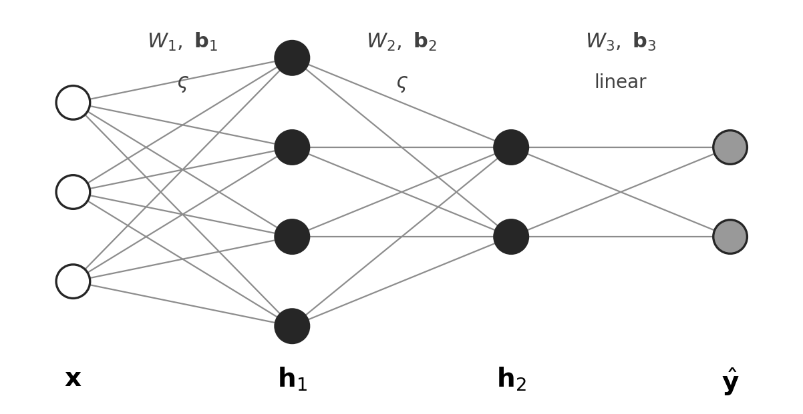
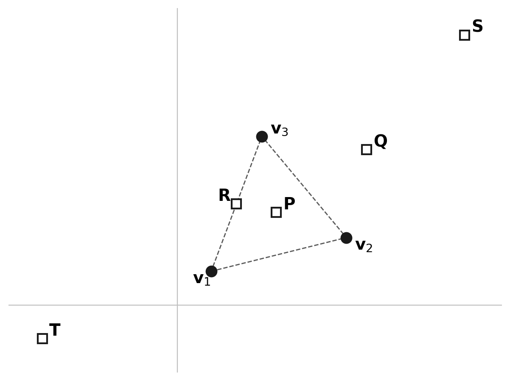

# Week 13: Neural Networks & AI

*25 problems. GENERATED by scripts/compile.py — edit problems/*.yaml, not this file.*

## ESE2030-0118
*week 13 · 2025C final #3 · needs-review*  
skills: `W13.S02` Recognize a single perceptron as a half-space classifier: w is normal to the decision boundary, wᵀx + b is a scaled signed distance, and only linearly separable regions are representable (XOR is not)  

A single perceptron computes $f(\mathbf{x}) = \text{sign}(\mathbf{w} \cdot \mathbf{x} + b)$ where $\mathbf{w} \in \mathbb{R}^n$ is a weight vector and $b$ is a bias. Four classification tasks in $\mathbb{R}^2$ are proposed:

\begin{itemize}
\item Task 1: Separate points where $x_1 + x_2 > 1$ from points where $x_1 + x_2 < 1$
\item Task 2: Separate points where $x_1 \cdot x_2 > 0$ from points where $x_1 \cdot x_2 < 0$
\item Task 3: Separate points inside the unit circle from points outside
\item Task 4: Separate points where $|x_1| > |x_2|$ from points where $|x_1| < |x_2|$
\end{itemize}

Which tasks can be solved by a single perceptron?

- **(A)** Tasks 1 and 2 only
- **(B)** Task 1 only
- **(C)** Tasks 1, 2, and 4
- **(D)** All four tasks
- **(E)** None of the tasks

Answer

**Correct: (B)**  — partial credit: A

A single perceptron can only implement linear decision boundaries—hyperplanes of the form $\mathbf{w} \cdot \mathbf{x} + b = 0$. - Task 1: The boundary $x_1 + x_2 = 1$ IS a hyperplane (line in $\mathbb{R}^2$), so YES. - Task 2: The boundary $x_1 \cdot x_2 = 0$ consists of BOTH axes (two lines), and the regions alternate in quadrants (like XOR). NOT linearly separable. - Task 3: The boundary is a circle $x_1^2 + x_2^2 = 1$, which is NOT a hyperplane. NOT linearly separable. - Task 4: The boundaries are $|x_1| = |x_2|$, i.e., the lines $x_1 = x_2$ AND $x_1 = -x_2$. Regions alternate, NOT linearly separable.

Why the distractors tempt:
- (C) confuses "can be described algebraically" with "linearly separable"
- (D) doesn't understand that perceptrons are limited to linear boundaries
- (E) (fails to recognize that at least one task has a linear boundary) %%%%%%%%%%%%%%%%%%%%%%%%%%%%%%%%%%%%%%%%%%%%%%%%%%%%%%%%%%%%%%%% %%%%%%%%%%%%%%%%%%%%%%%%%%%%%%%%%%%%%%%%%%%%%%%%%%%%%%%%%%%%%%%%

---

## ESE2030-0132
*week 13 · 2025C final #17 · active*  
skills: `W13.S06` Recognize backpropagation as the chain rule on a composition, and identify where the TRANSPOSE enters (forward W, backward Wᵀ — the adjoint of Week 5)  

Training a neural network requires computing the gradient of the loss function $L$ with respect to all weight matrices $W_1, W_2, \ldots, W_k$ in the network. The backpropagation algorithm accomplishes this efficiently by working backward from the output layer to the input layer.

Which mathematical principle most directly explains why backpropagation works?

- **(A)** The spectral theorem: weight matrices can be diagonalized, allowing gradients to be computed in eigenvector coordinates
- **(B)** The chain rule: the loss depends on weights through a composition of functions, and derivatives of compositions factor into products
- **(C)** Orthogonal decomposition: each layer's contribution to the gradient is orthogonal to the others, so they can be computed independently
- **(D)** Singular value decomposition: gradients flow through the principal directions of each weight matrix
- **(E)** The Fundamental Theorem of Linear Algebra: it's the foundation of all

Answer

**Correct: (B)**

A neural network computes a composition: $L = \ell(\mathbf{y}, f_k(f_{k-1}(\cdots f_1(\mathbf{x})\cdots)))$ where each $f_i$ depends on weights $W_i$. The chain rule states that derivatives of compositions are products of derivatives: $\frac{\partial L}{\partial W_1} = \frac{\partial L}{\partial f_k} \cdot \frac{\partial f_k}{\partial f_{k-1}} \cdots \frac{\partial f_2}{\partial f_1} \cdot \frac{\partial f_1}{\partial W_1}$. Backpropagation computes these factors from right to left (output to input), reusing intermediate results. This is literally the chain rule applied to the computational graph.

Why the distractors tempt:
- (A) weight matrices are generally not symmetric, so spectral theorem doesn't apply; even when eigendecomposition exists, it's not how backprop works
- (C) layer gradients are NOT orthogonal; they are multiplied together, not added independently
- (D) FTC relates integrals and derivatives; backprop involves no integration. The "backward" direction is about computational ordering, not inverting an operation
- (E) (SVD is useful for analyzing weight matrices but is not the mechanism behind backpropagation) ===============================================

---

## ESE2030-0154
*week 13 · 2025C final #39 · active*  
skills: `W13.S01` Explain why depth without nonlinearity collapses to a single affine map, and what an elementwise activation adds  

Consider a neural network with input dimension 10, three hidden layers of dimensions 20, 15, and 8 respectively, and output dimension 3. All connections are fully connected (dense layers). If the network uses NO activation functions (i.e., each layer computes only an affine transformation $\mathbf{y} = W\mathbf{x} + \mathbf{b}$), what is the network's effective computational power?

- **(A)** The network can approximate any continuous function from $\mathbb{R}^{10}$ to $\mathbb{R}^3$ due to its depth
- **(B)** The network is equivalent to a single affine transformation $\mathbf{y} = A\mathbf{x} + \mathbf{c}$ where $A \in \mathbb{R}^{3 \times 10}$
- **(C)** The network can represent any polynomial function of degree at most 4 (one degree per layer)
- **(D)** The network can represent any rank-3 linear map due to the bottleneck at the output
- **(E)** The network has greater expressive power than a shallow network because matrix products can increase rank

Answer

**Correct: (B)**  — partial credit: D

Without nonlinear activation functions, each layer computes $\mathbf{h}_k = W_k \mathbf{h}_{k-1} + \mathbf{b}_k$. The composition of affine maps is affine: if we trace through, we get $\mathbf{y} = W_4(W_3(W_2(W_1\mathbf{x} + \mathbf{b}_1) + \mathbf{b}_2) + \mathbf{b}_3) + \mathbf{b}_4 = (W_4W_3W_2W_1)\mathbf{x} + (\text{combined biases})$. This is just $A\mathbf{x} + \mathbf{c}$ where $A = W_4W_3W_2W_1 \in \mathbb{R}^{3 \times 10}$. The entire deep network collapses to a single linear layer! This is why nonlinear activations are essential for deep learning.

Why the distractors tempt:
- (A) this would require nonlinearity—the universal approximation theorem assumes nonlinear activations
- (C) composition of linear maps stays linear, doesn't create polynomials
- (E) (matrix products can only decrease or maintain rank, never increase it; $\text{rank}(AB) \leq \min(\text{rank}(A), \text{rank}(B))$) ===============================================

---

## ESE2030-0227
*week 13 · 2026A quiz4 #2 · active · Core (conceptual)*  
skills: `W13.S05` Know what the error signal δ_l IS (the sensitivity ∂L/∂z_l), that hidden layers have no targets, and that backpropagation derives δ_l from δ_{l+1}  
topics: Backpropagation, error signal, meaning of delta, sensitivity interpretation

In backpropagation, the algorithm computes at each layer $k$ of a feed-forward network a vector $\boldsymbol{\delta}^{(k)}$, called the ``error signal'' (or ``error vector'') at that layer.
Which statement best describes what $\boldsymbol{\delta}^{(k)}$ measures, and why backpropagation goes to the trouble of computing it?

- **(A)** A local quantity at layer $k$ that depends only on the layer's own weights and inputs, not on anything downstream.
- **(B)** The prediction error $\mathbf{y} - \mathbf{t}$ scaled down geometrically with depth, so that earlier layers receive proportionally smaller error signals.
- **(C)** The sensitivity of the loss to the layer's pre-activation $\mathbf{z}^{(k)}$: how much $L$ would change in response to a small perturbation of $\mathbf{z}^{(k)}$.
- **(D)** The change in weights to be applied at layer $k$ during the gradient descent update.
- **(E)** The difference between the layer's actual output and the output the layer should have produced, supplied as a per-layer target during training.

Answer

**Correct: (C)**

The error signal at layer $k$ is the gradient of the loss with respect to the pre-activation at that layer, $$\boldsymbol{\delta}^{(k)} = \frac{\partial L}{\partial \mathbf{z}^{(k)}},$$ which is by definition a sensitivity: to first order, $\Delta L \approx \boldsymbol{\delta}^{(k)} \cdot \Delta \mathbf{z}^{(k)}$. It tells us how much the loss would change if we could nudge the layer's pre-activation in some direction --- the layer's ``share of responsibility'' for the output error. Why this is the quantity worth computing: the gradient with respect to any weight at layer $k$ factors as $$\frac{\partial L}{\partial W_{ij}^{(k)}} = \delta_i^{(k)} \cdot a_j^{(k-1)}$$ --- the error signal at the unit, times the activation flowing into that weight. Once $\boldsymbol{\delta}^{(k)}$ is known, every weight and bias gradient at layer $k$ is one multiplication away. Backpropagation is precisely the procedure that computes the $\boldsymbol{\delta}^{(k)}$'s recursively from output to input. The deeper conceptual content is the absence of intermediate targets. In supervised training we are given a ground-truth target ONLY at the output. Hidden layers have no externally-supplied ``correct value.'' Backpropagation's central insight is that we can DERIVE an effective target signal for each hidden layer by chain-ruling the output error backward --- and that derived signal is exactly $\boldsymbol{\delta}^{(k)}$.

Why the distractors tempt:
- (A) contradicts the chain rule: the loss is computed only at the output, so the influence of $\mathbf{z}^{(k)}$ on $L$ flows through every subsequent layer. The recursion $\boldsymbol{\delta}^{(k)} = \big((W^{(k+1)})^T \boldsymbol{\delta}^{(k+1)}\big) \odot \sigma'(\mathbf{z}^{(k)})$ shows the dependence on layer $k+1$ explicitly. A purely local quantity at layer $k$ could not possibly carry information about an output-layer loss.
- (B) error signals do not decay geometrically with depth. At each layer they are transformed by $(W^{(k+1)})^T$ and $\sigma'$, which can shrink, preserve, or amplify them depending on the weights and activations. The vanishing gradient phenomenon is one possible behavior of training dynamics, but it is not part of the definition or purpose of $\boldsymbol{\delta}^{(k)}$.
- (D) confuses the error signal with the weight update. The update is $W^{(k)} \leftarrow W^{(k)} - \eta \, \partial L / \partial W^{(k)}$, and $\partial L / \partial W^{(k)}$ differs from $\boldsymbol{\delta}^{(k)}$ by a factor of the incoming activation $\mathbf{a}^{(k-1)}$. The error signal lives in the SPACE of the layer's pre-activations, not the space of its weights.
- (E) the most seductive wrong answer: it pictures each hidden layer as having its own target, with $\boldsymbol{\delta}^{(k)}$ playing the role of (actual $-$ target) layer by layer. There ARE no targets at hidden layers; backprop exists precisely because we need a way to assign blame to hidden units WITHOUT knowing what they ``should have'' produced.

---

## ESE2030-0228
*week 13 · 2026A quiz4 #3 · active · Core*  
skills: `W13.S02` Recognize a single perceptron as a half-space classifier: w is normal to the decision boundary, wᵀx + b is a scaled signed distance, and only linearly separable regions are representable (XOR is not)  
topics: Perceptron geometry, decision boundary invariance, sigmoid saturation

A perceptron with input $\mathbf{x} \in \mathbb{R}^n$, weights $\mathbf{w} \in \mathbb{R}^n$,
bias $b \in \mathbb{R}$, and sigmoid activation $\sigma$ computes
$y = \sigma(\mathbf{w}^T\mathbf{x} + b)$. Suppose we replace $\mathbf{w}$ with $2\mathbf{w}$
and replace $b$ with $2b$, but leave $\sigma$ unchanged. Which statement best describes
the effect on the perceptron's output?

- **(A)** The output $y$ doubles for every input $\mathbf{x}$.
- **(B)** The set of inputs $\mathbf{x}$ for which $y = 1/2$ is unchanged.
- **(C)** The decision boundary $\{\mathbf{x} : y = 1/2\}$ shifts by a constant vector in $\mathbb{R}^n$.
- **(D)** The output becomes more sensitive to changes in $\mathbf{x}$ near the decision boundary, and the boundary itself moves.
- **(E)** The output saturates more sharply near the decision boundary, and the boundary itself is unchanged.

Answer

**Correct: (E)**  — partial credit: B

The decision boundary is the level set $\{\mathbf{x} : \mathbf{w}^T\mathbf{x} + b = 0\}$ (since $\sigma(0) = 1/2$). After scaling, the new pre-activation is $2\mathbf{w}^T\mathbf{x} + 2b = 2(\mathbf{w}^T\mathbf{x} + b)$. Two consequences: (1) BOUNDARY UNCHANGED. The zero set is identical: $2(\mathbf{w}^T\mathbf{x} + b) = 0$ iff $\mathbf{w}^T\mathbf{x} + b = 0$. The hyperplane is the same set of points in $\mathbb{R}^n$, so the decision boundary $\{\mathbf{x} : y = 1/2\}$ is preserved. (2) SHARPER SATURATION. Away from the boundary, the pre-activation is twice as large in magnitude. The sigmoid pushes $y$ closer to $0$ or $1$ for the same input, and the slope of $y$ as a function of $\mathbf{x}$ along the normal direction is doubled at the boundary itself: $\nabla y \big|_{\text{boundary}}$ scales linearly with the magnitude of the pre-activation gradient. This is why scaling $(\mathbf{w}, b)$ jointly is a meaningful operation: it controls ``confidence'' (saturation) without changing ``what is classified positive'' (boundary). In the limit of large scaling, the sigmoid approaches a step function with the same boundary --- recovering the hard-threshold perceptron.

Why the distractors tempt:
- (A) sigmoid is nonlinear, so doubling the pre-activation does not double the output; e.g., $\sigma(0) = 1/2$ but $\sigma(0) = 1/2$ also after scaling, not $1$. Confuses doubling the affine map with doubling the network output.
- (C) the boundary is invariant under joint scaling of $\mathbf{w}$ and $b$ by the same factor; a shift would result from scaling $\mathbf{w}$ alone, which would change $\{\mathbf{w}^T\mathbf{x} + b = 0\}$ to a parallel hyperplane offset by $b/2$. This distractor is exactly the case the question avoids by scaling both.
- (D) (correctly identifies sharper sensitivity at the boundary, but incorrectly claims the boundary moves. A student picking (D) has internalized that scaling pre-activations sharpens the sigmoid but hasn't checked that joint scaling preserves the zero set.) %%%%%%%%%%%%%%%%%%%%%%%%%%%%%%%%%%%%%%%%%%%%%%%%%%% \newpage %%%%%%%%%%%%%%%%%%%%%%%%%%%%%%%%%%%%%%%%%%%%%%%%%%%

---

## ESE2030-0229
*week 13 · 2026A quiz4 #4 · active · Deeper*  
skills: `W13.S12` Explain the sense in which a linear autoencoder reproduces PCA, and what a nonlinear one adds  
topics: PCA vs neural network features, linear vs nonlinear dimensionality reduction

Both PCA and neural networks can extract features from high-dimensional data. PCA reduces
$X \in \mathbb{R}^{n \times d}$ to $k$-dimensional coordinates via
$\mathbf{y}_{\text{PCA}} = V_k^T \mathbf{x}$, where $V_k$ contains the top $k$ right singular
vectors of $X$. A neural network with a hidden layer of $k$ units produces an alternative
feature vector $\mathbf{y}_{\text{NN}} = \sigma(W_1 \mathbf{x} + \mathbf{b}_1)$, where
$\sigma$ is a nonlinear activation and $W_1, \mathbf{b}_1$ are learned during training.

Two researchers are given the same dataset $X$. The first computes $V_k$ via PCA. The second
trains a neural network and extracts $W_1, \mathbf{b}_1$. Which statement best describes how
their resulting feature maps compare?

- **(A)** The neural network's feature map can always be written as $\sigma(V_k^T \mathbf{x} + \mathbf{b}_1)$ for some bias $\mathbf{b}_1$, so the two approaches differ only in the activation function.
- **(B)** The neural network's feature map is a nonlinear function of $\mathbf{x}$, so it cannot in general be written as a linear projection $V_k^T \mathbf{x}$; this is the only structural difference between the two approaches.
- **(C)** The PCA feature map is determined by $X$ alone, whereas the neural network's feature map depends on the training objective; the two researchers can obtain genuinely different features from the same $X$.
- **(D)** The PCA feature map is optimal for reconstructing $X$, so any neural network feature map trained on $X$ will reconstruct $X$ at most as well as PCA does.
- **(E)** Both feature maps are determined entirely by $X$, so the two researchers will obtain features that span the same $k$-dimensional subspace of input space.

Answer

**Correct: (C)**  — partial credit: B

The genuine structural difference between PCA and neural-network feature extraction is not just linearity vs. nonlinearity --- it is that PCA is determined by the data alone, while neural network features are determined by the data *together with* a training objective. PCA: $V_k$ comes from the SVD of $X$. There is no notion of a task; $V_k$ is the same regardless of what the features will be used for. NEURAL NETWORK: $W_1, \mathbf{b}_1$ are learned by minimizing some loss on training data. Different losses (classification, regression, or different supervised targets) yield different $W_1$, even with the same $X$. The features adapt to the task. This task-dependence is what makes neural network features powerful for supervised problems --- they can encode whatever about $\mathbf{x}$ is useful for the goal --- and also what makes them less interpretable: they are no longer a canonical representation of $X$ itself.

Why the distractors tempt:
- (A) claims the network's $W_1$ must factor through the PCA basis; this is false. $W_1$ can have any rows, not just linear combinations of top singular vectors.
- (D) PCA is optimal for *linear* reconstruction in Frobenius norm (Eckart-Young), but the comparison to general nonlinear feature maps is not the right framing here, and a network trained for a different objective entirely (classification, say) is not even trying to reconstruct $X$.
- (E) assumes both are data-determined; misses that the network's training objective is an additional input. Also subtly conflates ``feature map'' with ``subspace'' --- the PCA features live in a fixed subspace, but the NN features generally do not even define a subspace, since $\sigma$ is nonlinear.

---

## ESE2030-0231
*week 13 · 2026A quiz4 #6 · active · Core*  
skills: `W13.S02` Recognize a single perceptron as a half-space classifier: w is normal to the decision boundary, wᵀx + b is a scaled signed distance, and only linearly separable regions are representable (XOR is not)  
topics: Perceptron limitations, linear separability, hyperplane decision boundary

A single perceptron with input $\mathbf{x} \in \mathbb{R}^2$ computes output $y = \sigma(\mathbf{w}^T\mathbf{x} + b)$, where $\sigma$ is a sigmoid function. The perceptron classifies an input as ``positive'' when $y \geq 0.5$.
Below are four subsets of $\mathbb{R}^2$ (shaded grey). For which subsets can a single perceptron be trained so that its ``positive'' region exactly matches the shaded region?

\begin{tikzpicture}[scale=0.8]
\begin{scope}[shift={(0,0)}]
  \fill[gray!40] (-1.5,-1.5) rectangle (1.5,1.5);
  \fill[white] (-1.5,1.5) -- (1.5,-0.5) -- (1.5,1.5) -- cycle;
  \draw[thick] (-1.5,-1.5) rectangle (1.5,1.5);
  \draw[thick] (-1.5,1.5) -- (1.5,-0.5);
  \node at (0,-2) {\textbf{I}};
\end{scope}
\begin{scope}[shift={(4,0)}]
  \draw[thick] (-1.5,-1.5) rectangle (1.5,1.5);
  \fill[gray!40] (0,0) circle (1);
  \draw[thick] (0,0) circle (1);
  \node at (0,-2) {\textbf{II}};
\end{scope}
\begin{scope}[shift={(8,0)}]
  \draw[thick] (-1.5,-1.5) rectangle (1.5,1.5);
  \fill[gray!40] (-1.5,-0.5) rectangle (1.5,0.5);
  \draw[thick] (-1.5,-0.5) -- (1.5,-0.5);
  \draw[thick] (-1.5,0.5) -- (1.5,0.5);
  \node at (0,-2) {\textbf{III}};
\end{scope}
\begin{scope}[shift={(12,0)}]
  \fill[gray!40] (-1.5,0.3) rectangle (1.5,1.5);
  \draw[thick] (-1.5,-1.5) rectangle (1.5,1.5);
  \draw[thick] (-1.5,0.3) -- (1.5,0.3);
  \node at (0,-2) {\textbf{IV}};
\end{scope}
\end{tikzpicture}

- **(A)** Regions I, III, and IV only.
- **(B)** Regions I and II only.
- **(C)** Regions II and III only.
- **(D)** None can be {\em exactly} matched.
- **(E)** Regions I and IV only.

Answer

**Correct: (E)**  — partial credit: A

A perceptron's decision boundary in $\mathbb{R}^2$ is the line $\mathbf{w}^T\mathbf{x} + b = c$ (where $c$ is determined by the threshold $y \geq 0.5$ and the monotonicity of $\sigma$). The ``positive'' region is the half-plane on one side of this line. - Region I (half-plane below the diagonal): linearly separable. $\checkmark$ - Region II (disk): requires a curved boundary; not realizable by any single line. $\times$ - Region III (horizontal strip): requires the conjunction of two inequalities (above one line AND below another); a single perceptron enforces only one. $\times$ - Region IV (horizontal half-plane $y > 0.3$): linearly separable, with weight vector $\mathbf{w} = (0, 1)$. $\checkmark$ This limitation --- representability is restricted to half-planes --- is exactly what hidden layers exist to overcome.

Why the distractors tempt:
- (B) groups I and II as ``regions bounded by a single curve'' --- but linearity, not smoothness, is the relevant criterion.
- (C) (groups II and III as ``bounded'' or ``convex'' regions --- but convexity is necessary, not sufficient; both convexity AND being a half-plane are required.) %%%%%%%%%%%%%%%%%%%%%%%%%%%%%%%%%%%%%%%%%%%%%%%%%%% \newpage %%%%%%%%%%%%%%%%%%%%%%%%%%%%%%%%%%%%%%%%%%%%%%%%%%%
- (D) the perceptron is more limited than the multi-layer networks students will see next, but it can represent half-planes exactly.

---

## ESE2030-0236
*week 13 · 2026A quiz4 #11 · active · Core*  
skills: `W13.S01` Explain why depth without nonlinearity collapses to a single affine map, and what an elementwise activation adds  
topics: Why nonlinearity matters, composition of affine maps is affine

The network below takes input $\mathbf{x} \in \mathbb{R}^3$ and produces output $\mathbf{y} \in \mathbb{R}^2$:
\begin{tikzpicture}[
    node distance=1.5cm,
    block/.style={rectangle, draw, minimum height=1cm, minimum width=1.6cm, align=center},
    arrow/.style={->, >=stealth, thick}
]
\node (x) {$\mathbf{x}$};
\node[block, right of=x, node distance=1.8cm] (L1) {$W_1,\ \mathbf{b}_1$};
\node[right of=L1, node distance=2.2cm] (h) {$\mathbf{h}$};
\node[block, right of=h, node distance=1.8cm] (L2) {$W_2,\ \mathbf{b}_2$};
\node[right of=L2, node distance=1.8cm] (y) {$\mathbf{y}$};

\draw[arrow] (x) -- (L1);
\draw[arrow] (L1) -- (h);
\draw[arrow] (h) -- (L2);
\draw[arrow] (L2) -- (y);
\end{tikzpicture}
Each block applies the stated weights and biases to its input, with no activation function between blocks.
Which statement best describes what this network can compute?

- **(A)** A more limited class of functions than a single-block map.
- **(B)** (approximately) Any continuous function $f: \mathbb{R}^3 \to \mathbb{R}^2$, since it has a hidden layer.
- **(C)** It reduces to a single linear map.
- **(D)** Exactly what a single-block affine map computes; the extra block adds no expressive power.
- **(E)** Any quadratic function of $\mathbf{x}$, since composing two blocks introduces second-order terms.

Answer

**Correct: (D)**

Without an activation function between blocks, the network is the composition of two affine maps. Expanding: $$\mathbf{y} = W_2(W_1\mathbf{x} + \mathbf{b}_1) + \mathbf{b}_2 = (W_2W_1)\mathbf{x} + (W_2\mathbf{b}_1 + \mathbf{b}_2).$$ The composition is itself an affine map; stacking does not enlarge the function class. This is exactly why activation functions are essential. Without a nonlinearity between layers, depth gives no new expressive power.

Why the distractors tempt:
- (A) 
- (B) universal approximation requires a nonlinear activation; without $\sigma$, the network can only represent affine maps, regardless of hidden width
- (C) biases do not vanish; they combine into $W_2\mathbf{b}_1 + \mathbf{b}_2$, which is generally nonzero
- (E) composing linear maps gives a linear map, not a quadratic one; no $x_i x_j$ terms appear

---

## ESE2030-0238
*week 13 · 2026A quiz4 #13 · active · Core*  
skills: `W13.S03` State universal approximation as an existence claim about WIDTH, and recognize what it does not say (trainability, depth efficiency, sample complexity)  
topics: Universal approximation theorem, expressive power vs trainability

The Universal Approximation Theorem is a foundational result about feed-forward neural networks
with at least one hidden layer and a nonlinear activation function.
Which of the following statements most accurately describes what the theorem claims?

- **(A)** A network with one hidden layer can approximate any target function to arbitrary accuracy, provided the hidden layer is wide enough and the weights are found by stochastic gradient descent.
- **(B)** Approximation to arbitrary accuracy requires at least two hidden layers; a single hidden layer is fundamentally insufficient.
- **(C)** A network with one hidden layer can compute any target function exactly, provided the hidden layer is wide enough.
- **(D)** A network with one hidden layer can approximate any target function to arbitrary accuracy, provided the hidden layer is wide enough and the right weights and biases exist.
- **(E)** A network with one hidden layer can approximate any target function to arbitrary accuracy, provided the hidden layer is wide enough.

Answer

**Correct: (D)**  — partial credit: E

The Universal Approximation Theorem is an EXISTENCE statement about expressive power: with enough hidden units and a nonlinear activation, there *exist* weights and biases such that a one-hidden-layer network approximates the target function to any desired accuracy. Two important features of the claim: 1. APPROXIMATION, NOT EQUALITY. The network can get arbitrarily close, but in general cannot compute the target function exactly. 2. EXISTENCE, NOT TRAINABILITY. The theorem says good weights exist; it says nothing about whether any algorithm (SGD or otherwise) can find them, how long that would take, or whether training would converge.

Why the distractors tempt:
- (A) conflates expressive power with trainability. The theorem says good weights exist; SGD's ability to find them is a separate, much harder question.
- (B) depth is not required; one hidden layer is provably sufficient. Modern deep networks use depth for efficiency and inductive bias, not because shallow networks are fundamentally limited.
- (C) ``compute exactly'' is too strong; the theorem gives approximation, not equality. Confuses ``arbitrarily close'' with ``equal.''

---

## ESE2030-0253
*week 13 · 2026A final #4 · active · Core (conceptual)*  
skills: `W13.S06` Recognize backpropagation as the chain rule on a composition, and identify where the TRANSPOSE enters (forward W, backward Wᵀ — the adjoint of Week 5); `W13.S05` Know what the error signal δ_l IS (the sensitivity ∂L/∂z_l), that hidden layers have no targets, and that backpropagation derives δ_l from δ_{l+1}  
topics: Backpropagation, chain rule as composition of derivatives

In a feed-forward network, layer $k$ takes input $\mathbf{h}_{k-1}$ and produces $\mathbf{z}_k = W_k \mathbf{h}_{k-1} + \mathbf{b}_k$ followed by $\mathbf{h}_k = \sigma(\mathbf{z}_k)$, with $\sigma$ applied componentwise. Define $\boldsymbol{\delta}_k = \partial L / \partial \mathbf{z}_k$.
Backpropagation produces a recursion that expresses $\boldsymbol{\delta}_k$ in terms of $\boldsymbol{\delta}_{k+1}$. Which is the most accurate description of \emph{why} this recursion takes the form it does?

- **(A)** Since the loss is computed at the output, a hidden layer's contribution decays geometrically with depth, and the recursion encodes that decay.
- **(B)** The map $\mathbf{z}_k \mapsto \mathbf{z}_{k+1}$ factors through $\mathbf{h}_k$, and its derivative is the product of the derivatives of the two pieces --- a diagonal matrix from componentwise $\sigma$ and the matrix $W_{k+1}$ from the affine step. %Pulling a gradient back through this composition multiplies by the transposes of these derivatives in reverse order.
- **(C)** The recursion is a consequence of gradient descent on the loss, in which the learning rate is replaced by $\mathrm{diag}(\sigma'(\mathbf{z}_k))$ to keep updates well-scaled across layers.
- **(D)** Backpropagation distributes the output error $\mathbf{h}_{\text{out}} - \mathbf{t}$ across layers in proportion to each layer's share of the network's total weight magnitude.
- **(E)** Each layer must be inverted to send information from the output back toward the input, so the recursion involves $W_{k+1}^{-1}$ acting on $\boldsymbol{\delta}_{k+1}$.

Answer

**Correct: (B)**

Backpropagation is the chain rule applied to a composition. The map $\mathbf{z}_k \mapsto \mathbf{z}_{k+1}$ factors as $\mathbf{z}_k \;\xrightarrow{\;\sigma\;}\; \mathbf{h}_k \;\xrightarrow{\;W_{k+1}\,\cdot\,+\,\mathbf{b}_{k+1}\;}\; \mathbf{z}_{k+1}.$ Neither piece is a linear map: the first is a nonlinear pointwise map, the second is affine. But the chain rule operates on \emph{derivatives}, and at a given $\mathbf{z}_k$ each piece has a well-defined derivative (a linear map): - The derivative of $\sigma$ at $\mathbf{z}_k$ is the diagonal matrix $D_k = \mathrm{diag}(\sigma'(\mathbf{z}_k))$ (componentwise application has a diagonal derivative). - The derivative of the affine map $\mathbf{h} \mapsto W_{k+1}\mathbf{h} + \mathbf{b}_{k+1}$ is $W_{k+1}$ at every point (the bias contributes a constant and drops out). The chain rule multiplies these derivatives in forward order, giving $W_{k+1} D_k$, and pulling a gradient back through a linear map multiplies by its \emph{transpose}: that is the adjoint, not the inverse. Composing transposes reverses order, so $\boldsymbol{\delta}_k \;=\; (W_{k+1} D_k)^T \, \boldsymbol{\delta}_{k+1} \;=\; D_k^T W_{k+1}^T \, \boldsymbol{\delta}_{k+1} \;=\; D_k W_{k+1}^T \, \boldsymbol{\delta}_{k+1}$ (using $D_k^T = D_k$ since $D_k$ is diagonal). Every structural feature of the recursion --- the transpose, the reversed order, the diagonal $D_k$, the absence of the bias --- comes directly from this derivative-factorization picture. This is the linear-algebra heart of the entire course showing up in the deep-learning setting: forward through a linear map uses $W$, backward through it uses $W^T$ --- the same transpose that drives least squares ($A^T A \mathbf{x} = A^T \mathbf{b}$), the FTLA ($\ker(A)^\perp = \mathrm{im}(A^T)$), and the pseudoinverse.

Why the distractors tempt:
- (A) geometric decay with depth is a possible \emph{training-dynamics} phenomenon (the vanishing-gradient effect), not a property of the recursion itself. The recursion can shrink, preserve, or amplify $\boldsymbol{\delta}$ depending on $W_{k+1}$ and $\sigma'(\mathbf{z}_k)$.
- (C) confuses the recursion with the gradient-descent update step. $\boldsymbol{\delta}_k$ is computed before any learning rate enters; the learning rate appears later, when $\boldsymbol{\delta}_k$ is used to form $\partial L / \partial W_k$ and update weights.
- (D) a folk picture of error ``flowing back'' in proportion to weights; no chain rule, and the proportional-to-weight-magnitude story is not what the actual recursion does. This is the kind of plausible-sounding pseudo-explanation the chain rule replaces.
- (E) the naive ``to go backward, invert'' instinct. Wrong on the linear- algebra: weight matrices are generally not square --- $W_{k+1} \in \mathbb{R}^{n_{k+1} \times n_k}$ --- and even when they are, the chain rule produces the adjoint, not the inverse. Adjoint and inverse coincide only for orthogonal matrices.

---

## ESE2030-0276
*week 13 · 2026A final #27 · active · Deeper*  
skills: `W13.S01` Explain why depth without nonlinearity collapses to a single affine map, and what an elementwise activation adds  
topics: Role of nonlinear activation, expressive power, why sigma is essential

A feed-forward neural network alternates affine layers $\mathbf{z}_k = W_k \mathbf{h}_{k-1} +
\mathbf{b}_k$ with a componentwise nonlinear activation $\mathbf{h}_k = \sigma(\mathbf{z}_k)$.
Removing the activations from such a network --- so each layer is purely affine and the layers
are composed directly --- collapses the network's expressive power dramatically. Which of the
following best describes the {\em fundamental} reason a nonlinear $\sigma$ is required?

- **(A)** Without $\sigma$, the Universal Approximation Theorem does not apply, so the network is not guaranteed to approximate arbitrary target functions.
- **(B)** Without $\sigma$, gradients cannot flow back through the network during backpropagation, so the weights cannot be trained.
- **(C)** Without $\sigma$, hidden activations are unbounded and the network's outputs cannot be interpreted as probabilities or classifications.
- **(D)** Without $\sigma$, the network can only fit linear targets, and most real-world relationships between inputs and outputs are nonlinear.
- **(E)** Without $\sigma$, the entire network --- regardless of depth or width --- represents only an affine function of its input, so no amount of stacking enlarges the class of functions the network can compute.

Answer

**Correct: (E)**

The structural fact is that the composition of affine maps is affine. Writing two consecutive layers without activation, $$\mathbf{z}_2 = W_2(W_1 \mathbf{x} + \mathbf{b}_1) + \mathbf{b}_2 = (W_2 W_1) \mathbf{x} + (W_2 \mathbf{b}_1 + \mathbf{b}_2),$$ the result is again of the form $W' \mathbf{x} + \mathbf{b}'$. Iterating, a network of any depth without $\sigma$ collapses to a single affine map $\mathbf{x} \mapsto W' \mathbf{x} + \mathbf{b}'$. Depth gives no new expressive power; width gives no new expressive power; the function class is exactly the affine maps. The nonlinear $\sigma$ is the {\em only} ingredient that breaks this collapse and makes depth meaningful. Every other consequence --- universal approximation, the ability to fit nonlinear targets, the bounded-output interpretation of sigmoid specifically --- is downstream of this structural fact. [Pedagogical note: this is the foundational ``why $\sigma$ exists'' answer for the course. Distractors (A), (B), (C), (E) each name something true {\em about} networks with $\sigma$, but they describe consequences rather than the structural cause. The test of whether a student has understood the role of $\sigma$ is whether they can articulate, without prompting, that affine-composed-with-affine is affine and that this is what stacking-without-$\sigma$ does.]

Why the distractors tempt:
- (A) D7 tautology: ``UAT does not apply'' restates the question in different vocabulary. The Universal Approximation Theorem {\em assumes} a nonlinear activation as a hypothesis, so saying ``without $\sigma$ UAT fails'' is just naming UAT's hypothesis, not explaining why $\sigma$ is needed. The genuine answer addresses the structural cause that makes UAT's hypothesis necessary in the first place.
- (B) D4 surface match: imports a backpropagation concern. Affine maps are perfectly differentiable, and backpropagation through a network with no activations works mechanically --- it just computes the gradient of an affine map, which exists and is well-defined. The training pathology if you removed $\sigma$ is not that gradients vanish but that the only function the network {\em can} represent is affine. The student who picks (A) is reaching for ``$\sigma$ is needed for training'' without checking whether removing $\sigma$ actually breaks training mechanics.
- (C) D6 shape-implies-property: confuses the role of nonlinearity in general with the specific behavior of sigmoid. Sigmoid bounds outputs to $(0,1)$; tanh bounds to $(-1,1)$; ReLU does not bound at all. Boundedness is a feature of {\em particular} activations, not the structural reason any nonlinearity is needed. A network using ReLU still escapes the affine-collapse problem despite its activations being unbounded above.
- (D) D5 naive-prior: locates the problem in the world rather than in the network. Even if every target function in the universe were linear, removing $\sigma$ would still mean the network's depth and width are wasted --- you would have a 50-layer linear regressor that does the same thing as a 1-layer linear regressor. The issue is intrinsic to the network architecture, not contingent on the target.

---

## ESE2030-0283
*week 13 · 2026A final #34 · active · Core (conceptual, synthesis)*  
skills: `W13.S02` Recognize a single perceptron as a half-space classifier: w is normal to the decision boundary, wᵀx + b is a scaled signed distance, and only linearly separable regions are representable (XOR is not)  
topics: Perceptron geometry, decision boundary, normal vector

A perceptron with weights $\mathbf{w} \in \mathbb{R}^n$, bias $b \in \mathbb{R}$, and sigmoid activation $\sigma$ computes $y = \sigma(\mathbf{w}^T \mathbf{x} + b)$, with decision boundary $\{\mathbf{x} : \mathbf{w}^T \mathbf{x} + b = 0\}$.
Which statement best and most fundamentally describes the geometric role of $\mathbf{w}$?

- **(A)** $\mathbf{w}$ points from the origin toward the centroid of the training inputs whose target label is close to $1$.
- **(B)** $\mathbf{w}$ lies in the decision boundary, since $\mathbf{w}$ and $\mathbf{x}$ are vectors in the same space $\mathbb{R}^n$.
- **(C)** $\mathbf{w}$ is normal to the decision boundary, and $\mathbf{w}^T \mathbf{x} + b$ equals $\norm{\mathbf{w}}$ times the signed distance from $\mathbf{x}$ to that boundary.
- **(D)** $\mathbf{w}$ determines the decision boundary.
- **(E)** $\mathbf{w}$ is the direction of steepest ascent of the pre-activation $\mathbf{x} \mapsto \mathbf{w}^T \mathbf{x} + b$.

Answer

**Correct: (C)**

Two facts together pin down the geometric role of $\mathbf{w}$. (i) The decision boundary is the level set $\{\mathbf{x} : \mathbf{w}^T \mathbf{x} + b = 0\}$, an affine hyperplane. For any two points $\mathbf{x}_1, \mathbf{x}_2$ on the boundary, $\mathbf{w}^T(\mathbf{x}_1 - \mathbf{x}_2) = 0$, so $\mathbf{w}$ is orthogonal to every direction along the boundary --- i.e., $\mathbf{w}$ is a \emph{normal vector} to the hyperplane. (ii) Decompose any input as $\mathbf{x} = \mathbf{x}_\parallel + t \cdot \mathbf{w} / \norm{\mathbf{w}}$, where $\mathbf{x}_\parallel$ is the projection of $\mathbf{x}$ onto the boundary and $t$ is its signed distance to the boundary along $\mathbf{w}$. Then $\mathbf{w}^T \mathbf{x} + b = \mathbf{w}^T \mathbf{x}_\parallel + b + t \norm{\mathbf{w}} = t \norm{\mathbf{w}}$, since $\mathbf{w}^T \mathbf{x}_\parallel + b = 0$ on the boundary. So the pre-activation is literally $\norm{\mathbf{w}}$ times the signed distance from $\mathbf{x}$ to the decision boundary. This is the synthesis: the perceptron is a geometric construction in disguise. The dot product $\mathbf{w}^T \mathbf{x}$ from Wk 5, the orthogonal-projection picture from Wk 6, and the affine-hyperplane / kernel picture from Wk 1--3 all collapse together. ``Classify $\mathbf{x}$'' means ``compute the signed distance from $\mathbf{x}$ to a hyperplane and squash through $\sigma$.''

Why the distractors tempt:
- (A) folk picture: the weight vector ``points toward the positive class.'' Directionally suggestive but mathematically false in general --- the centroid of positive examples need not lie along $\mathbf{w}$, and after training $\mathbf{w}$ is determined by margin geometry, not class centroids. This story is a half-remembered description of LDA or a class-mean classifier, not a perceptron.
- (B) input/weight-space confusion. Living in the same ambient $\mathbb{R}^n$ does not put $\mathbf{w}$ on the boundary --- $\mathbf{w}$ generically does not satisfy $\mathbf{w}^T \mathbf{w} + b = 0$. The fact that $\mathbf{w}$ is normal to the boundary is precisely the opposite of lying in it.
- (D) but misses that the pre-activation \emph{magnitude} also has metric meaning, namely $\norm{\mathbf{w}}$ times signed distance. One rung below (B) on the ladder.
- (E) true, but a \emph{calculus} consequence of the linear-algebraic fact in (B): once you know the level sets of $\mathbf{w}^T \mathbf{x} + b$ are hyperplanes normal to $\mathbf{w}$, ``steepest ascent direction is $\mathbf{w}$'' follows. The gradient fact describes a \emph{consequence} of $\mathbf{w}$'s role; it does not capture what $\mathbf{w}$ geometrically \emph{is}.

---

## ESE2030-0313
*week 13 · POOL pool #21 · active · Core*  
skills: `W13.S04` Recognize the feedforward architecture as alternating affine maps and elementwise nonlinearities with a linear last layer; identify the shapes of W_l, b_l, h_l and count parameters  

The figure shows a feedforward network: every unit of one layer is connected to every unit of the next, the hidden layers carry an elementwise activation $\varsigma$, the read-out is linear, and every unit past the input carries a bias. How many parameters (weights and biases together) does $\Psi$ contain?

- **(A)** 24
- **(B)** 30
- **(C)** 32
- **(D)** 35
- **(E)** 11

Answer

**Correct: (C)**

Read the widths off the figure: $3 \to 4 \to 2 \to 2$, so $\Lambda = 3$ layers. $W_1 \in \mathbb{R}^{4\times 3}$ carries $12$ weights and $\mathbf{b}_1 \in \mathbb{R}^4$ four biases; $W_2 \in \mathbb{R}^{2\times 4}$ and $\mathbf{b}_2$ give $8 + 2$; the linear read-out $W_3 \in \mathbb{R}^{2\times 2}$ and $\mathbf{b}_3$ give $4 + 2$. Total $16 + 10 + 6 = 32$. Nearly all of it sits in the matrices: $24$ of the $32$.

Why the distractors tempt:
- (A) Distractor: weights only ($12 + 8 + 4$); the biases are parameters too.
- (B) Trick: drops $\mathbf{b}_3$ on the grounds that the read-out is 'linear'. The read-out has no activation; it still has a bias (the last line of (13.2)).
- (D) Distractor: adds a bias to each of the three input units. The input is data, not a layer of units with parameters.
- (E) Distractor: counts units ($3 + 4 + 2 + 2$) rather than parameters.

---

## ESE2030-0314
*week 13 · POOL pool #22 · active · Core*  
skills: `W13.S04` Recognize the feedforward architecture as alternating affine maps and elementwise nonlinearities with a linear last layer; identify the shapes of W_l, b_l, h_l and count parameters  

A feedforward network of the text's form is to take $\mathbf{x} \in \mathbb{R}^3$ to $\hat{\mathbf{y}} \in \mathbb{R}^2$ through one hidden layer of width $5$, with elementwise activation $\varsigma$. Which expression is such a network?

- **(A)** $\hat{\mathbf{y}} = \varsigma\big(W_2\,\varsigma(W_1\mathbf{x} + \mathbf{b}_1) + \mathbf{b}_2\big)$, with $W_1 \in \mathbb{R}^{5\times 3}$, $W_2 \in \mathbb{R}^{2\times 5}$
- **(B)** $\hat{\mathbf{y}} = W_2\,\varsigma(W_1\mathbf{x} + \mathbf{b}_1) + \mathbf{b}_2$, with $W_1 \in \mathbb{R}^{5\times 3}$, $W_2 \in \mathbb{R}^{2\times 5}$
- **(C)** $\hat{\mathbf{y}} = W_2\,\varsigma(W_1\mathbf{x} + \mathbf{b}_1) + \mathbf{b}_2$, with $W_1 \in \mathbb{R}^{3\times 5}$, $W_2 \in \mathbb{R}^{5\times 2}$
- **(D)** $\hat{\mathbf{y}} = W_2 W_1 \mathbf{x} + \mathbf{b}$, with $W_1 \in \mathbb{R}^{5\times 3}$, $W_2 \in \mathbb{R}^{2\times 5}$
- **(E)** $\hat{\mathbf{y}} = W_2\,\varsigma(\mathbf{x}) + \mathbf{b}_2$, with $W_2 \in \mathbb{R}^{2\times 3}$

Answer

**Correct: (B)**

The architecture alternates affine maps with an elementwise activation, and the final line of (13.2) is purely linear: $\hat{\mathbf{y}} = W_\Lambda \mathbf{h}_{\Lambda-1} + \mathbf{b}_\Lambda$ with no $\varsigma$. A hidden layer of width $5$ fed by $\mathbb{R}^3$ needs $W_1$ with $5$ rows and $3$ columns; the read-out to $\mathbb{R}^2$ needs $W_2 \in \mathbb{R}^{2\times 5}$. Option B is the only expression with the right alternation, the right shapes, and a linear read-out.

Why the distractors tempt:
- (A) Trick: activation applied to the read-out. In the text's architecture the last layer is linear, so that whatever the network computed is linearly readable from the final hidden vector.
- (C) Distractor: shapes transposed. $W_1\mathbf{x}$ with $W_1 \in \mathbb{R}^{3\times 5}$ and $\mathbf{x} \in \mathbb{R}^3$ is not even defined; the width of a layer is the number of rows of its matrix.
- (D) Trick: no activation at all, so the 'two layers' collapse to the single affine map $\mathbf{x} \mapsto (W_2 W_1)\mathbf{x} + \mathbf{b}$ (the Section 13.1 point).
- (E) Distractor: activation applied to the raw input before any affine map, with no hidden layer at all.

---

## ESE2030-0315
*week 13 · POOL pool #23 · active · Core*  
skills: `W13.S07` Recognize the output-layer error signal as the negated least squares residual  

A network with a linear read-out predicts $\hat{\mathbf{y}}$ for a training example with target $\mathbf{y}$, under the squared loss $\mathcal{L} = \tfrac{1}{2}\|\mathbf{y} - \hat{\mathbf{y}}\|^2$. Which of the following is the error signal $[\delta_\Lambda]$ at the read-out?

- **(A)** $(\mathbf{y} - \hat{\mathbf{y}})^T$
- **(B)** $(\hat{\mathbf{y}} - \mathbf{y})^T W_\Lambda$
- **(C)** $(\hat{\mathbf{y}} - \mathbf{y})^T \operatorname{diag}\big(\varsigma'(\mathbf{z}_\Lambda)\big)$
- **(D)** $(\hat{\mathbf{y}} - \mathbf{y})^T$
- **(E)** $\tfrac{1}{2}\|\mathbf{y} - \hat{\mathbf{y}}\|^2$

Answer

**Correct: (D)**  — partial credit: A

The read-out carries no activation, so $\hat{\mathbf{y}} = \mathbf{z}_\Lambda$ and $[\delta_\Lambda]$ is the derivative of the loss with respect to the output itself. Perturbing $\hat{\mathbf{y}}$ by $\mathbf{v}$ changes $\tfrac12\|\mathbf{y}-\hat{\mathbf{y}}\|^2$ by $\langle \hat{\mathbf{y}} - \mathbf{y}, \mathbf{v}\rangle$ to first order, so $[\delta_\Lambda] = (\hat{\mathbf{y}} - \mathbf{y})^T$: prediction minus truth, transposed into a row. It is the least squares residual of Chapter 6 with its sign reversed, and this is the one place in the backward sweep where $\delta$ is a difference of anything.

Why the distractors tempt:
- (A) Partial credit: the residual without the sign flip (listed trap). Insight 1 of 2: $[\delta_\Lambda]$ is the residual, not a product and not the loss. Missing: the derivative of $\tfrac12\|\mathbf{y}-\hat{\mathbf{y}}\|^2$ with respect to $\hat{\mathbf{y}}$ is $\hat{\mathbf{y}} - \mathbf{y}$, not $\mathbf{y} - \hat{\mathbf{y}}$. Prefix: yes. Guessable: no. Defensible: yes.
- (B) Distractor: one step too far. $[\delta_\Lambda] W_\Lambda$ is the derivative with respect to $\mathbf{h}_{\Lambda-1}$, the start of the recursion of Lemma 13.5, not the error signal at the read-out.
- (C) Trick: multiplies by an activation slope that the read-out does not have. The final layer is linear; $\operatorname{diag}(\varsigma')$ enters only at hidden layers.
- (E) Distractor: the loss itself, a scalar. The error signal is a derivative of the loss, a row of sensitivities.

---

## ESE2030-0316
*week 13 · POOL pool #24 · active · Synthesis*  
skills: `W13.S07` Recognize the output-layer error signal as the negated least squares residual  

Take the degenerate case of a network with no hidden layer, $\hat{y} = \mathbf{w}^T\mathbf{x} + b$, trained by gradient descent on the squared loss over a dataset. Let $A$ be the matrix whose rows are the input examples (each augmented by a $1$ for the bias), and let $\mathbf{r}$ be the vector of residuals, prediction minus target, stacked over the data. Gradient descent has reached a fixed point exactly when $\mathbf{r}$ lies in which space?

- **(A)** $(\operatorname{im} A)^\perp$
- **(B)** $\operatorname{im} A$
- **(C)** $\ker A$
- **(D)** $(\ker A)^\perp$
- **(E)** $\{\mathbf{0}\}$ only

Answer

**Correct: (A)**

With no hidden layer the loss is $\tfrac12\|A\boldsymbol{\psi} - \mathbf{y}\|^2$ in the parameters $\boldsymbol{\psi} = (\mathbf{w}, b)$: ordinary least squares. The output error signal is the residual $\mathbf{r} = A\boldsymbol{\psi} - \mathbf{y}$ (transposed into a row), and the gradient with respect to the parameters is $A^T\mathbf{r}$. Descent stops exactly when $A^T\mathbf{r} = \mathbf{0}$, i.e. $\mathbf{r} \in \ker(A^T) = (\operatorname{im} A)^\perp$: the residual is orthogonal to the image, which is the normal equations of Chapter 6 and the cokernel of the Fundamental Theorem. Training the last layer of any network is this same problem in the features $\mathbf{h}_{\Lambda-1}$.

Why the distractors tempt:
- (B) Trick: the residual lies in the image only when it can still be reduced. At the optimum the residual is what the image cannot reach --- it is orthogonal to the image, not inside it.
- (C) Distractor: kernel of $A$ lives on the domain (parameter) side; $\mathbf{r}$ is a vector of outputs, one per example. The right kernel is $\ker(A^T)$.
- (D) Distractor: the coimage, again a domain-side space. Confuses the residual with the parameters.
- (E) Trick: descent stops when the gradient vanishes, not when the fit is perfect. A perfect fit is one fixed point; any residual orthogonal to the image is another, and it is the generic one.

---

## ESE2030-0317
*week 13 · POOL pool #25 · active · Core*  
skills: `W13.S08` Know why backpropagation is cheap (a constant multiple of one forward pass) versus finite differences (one pass per parameter)  

A network has $P$ parameters, and one forward pass (input to loss) costs $C$ arithmetic operations. Two ways to obtain the full gradient of the loss with respect to all $P$ parameters are backpropagation, and finite differences (perturb one parameter, rerun the forward pass, repeat). Which pair gives the orders of cost, backpropagation first?

- **(A)** $O(PC)$ and $O(PC)$
- **(B)** $O(C)$ and $O(C)$
- **(C)** $O(P)$ and $O(C)$
- **(D)** $O(PC)$ and $O(P^2 C)$
- **(E)** $O(C)$ and $O(PC)$

Answer

**Correct: (E)**

Finite differences need one forward pass per parameter: $P$ passes, $O(PC)$. Backpropagation is one forward sweep plus one backward sweep of the same order (Theorem 13.6): the entire gradient, one number per parameter, for a fixed constant multiple of $C$. The derivative of the network costs no more than the network. With $P$ in the millions or billions, this constant factor versus factor of $P$ is the whole reason training is possible.

Why the distractors tempt:
- (A) Trick: assumes every parameter must be visited separately in both methods. Backpropagation delivers all $P$ derivatives from one backward sweep.
- (B) Distractor: finite differences cannot be done in one pass; each perturbed parameter needs its own forward evaluation.
- (C) Distractor: swaps the roles, and counts backpropagation as if it touched each parameter once at unit cost with no forward pass.
- (D) Distractor: one power too many on both sides; backpropagation does not scale with $P$ at all beyond writing the answer down.

---

## ESE2030-0318
*week 13 · POOL pool #26 · active · Deeper*  
skills: `W13.S08` Know why backpropagation is cheap (a constant multiple of one forward pass) versus finite differences (one pass per parameter)  

The derivative of the loss is the matrix product $[D\mathcal{L}] = [Dg]\,[Df_\Lambda]\cdots[Df_1]$, one factor per layer. Backpropagation evaluates this product for a constant multiple of the cost of a forward pass, while a network of width $n$ has factors that are $n \times n$ matrices. What makes it that cheap?

- **(A)** The weight matrices of a trained network are sparse, so each factor costs far less than $n^2$ to apply
- **(B)** The loss is a scalar, so sweeping from the left keeps every intermediate product a row times a matrix
- **(C)** The gradient with respect to each weight matrix is rank one, so it has only $O(n)$ independent entries
- **(D)** Each factor $[Df_\ell]$ is a diagonal matrix, so the product costs $O(n)$ per layer
- **(E)** The forward pass stores every activation, so the backward pass performs no multiplications of its own

Answer

**Correct: (B)**

Associativity fixes the value of the product but not its cost. Starting from the loss end, $[Dg]$ is a $1 \times n$ row because the loss is a scalar; a row times an $n\times n$ matrix costs $O(n^2)$ and is again a row, so every one of the $\Lambda$ steps costs $O(n^2)$, the same order as a forward layer. Starting from the input end multiplies full matrices, $O(n^3)$ per step. Backpropagation is the associativity of matrix multiplication, exploited: reverse mode is left-association.

Why the distractors tempt:
- (A) Distractor: nothing about training makes $W_\ell$ sparse; the factors are dense, and the saving comes from their order of multiplication, not their entries.
- (C) Distractor: true --- $G_\ell = [\delta_\ell]^T \mathbf{h}_{\ell-1}^T$ is an outer product --- but it answers a question about storage, not about the cost of the sweep. The rank-one shape is a consequence of the row sweeping through, not the cause of its cheapness.
- (D) Trick: only $\operatorname{diag}(\varsigma'(\mathbf{z}_\ell))$ is diagonal; the factor $[Df_\ell] = \operatorname{diag}(\varsigma'(\mathbf{z}_\ell))\,W_\ell$ carries the full matrix $W_\ell$.
- (E) Distractor: storing activations lets the backward pass evaluate each factor where the forward pass visited, but the backward pass still multiplies by every $W_\ell$; its cost is $O(\Lambda n^2)$, not zero.

---

## ESE2030-0319
*week 13 · POOL pool #27 · active · Core*  
skills: `W13.S09` Recognize SGD as estimating an expectation by a sample: unbiased mini-batch gradients, variance falling with batch size  

Stochastic gradient descent replaces the full gradient, an average over all $n$ training examples, by the average over a mini-batch of $b$ examples drawn uniformly at random. The batch size is raised from $b$ to $4b$. What happens to the bias of the mini-batch gradient as an estimate of the full gradient, and to the bound on its variance?

- **(A)** Bias falls by a factor of $4$; variance bound falls by a factor of $4$
- **(B)** Bias stays zero; variance bound falls by a factor of $2$
- **(C)** Bias stays zero; variance bound falls by a factor of $4$
- **(D)** Bias stays zero; variance bound is unchanged
- **(E)** Bias falls by a factor of $4$; variance bound is unchanged

Answer

**Correct: (C)**  — partial credit: B

Each index is drawn uniformly, so by linearity of expectation the mini-batch gradient has expectation equal to the full gradient at every batch size: it is unbiased, and no batch size changes that (Lemma 13.8). Its variance is that of a mean of $b$ draws, at most $\nu^2/b$, so quadrupling $b$ divides the bound by $4$. Batch size trades arithmetic for variance and never buys correctness; this is Week 12's expectation estimated by a sample.

Why the distractors tempt:
- (A) Trick: the listed trap of believing mini-batch gradients are biased and that larger batches are 'more correct'. Only the variance changes.
- (B) Partial credit: standard deviation confused with variance. Insight 1 of 2: unbiased at every batch size. Missing: the bound is $\nu^2/b$ on the variance, so a factor of $4$ in $b$ is a factor of $4$ in variance (a factor of $2$ in standard deviation). Prefix: yes. Guessable: no. Defensible: yes.
- (D) Distractor: treats batch size as irrelevant to the quality of the estimate.
- (E) Trick: both parts wrong in the same misconception --- bias where there is none, and no benefit from averaging more samples.

---

## ESE2030-0320
*week 13 · POOL pool #28 · active · Core*  
skills: `W13.S09` Recognize SGD as estimating an expectation by a sample: unbiased mini-batch gradients, variance falling with batch size  

The full-batch gradient averages the per-example gradients over all $n$ training examples; the mini-batch gradient averages them over $b$ examples chosen uniformly at random, and so is itself a random quantity. In the vocabulary of Chapter 12, the full-batch gradient is which object of the mini-batch gradient?

- **(A)** Its expectation
- **(B)** Its variance
- **(C)** Its conditional expectation given the chosen batch
- **(D)** A sample drawn from it
- **(E)** Its projection onto the mini-batch

Answer

**Correct: (A)**

An average over $n$ items is an expectation under the uniform density on those items, and the mini-batch average is a sample mean of $b$ draws from that density. The sample mean's expectation is the population mean: the full gradient is the expectation of the mini-batch gradient, which is exactly the unbiasedness of Lemma 13.8. SGD is the Chapter 12 move --- an average too long to compute is an expectation, and an expectation can be estimated by a sample --- applied to the gradient.

Why the distractors tempt:
- (B) Distractor: the variance measures how far the estimate scatters about the full gradient; it is a number, not a gradient.
- (C) Trick: once the batch is fixed there is no randomness left, so the conditional expectation given the batch is the mini-batch gradient itself, not the full one.
- (D) Trick: the roles reversed. The mini-batch gradient is the sample; the full gradient is what it estimates.
- (E) Distractor: vocabulary from the wrong sentence; a mini-batch is a set of indices, not a subspace one projects onto.

---

## ESE2030-0321
*week 13 · POOL pool #29 · active · Core*  
skills: `W13.S10` Recognize attention as a LEARNED inner product (query/key bilinear form), softmax to a column-stochastic S, outputs in the convex hull of the values; know permutation equivariance and the quadratic cost  

An attention head acts on three tokens whose value vectors $\mathbf{v}_1, \mathbf{v}_2, \mathbf{v}_3 \in \mathbb{R}^2$ are drawn as points in the figure, along with five marked points. Which marked point could be the output $\mathbf{y}_i$ of the head for some token $i$?

- **(A)** P
- **(B)** Q
- **(C)** R
- **(D)** S
- **(E)** T

Answer

**Correct: (A)**

The output for token $i$ is $\mathbf{y}_i = \sum_j s_{ji}\mathbf{v}_j$ with the $i$th column of $S$ a softmax output: entrywise positive weights summing to one. So $\mathbf{y}_i$ is a convex combination of the values with every weight strictly positive, and lies strictly inside the triangle whose vertices are $\mathbf{v}_1, \mathbf{v}_2, \mathbf{v}_3$. Only P does. Attention decides the mixture; it cannot leave the convex hull of its own values.

Why the distractors tempt:
- (B) Trick: Q lies in the span of the values (all of $\mathbb{R}^2$ here) but outside their convex hull; reaching it needs a negative weight, and softmax weights are positive.
- (C) Trick: R sits on the edge joining $\mathbf{v}_1$ to $\mathbf{v}_3$, a mixture with zero weight on $\mathbf{v}_2$. Softmax never assigns weight exactly zero, so the output stays in the interior. (Hard attention that ignores a token is not what the mechanism computes.)
- (D) Distractor: S is the plain sum $\mathbf{v}_1 + \mathbf{v}_2 + \mathbf{v}_3$, weights not normalized to one; the mixture is a density, not a count.
- (E) Distractor: T is a difference of two values, a linear combination with a negative coefficient --- outside the hull and not a mixture at all.

---

## ESE2030-0322
*week 13 · POOL pool #30 · active · Core*  
skills: `W13.S10` Recognize attention as a LEARNED inner product (query/key bilinear form), softmax to a column-stochastic S, outputs in the convex hull of the values; know permutation equivariance and the quadratic cost  

A prompt of $n$ tokens is the matrix $X \in \mathbb{R}^{d \times n}$, one column per token, and an attention head returns $Y = VS \in \mathbb{R}^{d_v \times n}$ with $S = \operatorname{softmax}(K^TQ/\sqrt{d_k})$ column by column. The tokens are reordered by an $n \times n$ permutation matrix $P$, replacing $X$ by $XP$. What does the head now return?

- **(A)** $Y$
- **(B)** $VPS$
- **(C)** $YP^T$
- **(D)** $YP$
- **(E)** $P^TYP$

Answer

**Correct: (D)**

Every projection acts column by column, so $Q, K, V$ become $QP, KP, VP$. The scores become $(KP)^T(QP) = P^T(K^TQ)P$, which permutes rows and columns alike; column-wise softmax commutes with that, giving $P^TSP$; and $(VP)(P^TSP) = VSP = YP$ since $PP^T = I$. Attention is permutation equivariant (Theorem 13.13): shuffle the tokens and the outputs shuffle along, none the wiser. That blindness to order is why positional information must be added to the embeddings as data.

Why the distractors tempt:
- (A) Trick: invariance rather than equivariance. The outputs are the same vectors, but attached to the tokens in their new positions; $Y$ itself is a different matrix.
- (B) Distractor: moves the values but leaves the attention matrix fixed. $S$ is manufactured from the tokens and reorders with them, to $P^TSP$.
- (C) Distractor: the permutation applied backwards. $Y \mapsto YP$, matching $X \mapsto XP$; $P^T = P^{-1}$ undoes the reordering instead.
- (E) Distractor: conjugation is what happens to the square $n\times n$ matrix $S$, not to $Y$; $Y$ has $d_v$ rows, so $P^TY$ is not even defined in general.

---

## ESE2030-0323
*week 13 · POOL pool #31 · active · Deeper*  
skills: `W13.S10` Recognize attention as a LEARNED inner product (query/key bilinear form), softmax to a column-stochastic S, outputs in the convex hull of the values; know permutation equivariance and the quadratic cost  

The attention scores between tokens are the pairwise values of the pairing $(\mathbf{u}, \mathbf{v}) \mapsto \mathbf{u}^T M \mathbf{v}$ on embedding space, with $M = W_K^T W_Q \in \mathbb{R}^{d\times d}$ assembled from the learned key and query matrices. Measured against the requirements for an inner product on $\mathbb{R}^d$, which of them can this pairing fail?

- **(A)** Symmetry only
- **(B)** Positive definiteness only
- **(C)** Bilinearity only
- **(D)** None; it is an inner product for every choice of $W_Q$ and $W_K$
- **(E)** Symmetry and positive definiteness, but not bilinearity

Answer

**Correct: (E)**  — partial credit: A

The pairing $\mathbf{u}^T M \mathbf{v}$ is bilinear for any matrix $M$. Symmetry requires $M = M^T$, and $W_K^T W_Q$ is generically not symmetric because the two factors are different learned matrices; this is the point, since a symmetric form would force every pair of tokens to heed one another equally, and language is a web of directed dependencies. Positive definiteness fails as well: $M$ is not of the form $W^TW$, nothing forbids $\mathbf{x}^T M \mathbf{x} < 0$, and with $d_k < d$ the form is rank-deficient, so definiteness was never available. Attention learns a bilinear form, not an inner product.

Why the distractors tempt:
- (A) Partial credit: sees the asymmetry but takes $W_K^T W_Q$ for a Gram matrix. Insight 1 of 2: $M \neq M^T$ because keys and queries play different roles. Missing: a product of two different matrices is not $W^TW$, so definiteness fails too (and rank at most $d_k$ rules it out regardless). Prefix: yes. Guessable: no. Defensible: yes.
- (B) Distractor: assumes the scores are symmetric --- the listed trap of treating attention weights as symmetric. $\langle\mathbf{q}_i,\mathbf{k}_j\rangle$ and $\langle\mathbf{q}_j,\mathbf{k}_i\rangle$ are different numbers.
- (C) Distractor: bilinearity is the one axiom that survives; $\mathbf{u}^T M \mathbf{v}$ is linear in each argument for any $M$ whatever.
- (D) Trick: the notation $\langle\cdot,\cdot\rangle_M$ flatters. The Chapter 5 axioms demand symmetry and positive definiteness, and a learned $M$ delivers neither.

---

## ESE2030-0324
*week 13 · POOL pool #32 · active · Deeper*  
skills: `W13.S11` Identify kernel and image of a linearized autoencoder round trip D∘E (discarded variation; the learned model of the data), and why the encoder alone reveals little  

An autoencoder compresses data through an encoder $E:\mathbb{R}^n \to \mathbb{R}^k$ and a decoder $D:\mathbb{R}^k \to \mathbb{R}^n$ with $k \ll n$, trained so that $D(E(\mathbf{x})) \approx \mathbf{x}$ across the data. Take $E$ and $D$ linear. Why does the text study the fundamental spaces of the round trip $D \circ E$ rather than those of the encoder $E$ alone?

- **(A)** The encoder discards nothing; all of the forgetting happens in the decoder
- **(B)** A trained encoder is generically injective, so its kernel is trivial and reveals nothing
- **(C)** A trained encoder is generically surjective, so its image is all of $\mathbb{R}^k$ and its cokernel is trivial
- **(D)** The image of the encoder is the learned model of where the data lives, but it cannot be computed without the decoder
- **(E)** The encoder alone has no kernel or image, since only the round trip maps a space to itself

Answer

**Correct: (C)**

A trained encoder $E \in \mathbb{R}^{k\times n}$ with $k \ll n$ is generically of full rank $k$, hence onto: $\operatorname{im} E = \mathbb{R}^k$ and $\operatorname{coker} E = 0$. Its kernel has dimension $n - k$, but the bottleneck space $\mathbb{R}^k$ carries no geometry of its own, so the encoder by itself has little to confess. The round trip $D\circ E:\mathbb{R}^n\to\mathbb{R}^n$ lives in the data's own space, and there the four subspaces mean something: $\ker(D\circ E)$ is the variation discarded and $\operatorname{im}(D\circ E)$ is the learned model of where the data lives.

Why the distractors tempt:
- (A) Trick: backwards. The dimension drops at the encoder ($n \to k$), so that is where variation is discarded; the decoder $D$ is generically injective and discards nothing.
- (B) Distractor: a map from $\mathbb{R}^n$ to $\mathbb{R}^k$ with $k < n$ cannot be injective; its kernel has dimension at least $n-k$.
- (D) Trick: the listed trap of reading the encoder's spaces for meaning. The learned model of the data is $\operatorname{im}(D\circ E) \subset \mathbb{R}^n$; the encoder's image is just $\mathbb{R}^k$.
- (E) Distractor: every linear map has a kernel and an image, whatever its domain and codomain. The issue is that the encoder's are uninformative, not that they do not exist.

---

## ESE2030-0325
*week 13 · POOL pool #33 · active · Core*  
skills: `W13.S11` Identify kernel and image of a linearized autoencoder round trip D∘E (discarded variation; the learned model of the data), and why the encoder alone reveals little  

A linear autoencoder has round trip $T = D \circ E : \mathbb{R}^n \to \mathbb{R}^n$ with bottleneck $k \ll n$, trained to minimize the squared reconstruction error $\|\mathbf{x} - T\mathbf{x}\|^2$ over centered data. For a data point $\mathbf{x}$ write $\mathbf{r} = \mathbf{x} - T\mathbf{x}$ for its reconstruction residual. At the optimum, which relation is forced?

- **(A)** $\langle \mathbf{r}, \mathbf{x}\rangle = 0$
- **(B)** $\langle \mathbf{r}, T\mathbf{x}\rangle = 0$
- **(C)** $\mathbf{r} \in \operatorname{im} T$
- **(D)** $\|\mathbf{r}\| = \|T\mathbf{x}\|$
- **(E)** $\mathbf{r} = \mathbf{0}$

Answer

**Correct: (B)**

At the optimum the round trip is the orthogonal projection onto the span of the top $k$ principal components, so $T\mathbf{x}$ is the nearest point of $\operatorname{im} T$ to $\mathbf{x}$ and the residual is orthogonal to the image: $\mathbf{r} \in (\operatorname{im} T)^\perp$, the cokernel of $T$, and in particular $\langle\mathbf{r}, T\mathbf{x}\rangle = 0$. This is the least squares geometry of Chapter 6 with the image learned rather than given, and Pythagoras follows: $\|\mathbf{x}\|^2 = \|T\mathbf{x}\|^2 + \|\mathbf{r}\|^2$.

Why the distractors tempt:
- (A) Trick: the residual is orthogonal to the reconstruction, not to the data. $\langle\mathbf{r},\mathbf{x}\rangle = \langle\mathbf{r}, T\mathbf{x} + \mathbf{r}\rangle = \|\mathbf{r}\|^2$, which vanishes only when the point is reconstructed exactly.
- (C) Distractor: if the residual lay in the image the reconstruction could be moved along the image to shrink it, so the optimum would not be an optimum. The residual lies in the orthogonal complement of the image.
- (D) Distractor: nothing forces the kept and discarded parts to have equal length; Pythagoras relates their squares to $\|\mathbf{x}\|^2$ and says nothing about their ratio.
- (E) Trick: perfect reconstruction of every point would need the data to lie in a $k$-dimensional subspace. The bottleneck is a chosen forgetting; the residual is what it forgets.

---
